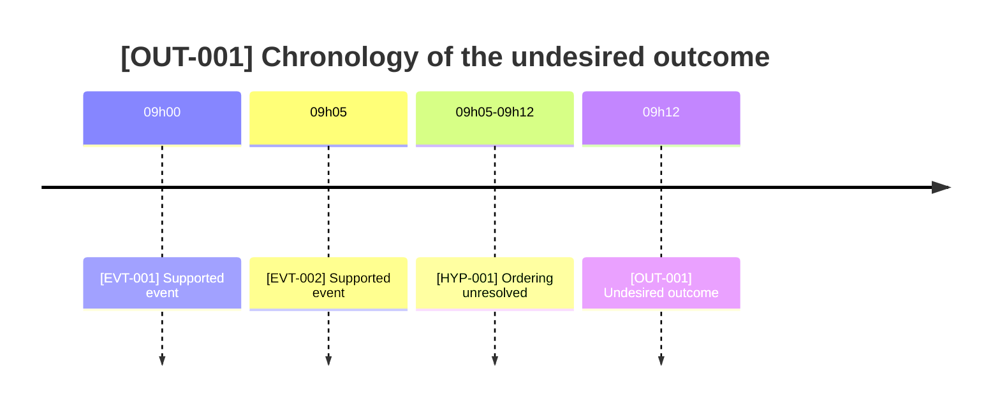
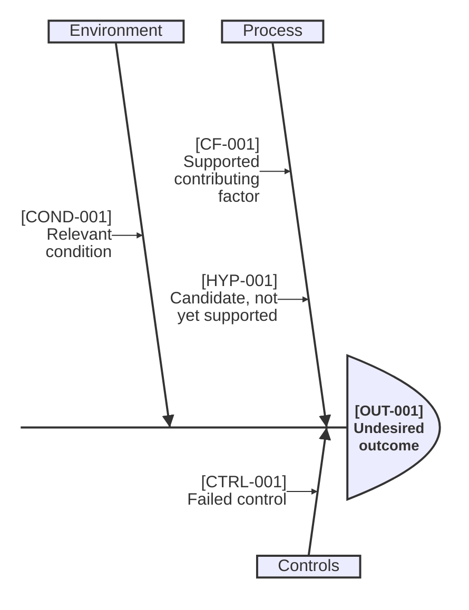
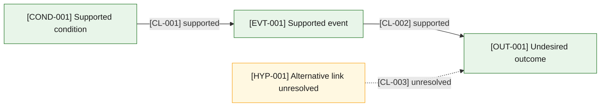
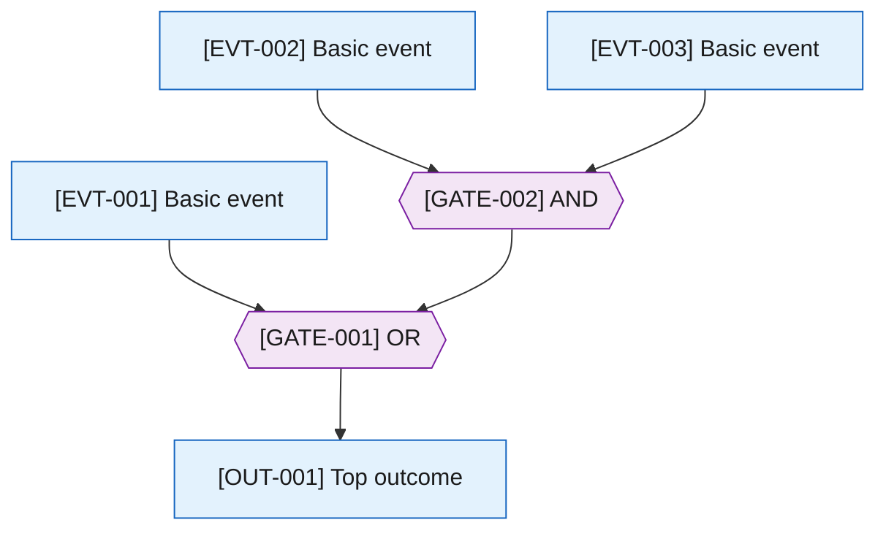

# Opt-in Mermaid visualization

Use these templates only after the operator opts in.
State the reader question before the diagram.
Replace example text with claims from the analysis record and retain the stable IDs in every node or entry.
Ishikawa category bones are the one exception: they group claims and carry no ID.

The complete template set targets Mermaid 11.16 or newer.
The `ishikawa-beta` template requires Mermaid 11.12.3 or newer and remains experimental, so its syntax may change.
Validate against the target renderer.
A diagram represents recorded claims; it does not add evidence or prove causation.

## Chronological timeline

Reader question: What happened in what order, and where is timing uncertain?

## Ishikawa candidate-factor map

Reader question: Which candidate and supported factors require comparison across categories?

Keep the map legible:

- Keep category labels to one or two short words.
  In these renders, some neighbouring category labels of 15 to 32 characters overlapped; none of 14 characters or fewer did.
- Keep consecutive factor labels on the same category from both running long.
  Long labels wrap into more lines than the layout leaves room for and print over the next factor.
  Pairs whose first label ran 66 to 69 characters, claim ID included, overprinted; pairs led by labels of 57 characters or fewer rendered cleanly.
  Shorten the earlier label of a colliding pair.
- A larger output size does not fix an overlap, because it enlarges the finished layout.
  Shorten the labels instead.
- Render the diagram and inspect it before sharing it.

These layout limits were observed with Mermaid CLI 11.16.0 and 12.0.0 on Windows 11 Home build 26200 on 2026-09-26.

## Evidence-backed causal flowchart

Reader question: Which supported links connect conditions and events to the outcome?

## Fault tree with explicit gates

Reader question: Which AND/OR combinations can produce the top outcome under the stated model?

## Sources

- [Mermaid, Timeline diagram syntax](https://mermaid.js.org/syntax/timeline.html)
- [Mermaid, Ishikawa diagram syntax](https://mermaid.js.org/syntax/ishikawa)
- [Mermaid, Flowchart syntax](https://mermaid.js.org/syntax/flowchart.html)
