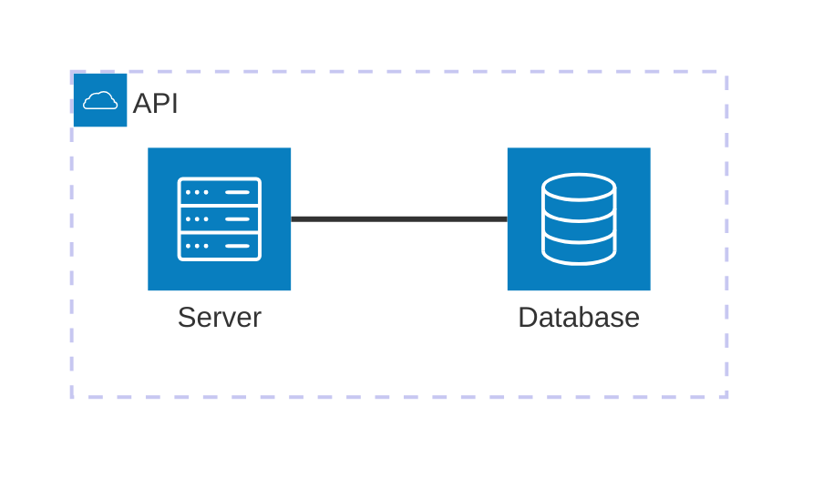

# Architecture diagram

**Use for:** cloud services, CI/CD topology, infrastructure relationships, with a built-in icon library for common service types (v11.1+, `architecture-beta`).
**Avoid for:** logical software architecture at the C4 Context/Container level, that's `c4.md`, which has richer element semantics (technology, description fields) that architecture diagrams lack.

**Experimental:** `architecture-beta` is still a beta diagram type; confirm the target renderer supports it before using it in a canonical doc.

## Core syntax

<!-- mermaid-render: id="architecture-diagram--block1" -->



Building blocks: `group`, `service`, `edge`, `junction`.

## Groups and services

```
group {groupId}({icon})[{title}] (in {parentId})?
service {serviceId}({icon})[{title}] (in {parentId})?
```

Both can nest inside another group via the optional `in` clause. Default built-in icons: `cloud`, `database`, `disk`, `internet`, `server`. Any of the 200,000+ iconify.design icons work once registered (`service web(logos:docker)[Docker]`), or install an npm icon pack (`@iconify-json/logos`, `@iconify-json/mdi`, and similar) and pass `--iconPacks` to `mmdc`.

## Edges

```
{serviceId}{{group}}?:{T|B|L|R} {<}?--{>}? {T|B|L|R}:{serviceId}{{group}}?
```

- Direction letters: `T`/`B`/`L`/`R` mark which side of each service the edge leaves/enters from.
- Arrowheads: `<` before the direction (incoming), `>` after (outgoing); omit both for a plain line.
- To connect a group boundary itself (not a specific service inside it), add the `{group}` modifier after the service id: `server{group}:B --> T:subnet{group}`.

## Junctions

```
junction {junctionId} (in {parentId})?
```

A junction is a 4-way splitter node with no label, useful for fanning one edge out to several destinations without every edge visually terminating at the same service side.

## Aligning siblings (v11.16+)

When several services share edge topology to a common downstream node, the layout heuristic can stack them on top of each other. Force separation with:

```
align row {id} {id} ...
align column {id} {id} ...
```

Use `align column` when siblings share a horizontal port pair to a common node (natural vertical stack); use `align row` when they share a vertical port pair (natural horizontal row). Combine both to build a grid across tiers. Order within the directive sets position along that axis, and must not contradict any edge direction between the listed members.

## Layout tuning

`config.architecture` exposes `randomize` (vary initial layout), and pass-through fcose knobs: `nodeSeparation`, `idealEdgeLengthMultiplier`, `edgeElasticity`, `numIter`, `seed` (deterministic by default at `seed: 1`). These tune spacing and density; they cannot fix two nodes forced to the same logical position, use `align` for that.

## Common pitfalls

- `architecture-beta` is still a beta diagram type; confirm the target renderer supports it before using it in a canonical doc (see `style-standard.md`'s beta-type guidance).
- Hand-drawn look is not supported for architecture diagrams.
- Icon packs are never bundled by default; an unregistered icon typically renders as a blank/placeholder shape.
