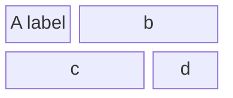
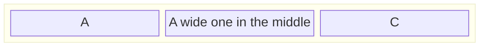
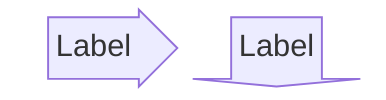
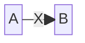

# Block diagram

**Use for:** system/network/electrical diagrams where you need full manual control over node position,
unlike a flowchart, Mermaid's auto-layout never moves a block diagram's shapes.
**Avoid for:** anything where automatic layout is preferable (a regular flowchart is usually less work).

## Core syntax

<!-- mermaid-render: id="block-diagram--block1" -->

- `columns N` sets how many columns the grid uses; blocks wrap to a new row after N.
- `id:N` after a block makes it span N columns; blank/no suffix means span 1.
- Blocks with no explicit columns setting flow left-to-right, wrapping automatically.
- `space` (or `space:N`) inserts an empty N-column gap for layout control.

## Composite (nested) blocks

<!-- mermaid-render: id="block-diagram--block2" -->

`block:ID ... end` nests a group of blocks inside a parent block,
useful for representing a server with multiple services, or any part-of hierarchy.
A single-column nested block (`columns 1`) stacks its children vertically,
effectively merging them into one tall block.

## Shapes

Block diagrams reuse the flowchart shape vocabulary: `id("rounded")`, `id(["stadium"])`,
`id[["subroutine"]]`, `id[("cylinder")]`, `id(("circle"))`, `id>"asymmetric"]`, `id{"rhombus"}`,
`id{{"hexagon"}}`, `id[/"parallelogram"/]`, `id[\"parallelogram-alt"\]`, `id((("double circle")))`.

## Block arrows and space blocks

<!-- mermaid-render: id="block-diagram--block3" -->

Block arrows point `right`, `left`, `up`, `down`, or diagonally (`x`, `y`,
or combined like `x, down`), useful as directional connectors between rows without a full edge.

## Connecting blocks

<!-- mermaid-render: id="block-diagram--block4" -->

Same arrow vocabulary as flowcharts (`-->`, `--`, labeled with `-- "text" -->`).
Because block diagrams provide full position control,
a `space` is required between two blocks that need to be linked but aren't adjacent in the grid,
otherwise there's no room to draw the edge.

## Styling

`style id fill:#969,stroke:#333,stroke-width:4px` and `classDef`/`class`/`:::` all work the same as in flowcharts.

## Common pitfalls

- Forgetting a `space` between blocks you intend to connect with an edge is the most common syntax error (`A - B` is invalid;
  use `A space B` then `A --> B`).
- Column width auto-adjusts to the widest block in that column;
  a single very wide label can push the whole column wider than expected.
  Use explicit `:N` spans to compensate.
