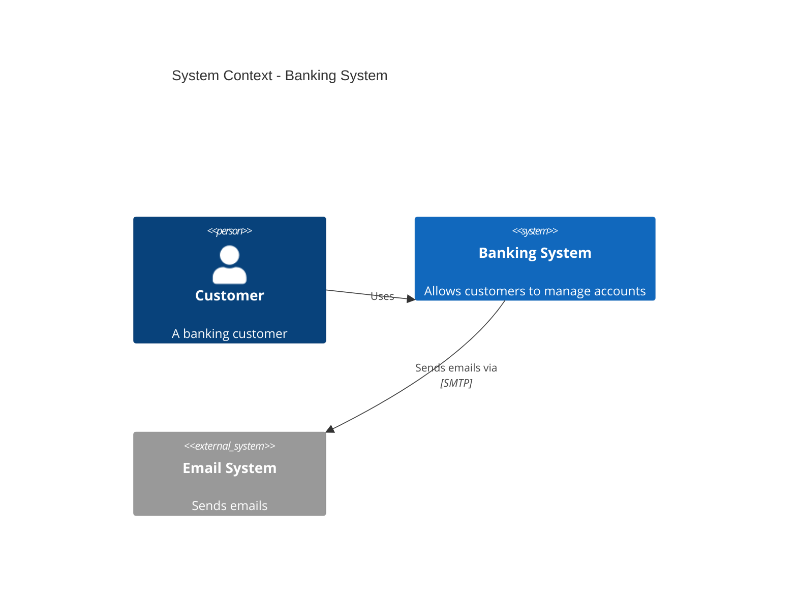
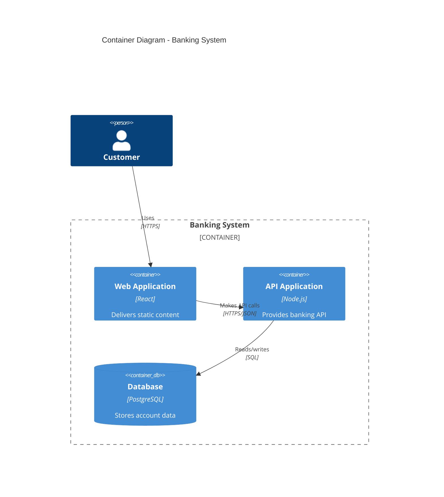
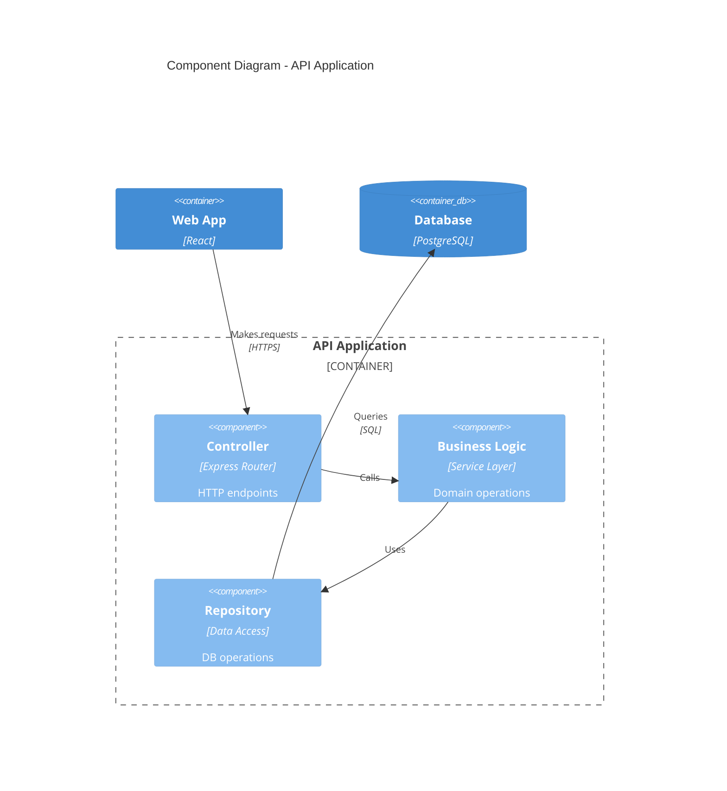
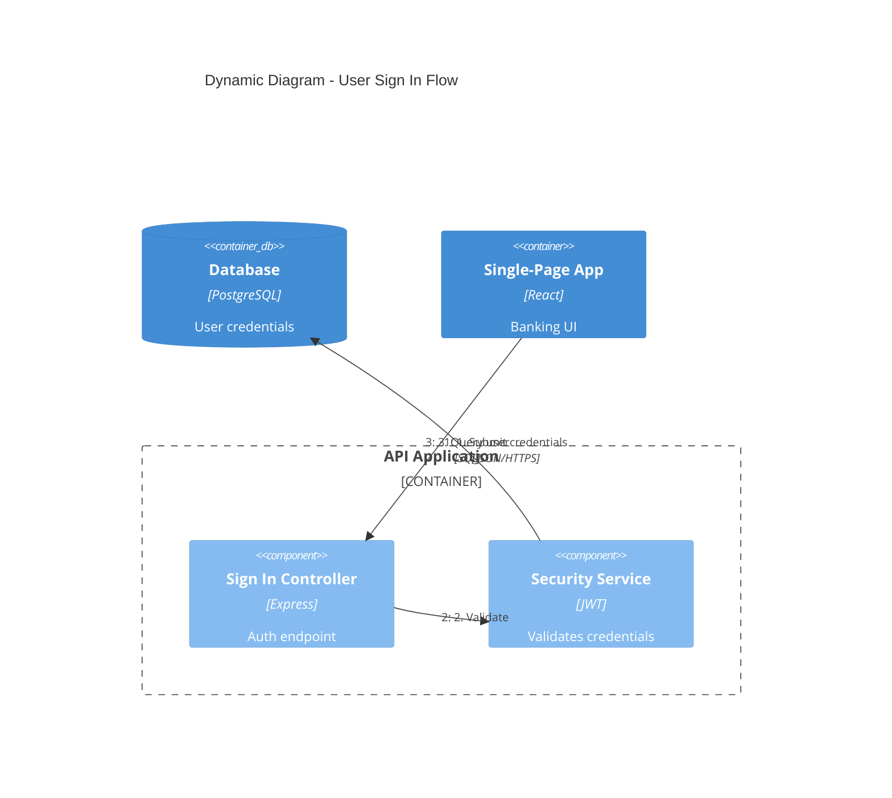
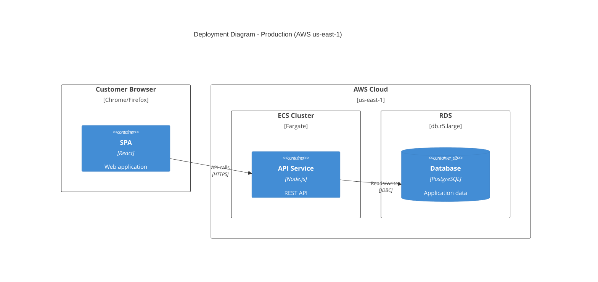

# C4 diagram

**Use for:** software architecture at any level of abstraction, using the C4 model (Context, Container, Component, Code). Mermaid's C4 syntax is compatible with PlantUML's C4-PlantUML.
**Avoid for:** anything below Container/Component detail that's really implementation, use a regular `classDiagram` for Code-level (Level 4) detail instead of forcing it into C4 syntax.

## The four levels (plus two supplementary diagrams)

| Level | Diagram type | Audience | Shows | When to create |
|---|---|---|---|---|
| 1 | `C4Context` | Everyone | System + external actors | Always |
| 2 | `C4Container` | Technical | Apps, databases, services | Always |
| 3 | `C4Component` | Developers | Internal components of one container | Only if it adds value |
| 4 | Code | Developers | Classes/interfaces | Rarely, use `classDiagram` instead |
| - | `C4Dynamic` | Technical | Numbered request flow across levels | For complex workflows |
| - | `C4Deployment` | DevOps | Infrastructure nodes | For production systems |

**Context and Container diagrams are sufficient for most teams.** Only add Component or Code diagrams when they genuinely clarify something a reader needs.

| Audience | Recommended diagrams |
|---|---|
| Executives | Context only |
| Product managers | Context + Container |
| Architects | Context + Container + key Components |
| Developers | All levels as needed |
| DevOps | Container + Deployment |

## System Context (`C4Context`)

<!-- mermaid-render: id="c4--block1" -->



## Container (`C4Container`)

<!-- mermaid-render: id="c4--block2" -->



## Component (`C4Component`)

<!-- mermaid-render: id="c4--block3" -->



## Dynamic (`C4Dynamic`, numbered request flow)

<!-- mermaid-render: id="c4--block4" -->



The step numbers are inferred from statement order; the `RelIndex` index parameter (if you use it directly) is ignored.

## Deployment (`C4Deployment`)

<!-- mermaid-render: id="c4--block5" -->



Deployment nodes nest arbitrarily to represent physical/virtual infrastructure hierarchy (region → cluster → instance).

## Element syntax reference

```
Person(alias, "Label", "Description")            Person_Ext(...)          # external person
System(alias, "Label", "Description")             System_Ext(...)
SystemDb(alias, "Label", "Description")           SystemDb_Ext(...)
SystemQueue(alias, "Label", "Description")        SystemQueue_Ext(...)

Container(alias, "Label", "Technology", "Description")        Container_Ext(...)
ContainerDb(alias, "Label", "Technology", "Description")       ContainerDb_Ext(...)
ContainerQueue(alias, "Label", "Technology", "Description")    ContainerQueue_Ext(...)

Component(alias, "Label", "Technology", "Description")         Component_Ext(...)
ComponentDb(alias, "Label", "Technology", "Description")

Deployment_Node(alias, "Label", "Type", "Description") { ... }
Node(alias, "Label", "Type", "Description") { ... }   # shorthand for Deployment_Node

Rel(from, to, "Label")
Rel(from, to, "Label", "Technology")
BiRel(from, to, "Label")            # bidirectional, use sparingly, see Best Practices
Rel_U(from, to, "Label")  Rel_D(...)  Rel_L(...)  Rel_R(...)  Rel_Back(...)  # directional hints

Enterprise_Boundary(alias, "Label") { ... }
System_Boundary(alias, "Label") { ... }
Container_Boundary(alias, "Label") { ... }
Boundary(alias, "Label", "type") { ... }
```

## Styling and layout

```
UpdateLayoutConfig($c4ShapeInRow="3", $c4BoundaryInRow="1")
UpdateElementStyle(customerA, $fontColor="red", $bgColor="grey", $borderColor="red")
UpdateRelStyle(customerA, SystemAA, $textColor="blue", $lineColor="blue", $offsetX="5", $offsetY="-10")
```

`UpdateLayoutConfig` controls shapes-per-row and boundaries-per-row (defaults 4 and 2). `UpdateRelStyle`'s `$offsetX`/`$offsetY` are the standard fix for overlapping relationship labels. Parameters can be positional (in the documented order) or named with a `$` prefix in any order.

Mermaid's C4 support does not include PlantUML C4 features like `sprite`, `tags`, `link`, auto-generated `Legend`, or custom line styles (`DashedLine`, `DottedLine`, `BoldLine`); layout directives like `Lay_U`/`Lay_D` are also unsupported, use `UpdateLayoutConfig` and statement ordering instead.

## Essential rules

1. Every element needs a name, type, technology (where applicable), and description. Don't strip these to "simplify."
2. Use unidirectional `Rel()` with an action-verb label (`"Fetches products, submits orders"`, not `"Uses"`); avoid `BiRel` except for genuinely symmetric relationships, because it hides who initiates and what flows each direction.
3. Include technology/protocol on relationships (`"JSON/HTTPS"`, `"JDBC"`, `"gRPC"`).
4. Stay under ~15-20 elements per diagram; split by bounded context, service, or one-service-plus-its-direct-dependencies instead of drawing one comprehensive diagram.
5. Start at Context, drill down only as far as adds value.

## Common mistakes

- **Containers vs. components:** containers are independently deployable units (apps, services, databases); components are non-deployable internals (classes, modules) that belong on a `C4Component` diagram, not a `C4Container` one. A Java class is a `Component`, never a `Container`.
- **Inventing abstraction levels:** C4 has exactly four levels. Don't add "subcomponents" or "microservice groups"; if you need more detail, that's the Code level, model it as a `classDiagram`.
- **Shared libraries as containers:** a library is copied into the binary of each service that uses it, not deployed on its own; show it as a component inside each consuming service, or omit it as an implementation detail.
- **Single message-broker box:** don't draw one `ContainerQueue(kafka, "Kafka", ...)` that every service connects to; model each topic/queue as its own `ContainerQueue` so publish/subscribe relationships are visible. Alternative: put the topic name on the relationship label between two services instead.
- **Exposing an external system's internals:** treat `System_Ext`/`Container_Ext` as black boxes; you don't control them and their internals go stale.
- **Missing environment on deployment diagrams:** title every `C4Deployment` diagram with which environment it depicts ("Production (AWS us-east-1)", not just "Deployment Diagram").
- **Infrastructure detail in a Container diagram:** container diagrams show logical architecture; put replica counts, load balancers, and instance sizing on a `C4Deployment` diagram instead.

## Microservices guidance

**Single team owns all services:** model each microservice as a `Container` (or a `Container` group) inside one `System_Boundary`.

**Separate teams own separate services:** promote each microservice to its own `System` inside an `Enterprise_Boundary`, each team then draws its own `C4Container` diagram for their system.

**Event-driven architectures:** see "Single message-broker box" under Common Mistakes above.

## Common patterns

See `common-patterns.md` for general architecture flowcharts; for C4-specific patterns (CQRS, API gateway, multi-region deployment, ADR cross-referencing) adapt the element syntax above directly, keeping every element's four required fields (name, type, technology, description) filled in.
