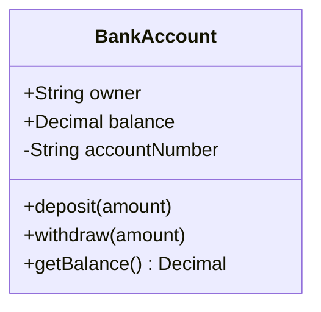
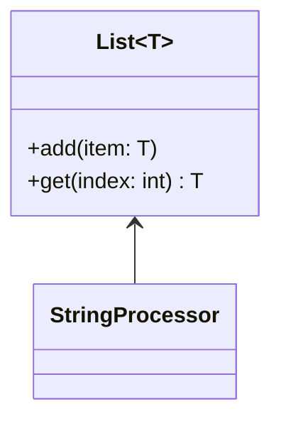
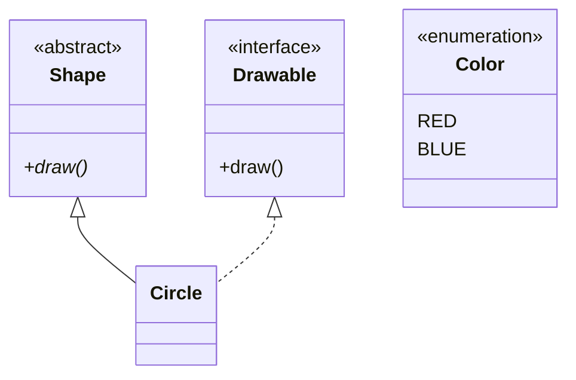
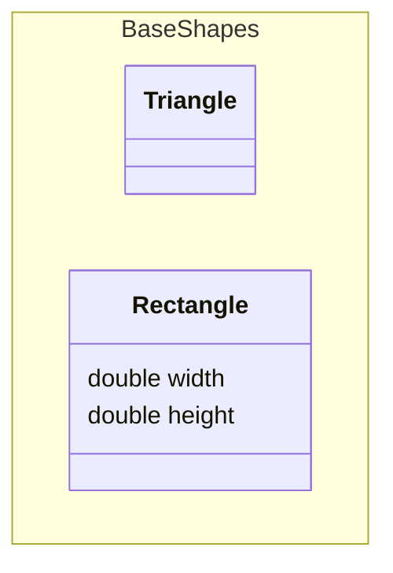
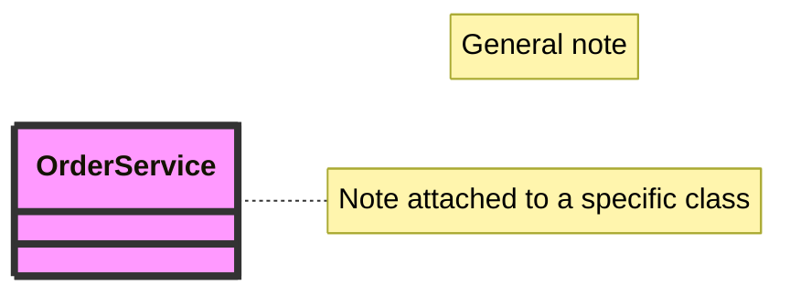

# Class diagram

**Use for:** object-oriented design, domain modeling,
entity relationships expressed as types rather than database tables.
**Avoid for:** a non-developer audience (use a birds-eye flowchart instead) or database schemas that map directly to tables (use `erd.md`,
which shows columns/keys more naturally).

## Core syntax

<!-- mermaid-render: id="class-diagram--block1" -->

Visibility modifiers: `+` public, `-` private, `#` protected, `~` package/internal.
A method ending in `*` is abstract (`draw()*`); ending in `$` is static (`someStaticMethod()$`).
Mermaid tells attributes from methods by the presence of `()`.

Define members one at a time (`ClassName : +type name`) or grouped in `{}`.
Optional return type goes after the closing `)` with a space: `+deposit(amount) bool`.

## Generics

<!-- mermaid-render: id="class-diagram--block2" -->

Wrap a generic type parameter in `~tilde~`.
Nested generics (`List~List~int~~`) work; generics containing a comma don't.
The generic part is not part of the class name for reference purposes.

## Relationships

| Syntax | Meaning |
|---|---|
| `A <|-- B` | Inheritance (B is-a A) |
| `A *-- B` | Composition (strong ownership, B dies with A) |
| `A o-- B` | Aggregation (weak ownership, B can outlive A) |
| `A --> B` | Association (directed) |
| `A -- B` | Link, solid (undirected association) |
| `A ..> B` | Dependency |
| `A ..|> B` | Realization/implements |
| `A .. B` | Link, dashed |

Add a label: `Customer --> Order : places`.
Add multiplicity/cardinality on either end: `Customer "1" --> "0..*" Order : places`.
Common values: `1`, `0..1`, `1..*`, `*`/`0..*`, `m..n`.

Two-way relations combine a relation type on each side: `Handler <|--|> Middleware`.

Lollipop interface: `bar ()-- foo` connects interface `bar` to class `foo`.

## Stereotypes, abstract classes, interfaces

<!-- mermaid-render: id="class-diagram--block3" -->

Common stereotypes: `<<interface>>`, `<<abstract>>`, `<<service>>`, `<<enumeration>>`,
and DDD ones like `<<entity>>`, `<<value object>>`, `<<aggregate root>>`.

## Namespaces

<!-- mermaid-render: id="class-diagram--block4" -->

Namespaces group classes visually and can be dot-nested (`namespace Company.Engineering.Backend { ... }`) or syntactically nested (a `namespace` block inside another).
Give a namespace a display label with `namespace id["Display Label"]`.

## Notes, direction, styling

<!-- mermaid-render: id="class-diagram--block5" -->

`direction` (`TB`, `BT`, `LR`, `RL`) sets layout direction.

**Styling does not work the same as in flowcharts.**
`classDef`, `style` and inline `:::` work here, but the flowchart habit of assigning a style with a space-separated `class` statement does not, and fails silently.
See [Applying a style to a class](#applying-a-style-to-a-class) before styling anything.

## Common pitfalls

- Class names support alphanumerics, underscores, and dashes only;
  escape anything else with backtick-quoted labels: `` class `Payment Handler!` ``.
- Mermaid does not support two classes with the same name but different generic type parameters.
- `cssClass` shorthand (`:::className`) cannot be combined on the same line as a relation statement.
- Notes and namespaces can't be individually styled with `style`, only via themes.

### Applying a style to a class

Attach the style with `:::`, with no space.
Verified on mermaid-cli 11.16.
Three of the four forms below are wrong and two of them fail silently, so `mmdc` exiting 0 is not evidence the diagram is styled.

| Form | Result |
|---|---|
| `class A:::styleName` | **Works.** Valid at the declaration (`class A:::s { ... }`) or on its own line. |
| `class A,B styleName` | Parse error. `classDiagram` does not accept a comma-separated name list the way `flowchart` does. |
| `class A styleName` | **Silently wrong.** Applies no style and adds an extra empty class box named `AstyleName` to the diagram. |
| `cssClass "A,B" styleName` | Parses and tags the nodes, but a `classDef` fill does not take effect. |

The trap is the second row leading to the third.
Hitting the parse error on `class A,B styleName` and expanding it to one `class A styleName` line per node looks like the obvious fix, and it trades a loud failure for a corrupted diagram that still exits 0.
Expand to one `class A:::styleName` line per node instead, or put `:::` on each declaration.

### Two things that do work, despite looking fragile

Both render correctly on mermaid-cli 11.16.
They are called out because a parse error elsewhere in the file is easy to misattribute to them, and deleting them throws away real information about the design:

- `<<interface>>`, `<<enumeration>>` and `<<abstract>>` annotations inside a class body's braces.
- Generic type parameters, in both a class name (`class Repo~T~`) and a member (`+findAll() List~T~`).

When a `classDiagram` won't parse, suspect the `class` styling statements first.

**Don't carry this rule to other diagram types.**
`class X style` and `class X,Y style` both work in `flowchart` and in `stateDiagram-v2`.
`classDiagram` is the outlier, see the per-type matrix in `style-standard.md`.

## Common patterns

See `common-patterns.md` for repository and strategy pattern class diagrams.
