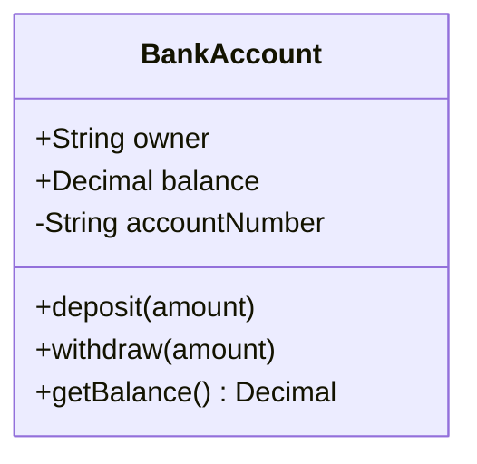
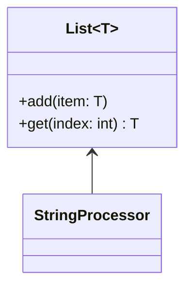
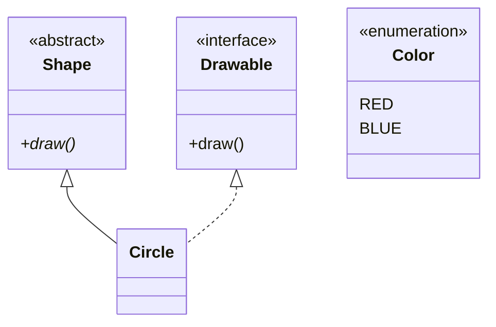
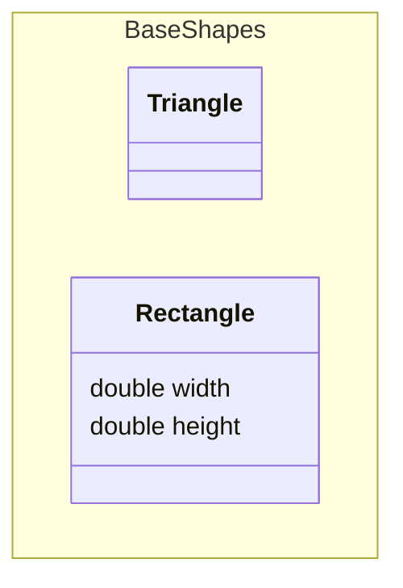
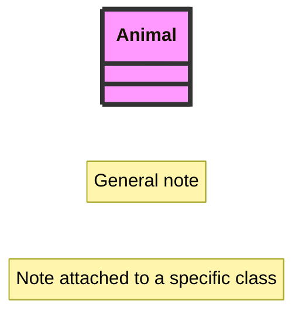

# Class diagram

**Use for:** object-oriented design, domain modeling, entity relationships expressed as types rather than database tables.
**Avoid for:** a non-developer audience (use a birds-eye flowchart instead) or database schemas that map directly to tables (use `erd.md`, which shows columns/keys more naturally).

## Core syntax

<!-- mermaid-render: id="class-diagram--block1" -->

Visibility modifiers: `+` public, `-` private, `#` protected, `~` package/internal. A method ending in `*` is abstract (`draw()*`); ending in `$` is static (`someStaticMethod()$`). Mermaid tells attributes from methods by the presence of `()`.

Define members one at a time (`ClassName : +type name`) or grouped in `{}`. Optional return type goes after the closing `)` with a space: `+deposit(amount) bool`.

## Generics

<!-- mermaid-render: id="class-diagram--block2" -->

Wrap a generic type parameter in `~tilde~`. Nested generics (`List~List~int~~`) work; generics containing a comma don't. The generic part is not part of the class name for reference purposes.

## Relationships

| Syntax | Meaning |
|---|---|
| `A <|-- B` | Inheritance (B is-a A) |
| `A *-- B` | Composition (strong ownership, B dies with A) |
| `A o-- B` | Aggregation (weak ownership, B can outlive A) |
| `A --> B` | Association (directed) |
| `A -- B` | Link, solid (undirected association) |
| `A ..> B` | Dependency |
| `A ..|> B` | Realization/implements |
| `A .. B` | Link, dashed |

Add a label: `Customer --> Order : places`. Add multiplicity/cardinality on either end: `Customer "1" --> "0..*" Order : places`. Common values: `1`, `0..1`, `1..*`, `*`/`0..*`, `m..n`.

Two-way relations combine a relation type on each side: `Animal <|--|> Zebra`.

Lollipop interface: `bar ()-- foo` connects interface `bar` to class `foo`.

## Stereotypes, abstract classes, interfaces

<!-- mermaid-render: id="class-diagram--block3" -->

Common stereotypes: `<<interface>>`, `<<abstract>>`, `<<service>>`, `<<enumeration>>`, and DDD ones like `<<entity>>`, `<<value object>>`, `<<aggregate root>>`.

## Namespaces

<!-- mermaid-render: id="class-diagram--block4" -->

Namespaces group classes visually and can be dot-nested (`namespace Company.Engineering.Backend { ... }`) or syntactically nested (a `namespace` block inside another). Give a namespace a display label with `namespace id["Display Label"]`.

## Notes, direction, styling

<!-- mermaid-render: id="class-diagram--block5" -->

`direction` (`TB`, `BT`, `LR`, `RL`) sets layout direction. `style`/`classDef`/`class`/`:::` work the same as in flowcharts.

## Common pitfalls

- Class names support alphanumerics, underscores, and dashes only; escape anything else with backtick-quoted labels: `` class `Animal Class!` ``.
- Mermaid does not support two classes with the same name but different generic type parameters.
- `cssClass` shorthand (`:::className`) cannot be combined on the same line as a relation statement.
- Notes and namespaces can't be individually styled with `style`, only via themes.

## Common patterns

See `common-patterns.md` for repository and strategy pattern class diagrams.
