# Common Mermaid diagram patterns

**Use for:** generic, reusable starting points for shapes that recur across projects, such as a CI/CD pipeline, an OAuth exchange, a junction table, or a repository class hierarchy.
**Avoid for:** explaining one specific system to your own team.
The scenario playbooks (`scenario-runtime.md`, `scenario-delivery.md`, `scenario-codebase.md`, `scenario-operations.md`) carry the same shapes tied to a reader question and a stated detail level, which is what you want when the diagram is about your system rather than about the pattern.

Each template says when to reach for it and what to change.
Copy the block, swap the names, and delete whatever your diagram doesn't need.
Never ship one unadapted.
The names here are placeholders, and a diagram whose labels still say `Service` is a diagram nobody checked.

**On styling:** the process, lifecycle and class templates below skip the node colour palette from `style-standard.md` on purpose.
That palette encodes producer, queue and consumer roles, which don't apply to a decision flow or a state machine.
The architecture templates, where those roles do apply, use it.

## Software development workflows

### Feature development flow

**Use when:** writing down how work moves from request to release, usually in a team handbook or an onboarding page.

<!-- mermaid-render: id="common-patterns--block1" -->
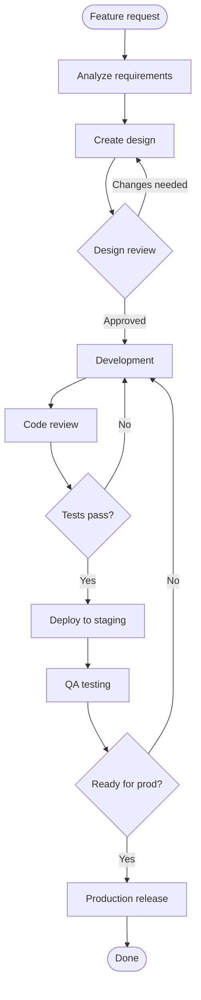

**Adapt it:** replace the two gates with the ones your team actually enforces, and delete any loop-back edge that doesn't exist in practice.
A loop-back you draw but never take makes the diagram look more careful than the process is.

### Bug fix workflow

**Use when:** explaining how a report is triaged and what each severity commits the team to.

<!-- mermaid-render: id="common-patterns--block2" -->
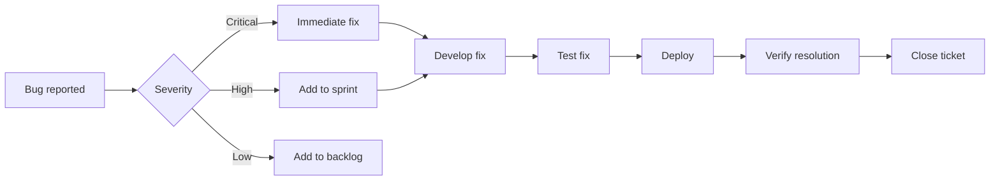

**Adapt it:** use your real severity names, and attach the response time each one promises to the edge label.
`Backlog` is deliberately a dead end here; if your low-severity bugs do get picked up, draw that edge or you are documenting an aspiration.

### CI/CD pipeline

**Use when:** showing the stages a commit passes through, in order, for a reader who just wants the shape.

<!-- mermaid-render: id="common-patterns--block3" -->

**Adapt it:** this is the happy path only, which is why it stays readable at fourteen nodes.
For what happens when a stage fails, who is allowed to waive a required check, or how a rollout is promoted, use `scenario-delivery.md` instead of growing this one.

## Authentication patterns

### OAuth 2.0 flow

**Use when:** documenting a third-party sign-in where your app trades an authorization code for a token and never sees the user's password.

<!-- mermaid-render: id="common-patterns--block4" -->
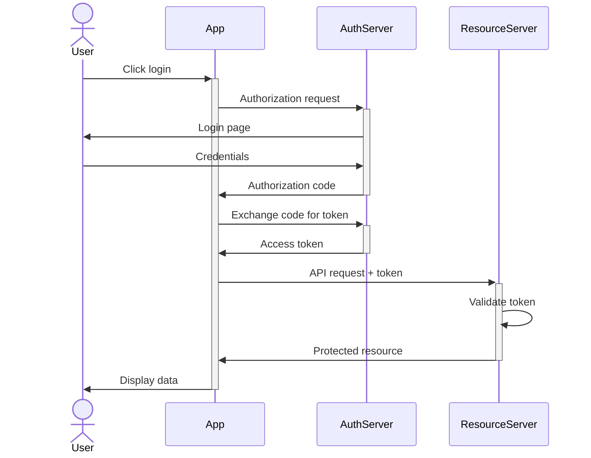

**Adapt it:** rename `AuthServer` and `ResourceServer` to your actual identity provider and API, and drop steps a flow variant skips, PKCE and client-credentials grants don't run all eleven messages shown here.
Don't relabel this as a JWT flow just because the token happens to be one, that's the separate template below.

### JWT authentication

**Use when:** showing a service that issues and later verifies its own bearer token, with no separate authorization server in the picture.

<!-- mermaid-render: id="common-patterns--block5" -->
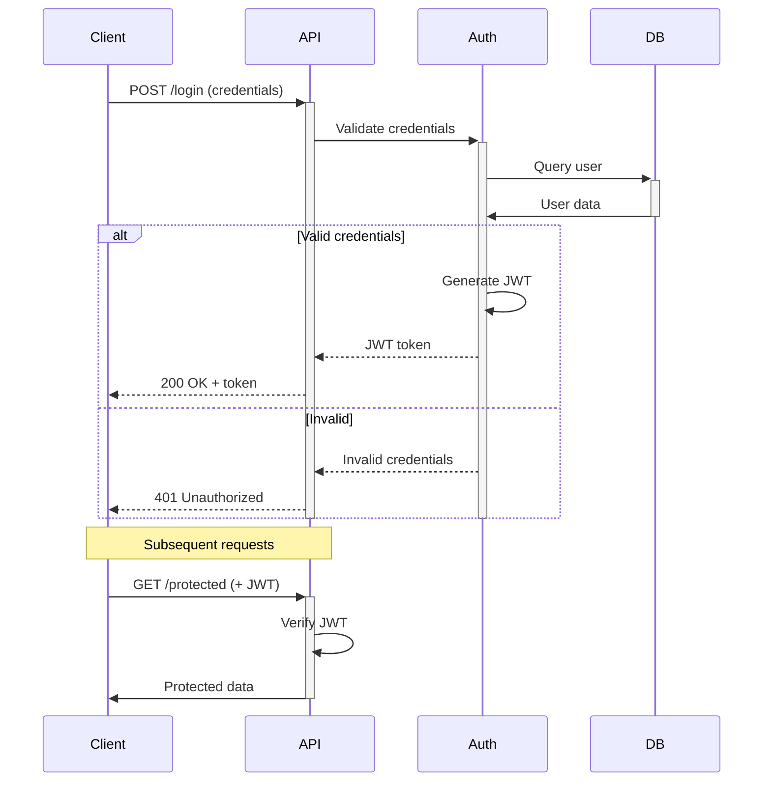

**Adapt it:** point `Auth` and `DB` at your real user store and token-issuing service, and put your actual claims and expiry rule where `Generate JWT` is now.
Keep both branches of the `alt`, a diagram that only shows the happy path implies verification never fails.

## API request/response

### REST API standard flow

**Use when:** showing a request passing through a gateway and a cache before it reaches a service's own logic.

<!-- mermaid-render: id="common-patterns--block6" -->

**Adapt it:** name `Gateway` and `Service` for your real components, and delete the cache entirely if your service doesn't have one rather than leaving a lookup that always misses.
For the version of this path with a failure branch and a real hop-by-hop timeout budget, see the checkout timeout scenario in `scenario-runtime.md`.

### Full request/response with layers

**Use when:** showing the call chain through an app's own layers, controller, service, model, down to the database and back, with no gateway or cache in scope.

<!-- mermaid-render: id="common-patterns--block7" -->
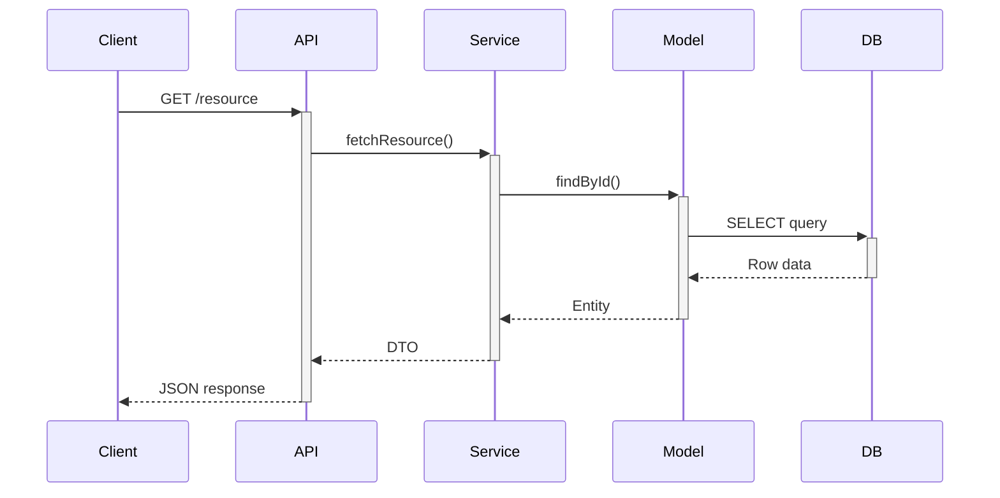

**Adapt it:** rename each layer to match your codebase's own terms, controller vs. API, service vs. use case, model vs. entity.
Keep the `+`/`-` activation pairs, they show each layer waiting on the one below it rather than firing calls in parallel.

### Error handling flow

**Use when:** documenting where a request can fail and which handler catches each kind of failure, for a reader deciding where to add a new error case.

<!-- mermaid-render: id="common-patterns--block8" -->
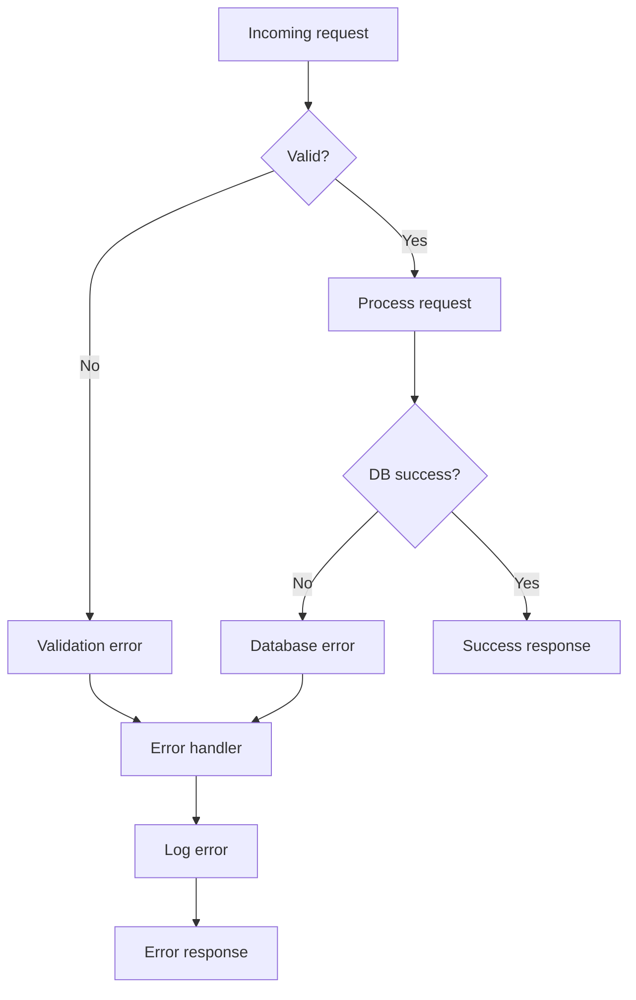

**Adapt it:** add or remove decision diamonds to match your actual validation and failure points, this template stops at two.
Route every failure through one `ErrorHandler` only if your code truly centralizes error handling, if validation and database errors respond differently, split the merge back into two paths.

## Architecture patterns

### Microservices architecture

**Use when:** showing which services exist, what fronts them, and which store each one owns, for a reader who has never seen the system before.

<!-- mermaid-render: id="common-patterns--block9" -->
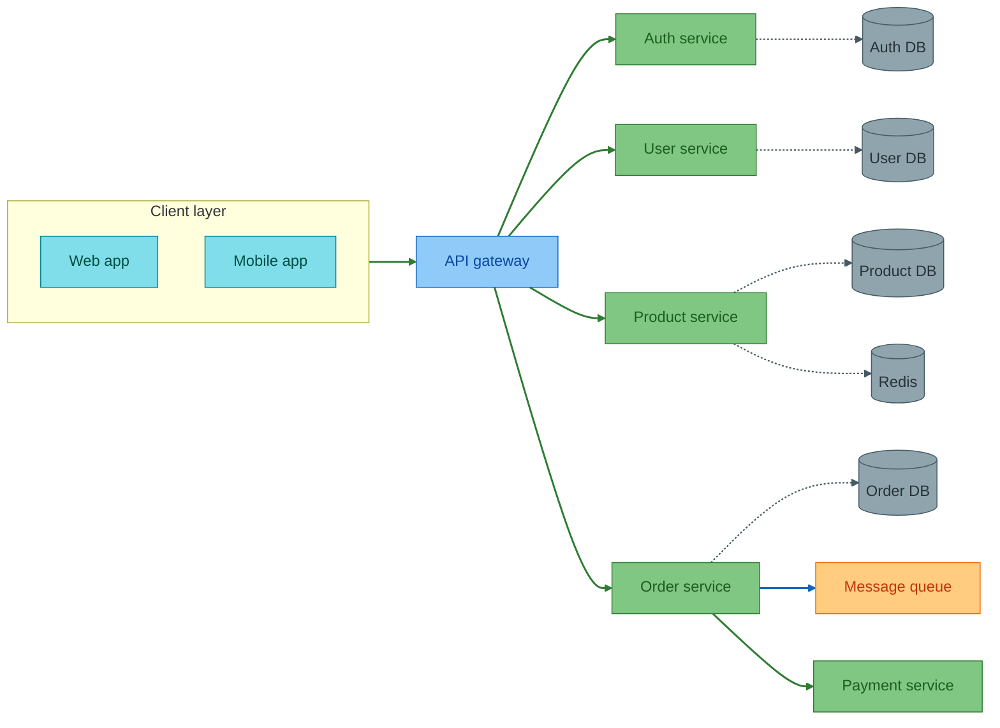

**Adapt it:** the shape that matters here is one database per service, so delete a service only together with its store, and if two of your services share a database, draw that honestly, because it is the most important thing this diagram can tell a reader.
Note what is doing the grouping: the palette, not boxes.
An earlier version wrapped the services, stores and infrastructure in three subgraphs, and the service-to-store edges then crossed each other into unreadable wallpaper.
Colour already says which nodes are services and which are stores, so the boxes were costing legibility and buying nothing.
Keep a subgraph only where it earns its place, as `Client layer` does, and let its edge name the box.
For what happens when one of these calls times out or retries, use `scenario-runtime.md` rather than adding failure paths here.

### Layered architecture

**Use when:** stating the layering rule a codebase is supposed to follow, so a reviewer can point at it when a change breaks it.

<!-- mermaid-render: id="common-patterns--block10" -->
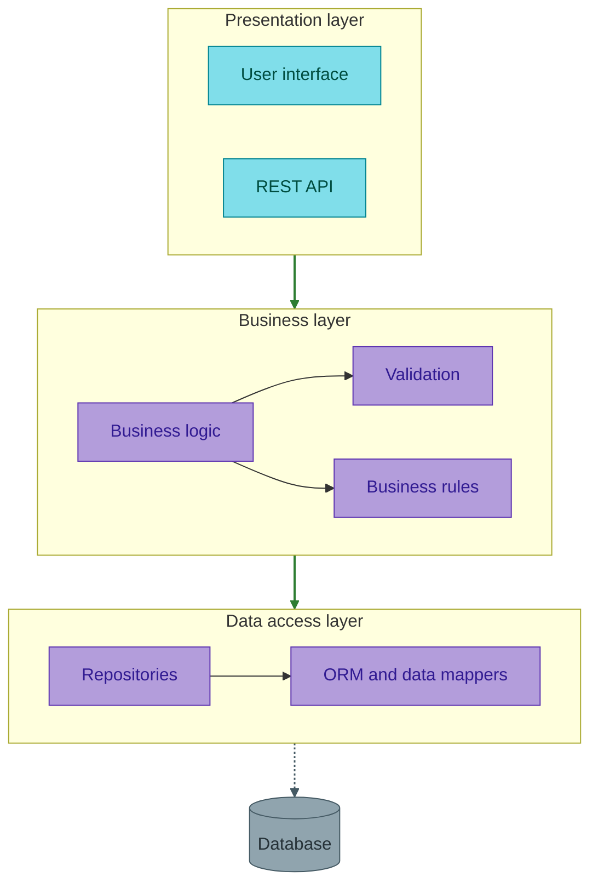

**Adapt it:** rename the layers to your own and delete any layer you don't have rather than leaving an empty one.
Layer-to-layer edges name the layer, not a node inside it, which is what keeps the bands stacked instead of staggering diagonally; see "Subgraph edges" in `style-standard.md`.
This template states the rule but cannot show it being broken, so when you need to point at a specific illegal import use the dependency graph in `scenario-codebase.md` instead.

## Database ER patterns

### Self-referencing (hierarchical)

**Use when:** modelling a tree in one table, such as nested categories, an org chart, or threaded replies.

<!-- mermaid-render: id="common-patterns--block11" -->
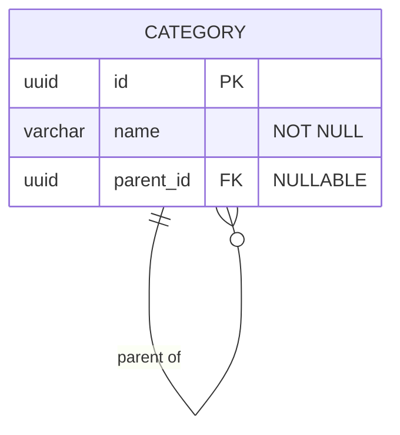

**Adapt it:** the load-bearing detail is that `parent_id` is nullable, because that is what makes a row a root.
Say in the prose how deep the tree is allowed to get and what stops a cycle, since the diagram cannot show either.

### Junction table (many-to-many)

**Use when:** two entities relate many-to-many and the relationship itself carries data, such as a grade or an enrolment date.

<!-- mermaid-render: id="common-patterns--block12" -->
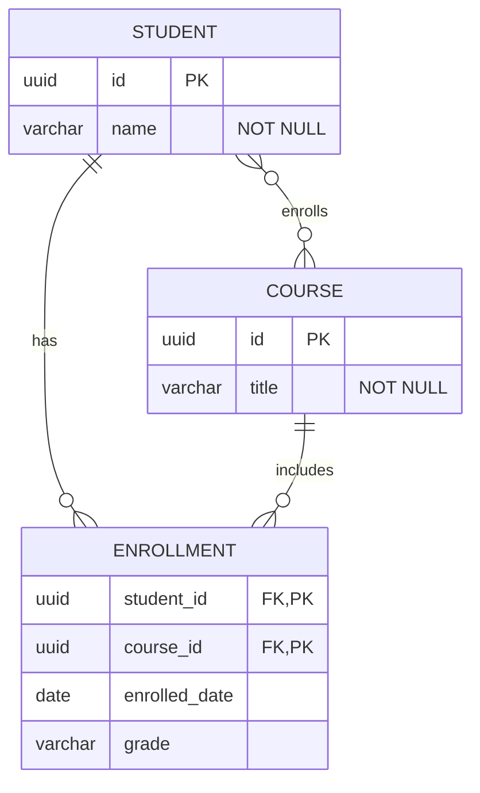

**Adapt it:** keep the `STUDENT }o--o{ COURSE` line only while it helps a reader see the logical relationship; the junction table is the thing that actually exists.
If your join table carries no columns beyond the two keys, drop it from the diagram and draw the plain many-to-many instead.

### Polymorphic relationship

**Use when:** one table points at rows in several other tables, identified by a type column rather than a real foreign key.

<!-- mermaid-render: id="common-patterns--block13" -->
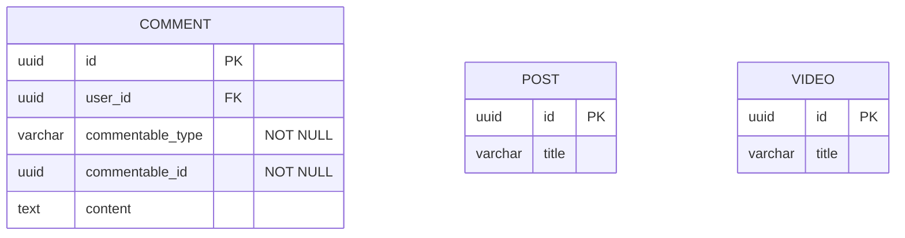

**Adapt it:** name the two discriminator columns exactly as your ORM expects, because that convention is the whole pattern.
There is deliberately no relationship line to `POST` or `VIDEO`: the database cannot enforce one, and drawing it would claim a constraint you do not have.

### Soft deletes

**Use when:** rows are retired by setting a timestamp rather than being removed, and a reader needs to know that every query must filter.

<!-- mermaid-render: id="common-patterns--block14" -->
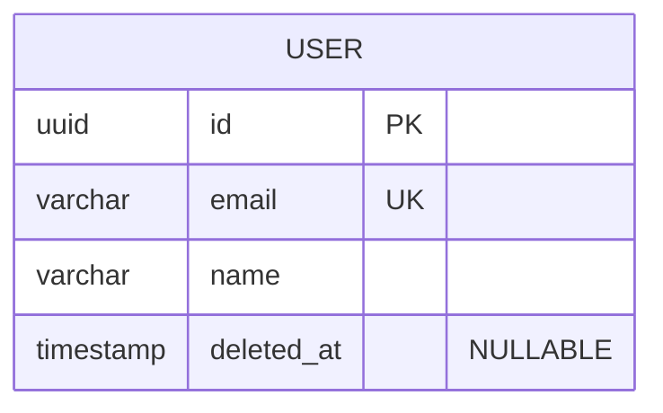

**Adapt it:** this is a single-table convention, so copy the `deleted_at` column onto whichever entity you are documenting rather than shipping a `USER` diagram.
Write next to it which queries filter on it, since a soft delete nobody filters for is just a slow leak of deleted data into results.

### Audit trail

**Use when:** history has to be kept, and each change is a new row rather than an update in place.

<!-- mermaid-render: id="common-patterns--block15" -->
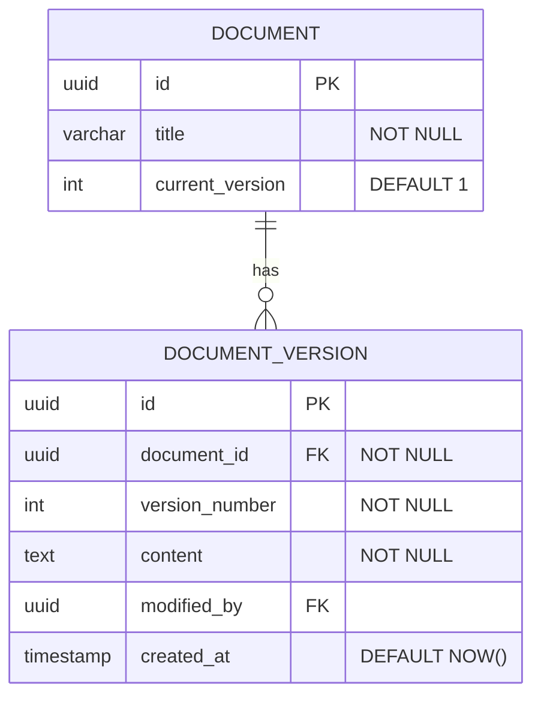

**Adapt it:** decide and state whether `DOCUMENT` holds the current content or only a pointer to the current version, because the two designs read identically here and behave very differently.
`current_version` is a denormalisation for fast reads; delete it if you would rather compute the latest version.

## State machine templates

### Order lifecycle

**Use when:** agreeing what statuses an order can hold and which transitions are legal, before anyone writes the status column.

<!-- mermaid-render: id="common-patterns--block16" -->
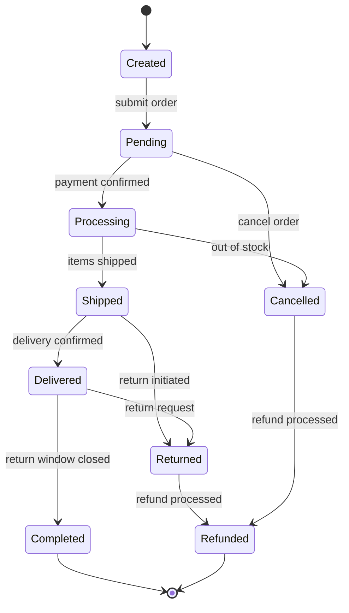

**Adapt it:** use your real status values as the state names, spelled exactly as they appear in the database, since that is what makes this diagram checkable against the code.
The transitions you leave out are the claim: every arrow absent here is a state change your system should reject.
`scenario-codebase.md` has the same shape applied to a document lifecycle if you want a second worked example.

### User account states

**Use when:** an account can be blocked in several different ways and a reader needs to know which of them a user can get out of.

<!-- mermaid-render: id="common-patterns--block17" -->

**Adapt it:** the useful distinction here is that `Suspended`, `Locked` and `Inactive` each have a different way back to `Active`, so keep whichever of those you have and delete the rest.
`Deleted` is terminal on purpose; if your deletion is reversible within a grace period, that is a different state and needs its own name.

## Class diagram patterns

### Repository pattern

**Use when:** showing how a generic data-access interface is shared by an abstract base and specialised per entity.

<!-- mermaid-render: id="common-patterns--block18" -->
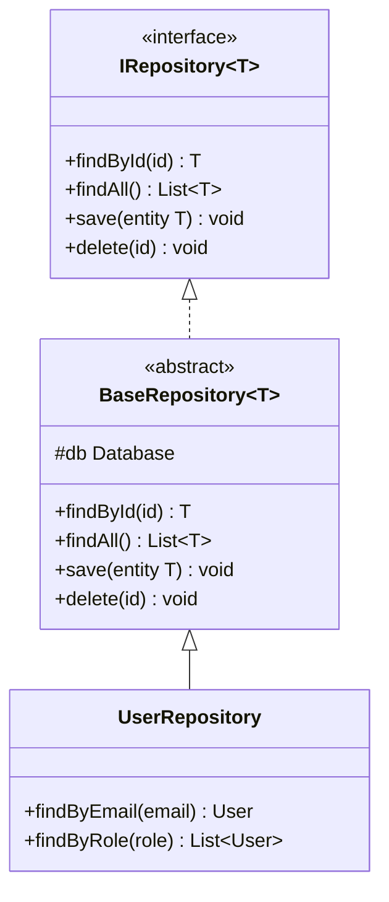

**Adapt it:** show only the members that carry the pattern, which here means the generic CRUD four on the interface and the entity-specific finders on the subclass.
A class diagram that lists every method is a worse version of the source file; if a reader needs all of them, link the file instead.

### Strategy pattern

**Use when:** one behaviour has several interchangeable implementations chosen at runtime, and you need to show the seam.

<!-- mermaid-render: id="common-patterns--block19" -->
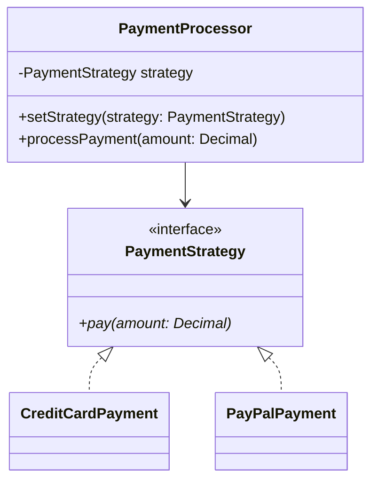

**Adapt it:** two concrete strategies is enough to show the shape; adding a fifth teaches the reader nothing new.
The arrow that matters is `PaymentProcessor --> PaymentStrategy`, because it is what says the processor depends on the abstraction and not on any one implementation.

## Tips for using these templates

1. Customize names, entities, and relationships to the real system before publishing.
2. Simplify: remove nodes the diagram's point doesn't need.
3. Validate with `mmdc` after customizing (see `SKILL.md`).
4. Keep each diagram focused on one concept; split rather than merge.
5. Explaining a specific scenario (an incident, a release, a call path) rather than adapting a generic template? Use the matching scenario playbook in `SKILL.md` instead; it carries the same shape tied to a reader question and a detail level.
