# Common Mermaid diagram patterns

Reusable templates for frequently needed scenarios. Adjust names and edges to the real system before use; don't ship these as-is.

## Software development workflows

### Feature development flow

<!-- mermaid-render: id="common-patterns--block1" -->
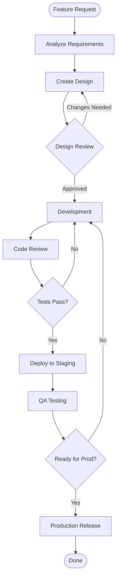
```mermaid
flowchart TD
    Start([Feature Request]) --> Analysis[Analyze Requirements]
    Analysis --> Design[Create Design]
    Design --> Review{Design Review}
    Review -->|Approved| Dev[Development]
    Review -->|Changes Needed| Design
    Dev --> CodeReview[Code Review]
    CodeReview --> Tests{Tests Pass?}
    Tests -->|No| Dev
    Tests -->|Yes| Deploy[Deploy to Staging]
    Deploy --> QA[QA Testing]
    QA --> Prod{Ready for Prod?}
    Prod -->|No| Dev
    Prod -->|Yes| Release[Production Release]
    Release --> End([Done])
```


### Bug fix workflow

<!-- mermaid-render: id="common-patterns--block2" -->
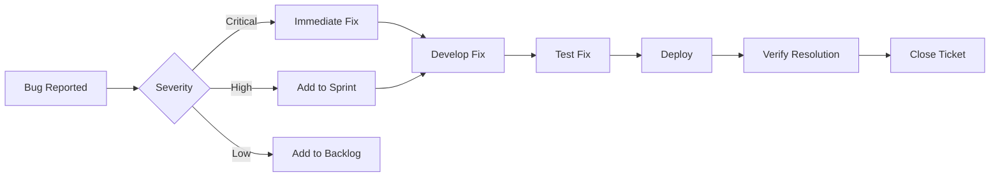
```mermaid
flowchart LR
    Report[Bug Reported] --> Triage{Severity}
    Triage -->|Critical| Immediate[Immediate Fix]
    Triage -->|High| Sprint[Add to Sprint]
    Triage -->|Low| Backlog[Add to Backlog]
    Immediate --> Fix[Develop Fix]
    Sprint --> Fix
    Fix --> Test[Test Fix]
    Test --> Deploy[Deploy]
    Deploy --> Verify[Verify Resolution]
    Verify --> Close[Close Ticket]
```


### CI/CD pipeline

<!-- mermaid-render: id="common-patterns--block3" -->
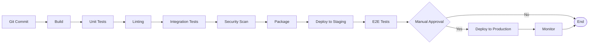
```mermaid
flowchart LR
    Commit[Git Commit] --> Build[Build]
    Build --> UnitTest[Unit Tests]
    UnitTest --> Lint[Linting]
    Lint --> IntTest[Integration Tests]
    IntTest --> Security[Security Scan]
    Security --> Package[Package]
    Package --> StageDeploy[Deploy to Staging]
    StageDeploy --> E2E[E2E Tests]
    E2E --> Approve{Manual Approval}
    Approve -->|Yes| ProdDeploy[Deploy to Production]
    Approve -->|No| End([End])
    ProdDeploy --> Monitor[Monitor]
    Monitor --> End
```


## Authentication patterns

### OAuth 2.0 flow

<!-- mermaid-render: id="common-patterns--block4" -->
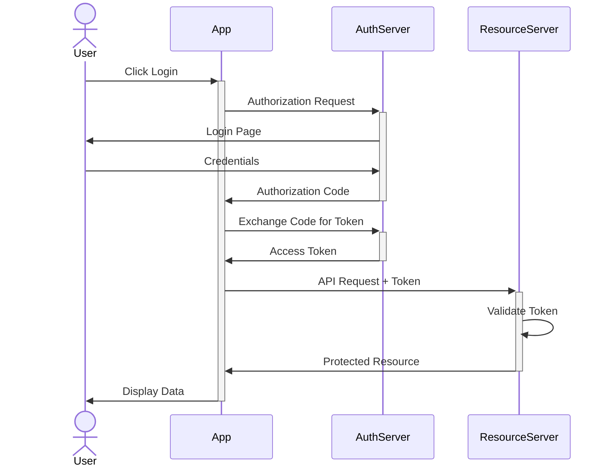
```mermaid
sequenceDiagram
    actor User
    participant App
    participant AuthServer
    participant ResourceServer

    User->>+App: Click Login
    App->>+AuthServer: Authorization Request
    AuthServer->>User: Login Page
    User->>AuthServer: Credentials
    AuthServer->>-App: Authorization Code
    App->>+AuthServer: Exchange Code for Token
    AuthServer->>-App: Access Token
    App->>+ResourceServer: API Request + Token
    ResourceServer->>ResourceServer: Validate Token
    ResourceServer->>-App: Protected Resource
    App->>-User: Display Data
```
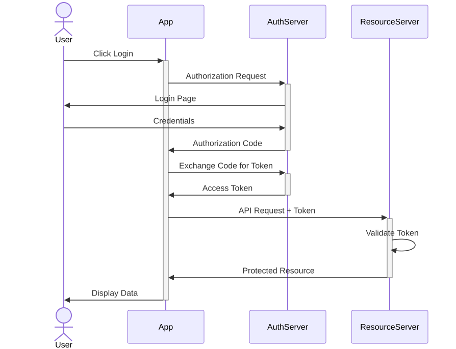

### JWT authentication

<!-- mermaid-render: id="common-patterns--block5" -->
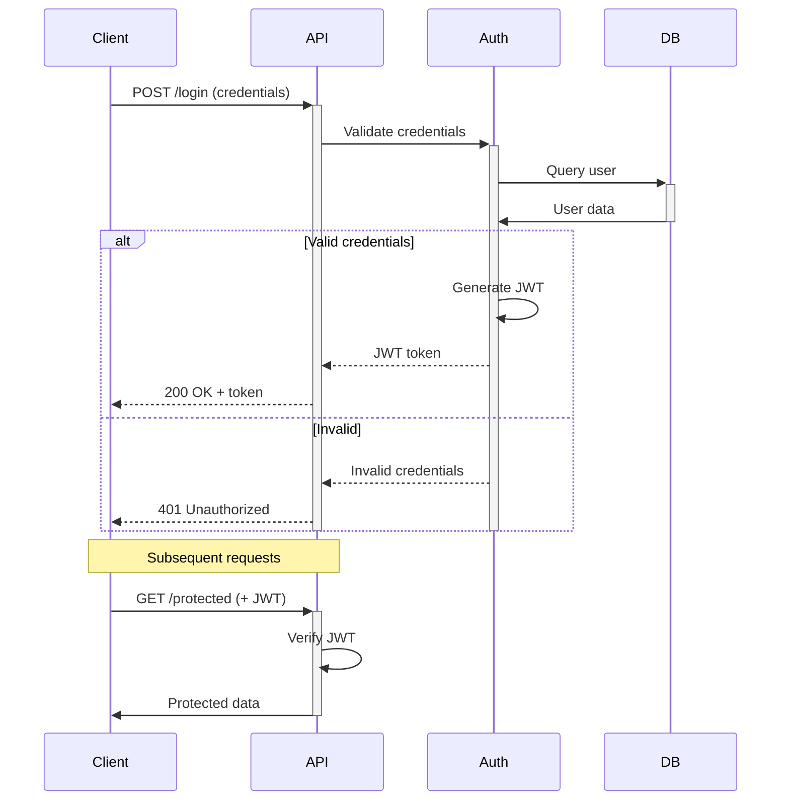
```mermaid
sequenceDiagram
    participant Client
    participant API
    participant Auth
    participant DB

    Client->>+API: POST /login (credentials)
    API->>+Auth: Validate credentials
    Auth->>+DB: Query user
    DB->>-Auth: User data

    alt Valid credentials
        Auth->>Auth: Generate JWT
        Auth-->>API: JWT token
        API-->>Client: 200 OK + token
    else Invalid
        Auth-->>API: Invalid credentials
        API-->>Client: 401 Unauthorized
    end
    deactivate Auth
    deactivate API

    Note over Client,API: Subsequent requests
    Client->>+API: GET /protected (+ JWT)
    API->>API: Verify JWT
    API->>-Client: Protected data
```
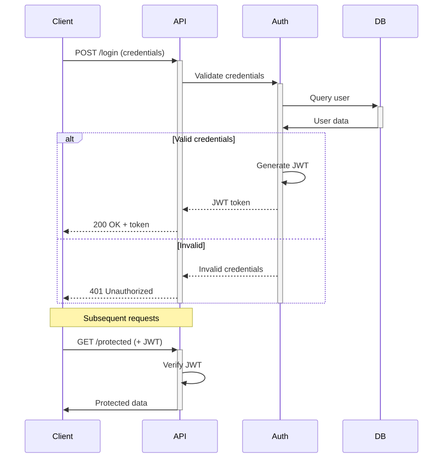

## API request/response

### REST API standard flow

<!-- mermaid-render: id="common-patterns--block6" -->
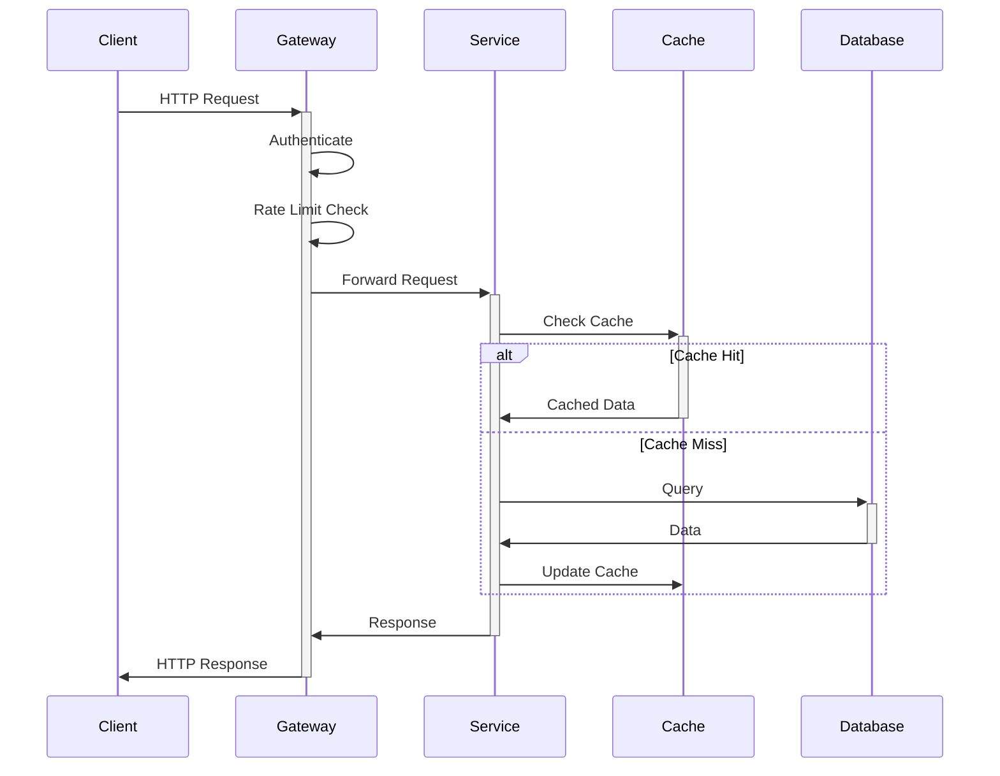
```mermaid
sequenceDiagram
    participant Client
    participant Gateway
    participant Service
    participant Cache
    participant Database

    Client->>+Gateway: HTTP Request
    Gateway->>Gateway: Authenticate
    Gateway->>Gateway: Rate Limit Check

    Gateway->>+Service: Forward Request
    Service->>+Cache: Check Cache

    alt Cache Hit
        Cache->>-Service: Cached Data
    else Cache Miss
        Service->>+Database: Query
        Database->>-Service: Data
        Service->>Cache: Update Cache
    end

    Service->>-Gateway: Response
    Gateway->>-Client: HTTP Response
```
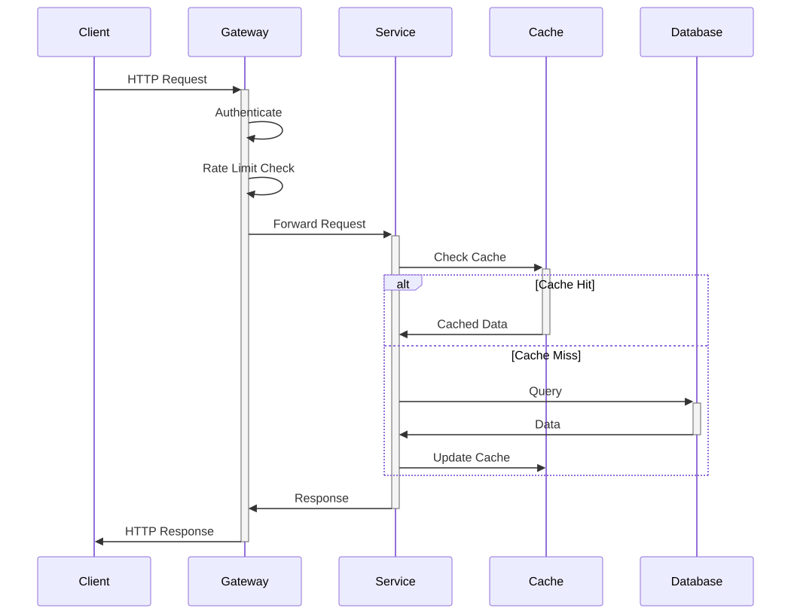

### Full request/response with layers

<!-- mermaid-render: id="common-patterns--block7" -->
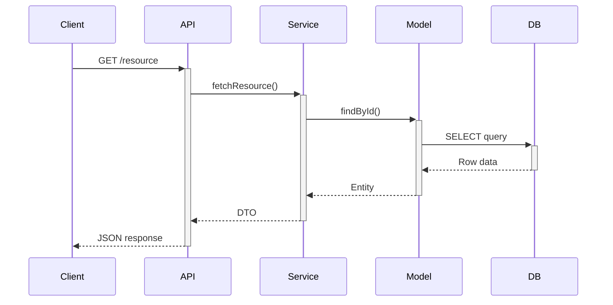
```mermaid
sequenceDiagram
    Client->>+API: GET /resource
    API->>+Service: fetchResource()
    Service->>+Model: findById()
    Model->>+DB: SELECT query
    DB-->>-Model: Row data
    Model-->>-Service: Entity
    Service-->>-API: DTO
    API-->>-Client: JSON response
```
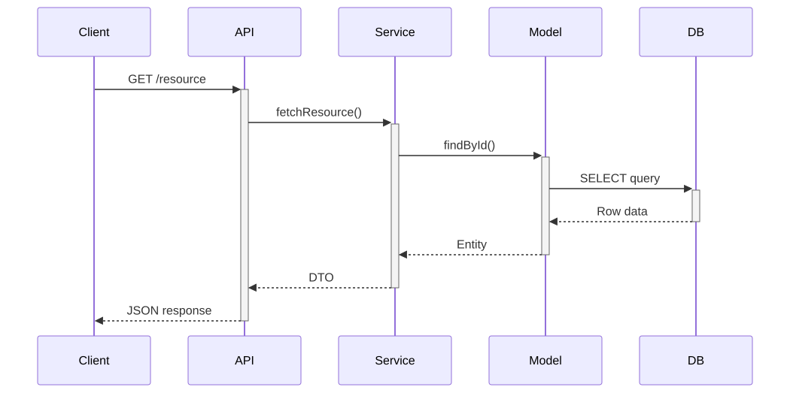

### Error handling flow

<!-- mermaid-render: id="common-patterns--block8" -->
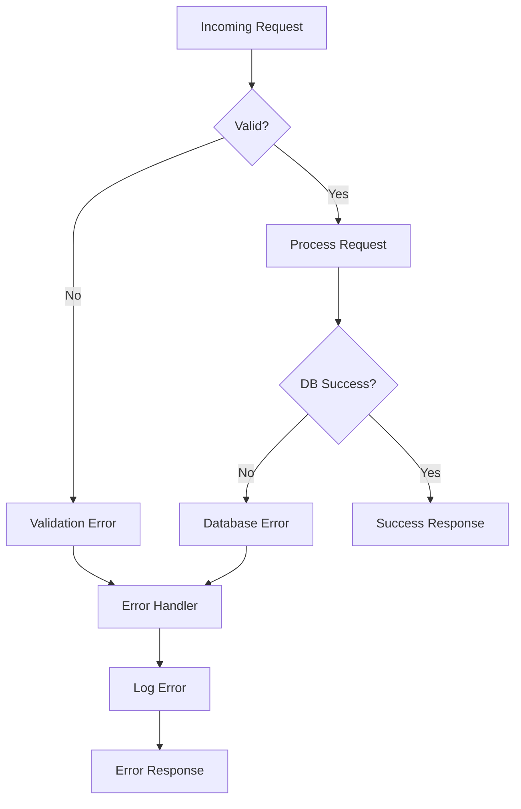
```mermaid
flowchart TD
    Request[Incoming Request] --> Validate{Valid?}
    Validate -->|No| ValidationError[Validation Error]
    ValidationError --> ErrorHandler[Error Handler]
    Validate -->|Yes| Process[Process Request]
    Process --> DB{DB Success?}
    DB -->|No| DBError[Database Error]
    DBError --> ErrorHandler
    DB -->|Yes| Success[Success Response]
    ErrorHandler --> LogError[Log Error]
    LogError --> ErrorResponse[Error Response]
```


## Architecture patterns

### Microservices architecture

<!-- mermaid-render: id="common-patterns--block9" -->
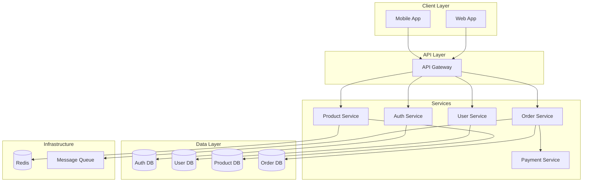
```mermaid
flowchart TB
    subgraph Client_Layer[Client Layer]
        Web[Web App]
        Mobile[Mobile App]
    end

    subgraph API_Layer[API Layer]
        Gateway[API Gateway]
    end

    subgraph Services
        Auth[Auth Service]
        User[User Service]
        Product[Product Service]
        Order[Order Service]
        Payment[Payment Service]
    end

    subgraph Data_Layer[Data Layer]
        AuthDB[(Auth DB)]
        UserDB[(User DB)]
        ProductDB[(Product DB)]
        OrderDB[(Order DB)]
    end

    subgraph Infrastructure
        Cache[(Redis)]
        Queue[Message Queue]
    end

    Web --> Gateway
    Mobile --> Gateway
    Gateway --> Auth
    Gateway --> User
    Gateway --> Product
    Gateway --> Order

    Auth --> AuthDB
    User --> UserDB
    Product --> ProductDB
    Order --> OrderDB

    Order --> Payment
    Order --> Queue
    Product --> Cache
```


### Layered architecture

<!-- mermaid-render: id="common-patterns--block10" -->
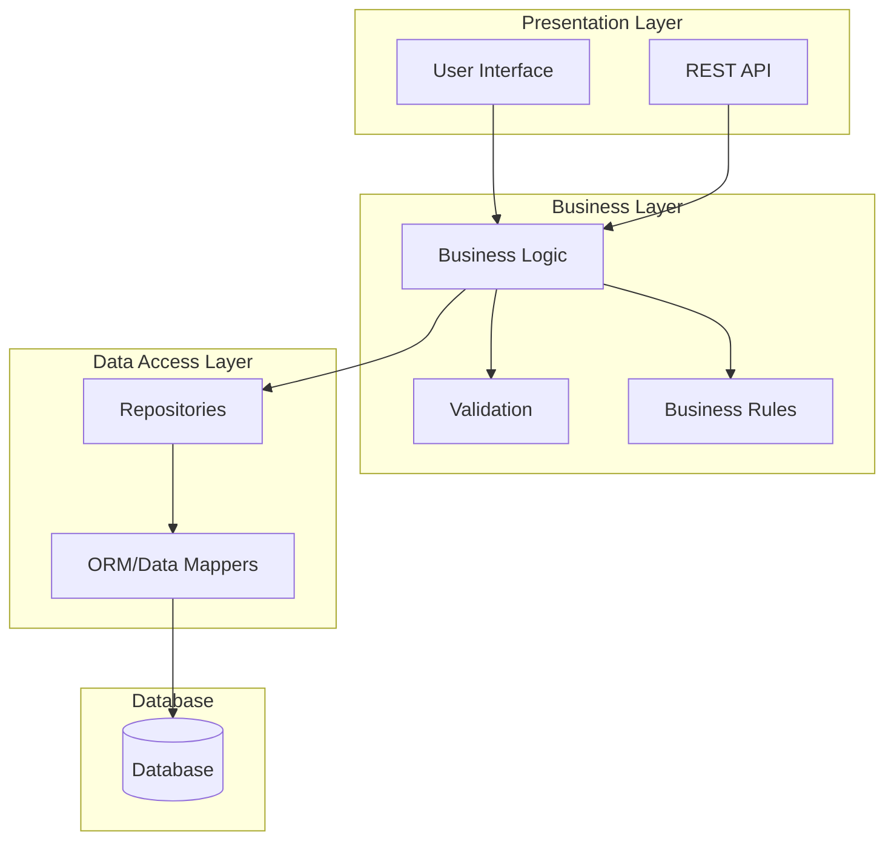
```mermaid
flowchart TD
    subgraph Presentation_Layer[Presentation Layer]
        UI[User Interface]
        API[REST API]
    end

    subgraph Business_Layer[Business Layer]
        BL[Business Logic]
        Validation[Validation]
        Rules[Business Rules]
    end

    subgraph Data_Access_Layer[Data Access Layer]
        Repo[Repositories]
        ORM[ORM/Data Mappers]
    end

    subgraph Database
        DB[(Database)]
    end

    UI --> BL
    API --> BL
    BL --> Validation
    BL --> Rules
    BL --> Repo
    Repo --> ORM
    ORM --> DB
```


## Database ER patterns

### Self-referencing (hierarchical)

<!-- mermaid-render: id="common-patterns--block11" -->
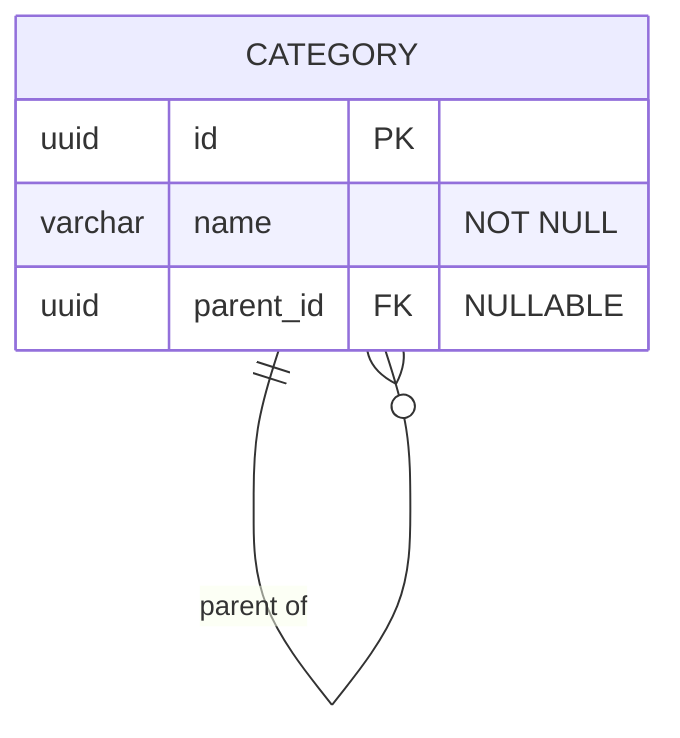
```mermaid
erDiagram
    CATEGORY ||--o{ CATEGORY : "parent of"

    CATEGORY {
        uuid id PK
        varchar name "NOT NULL"
        uuid parent_id FK "NULLABLE"
    }
```


### Junction table (many-to-many)

<!-- mermaid-render: id="common-patterns--block12" -->
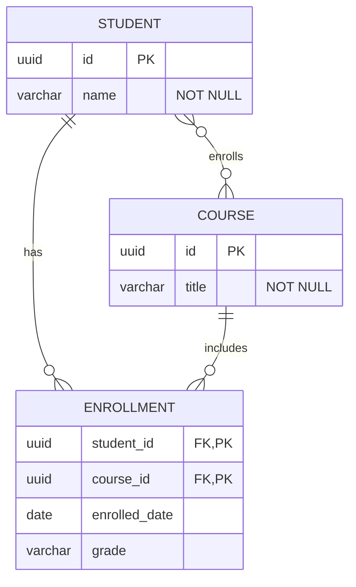
```mermaid
erDiagram
    STUDENT }o--o{ COURSE : enrolls
    STUDENT ||--o{ ENROLLMENT : has
    COURSE ||--o{ ENROLLMENT : includes

    STUDENT {
        uuid id PK
        varchar name "NOT NULL"
    }

    ENROLLMENT {
        uuid student_id FK, PK
        uuid course_id FK, PK
        date enrolled_date
        varchar grade
    }

    COURSE {
        uuid id PK
        varchar title "NOT NULL"
    }
```


### Polymorphic relationship

<!-- mermaid-render: id="common-patterns--block13" -->
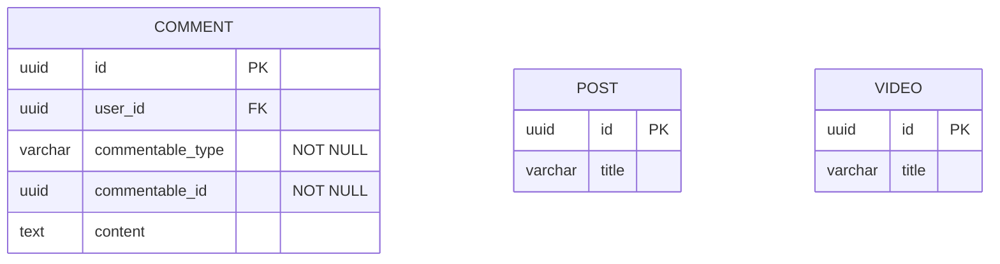
```mermaid
erDiagram
    COMMENT {
        uuid id PK
        uuid user_id FK
        varchar commentable_type "NOT NULL"
        uuid commentable_id "NOT NULL"
        text content
    }

    POST {
        uuid id PK
        varchar title
    }

    VIDEO {
        uuid id PK
        varchar title
    }
```


### Soft deletes

<!-- mermaid-render: id="common-patterns--block14" -->
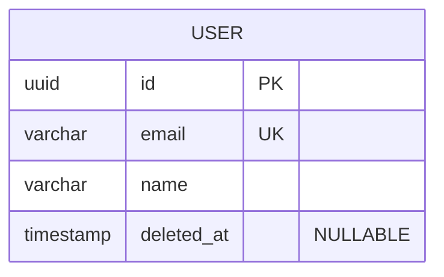
```mermaid
erDiagram
    USER {
        uuid id PK
        varchar email UK
        varchar name
        timestamp deleted_at "NULLABLE"
    }
```


### Audit trail

<!-- mermaid-render: id="common-patterns--block15" -->
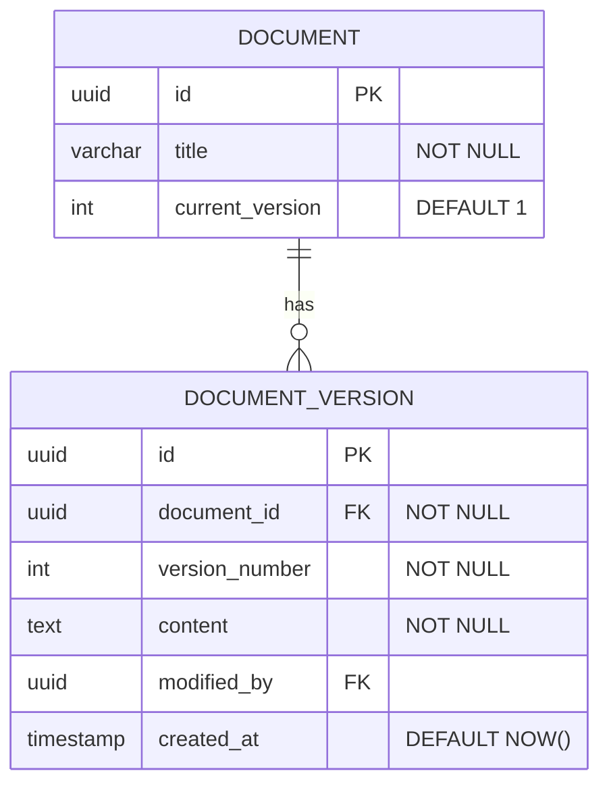
```mermaid
erDiagram
    DOCUMENT ||--o{ DOCUMENT_VERSION : has

    DOCUMENT {
        uuid id PK
        varchar title "NOT NULL"
        int current_version "DEFAULT 1"
    }

    DOCUMENT_VERSION {
        uuid id PK
        uuid document_id FK "NOT NULL"
        int version_number "NOT NULL"
        text content "NOT NULL"
        uuid modified_by FK
        timestamp created_at "DEFAULT NOW()"
    }
```


## State machine templates

### Order lifecycle

<!-- mermaid-render: id="common-patterns--block16" -->
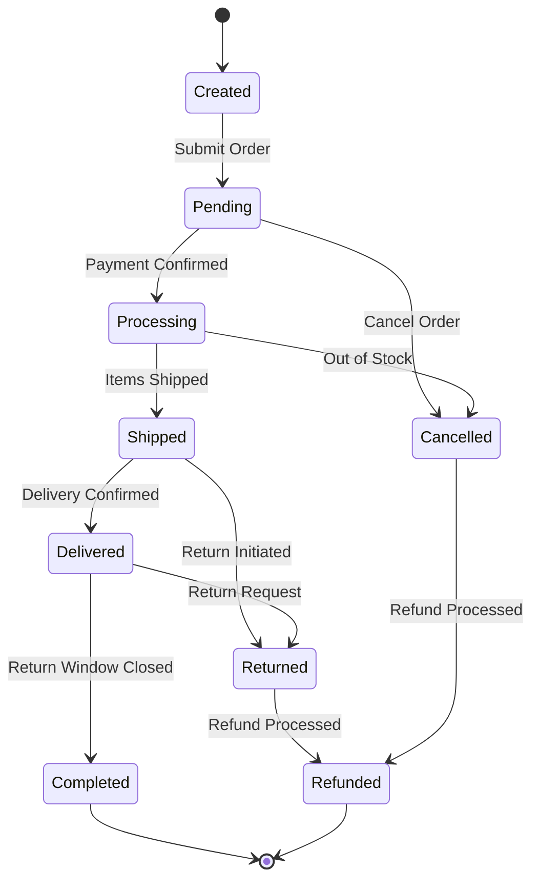
```mermaid
stateDiagram-v2
    [*] --> Created
    Created --> Pending : Submit Order
    Pending --> Processing : Payment Confirmed
    Pending --> Cancelled : Cancel Order

    Processing --> Shipped : Items Shipped
    Processing --> Cancelled : Out of Stock

    Shipped --> Delivered : Delivery Confirmed
    Shipped --> Returned : Return Initiated

    Delivered --> Returned : Return Request
    Delivered --> Completed : Return Window Closed

    Returned --> Refunded : Refund Processed
    Cancelled --> Refunded : Refund Processed

    Completed --> [*]
    Refunded --> [*]
```


### User account states

<!-- mermaid-render: id="common-patterns--block17" -->
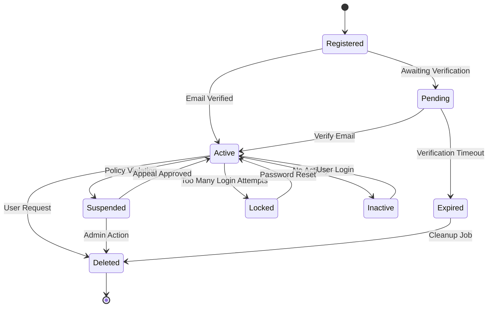
```mermaid
stateDiagram-v2
    [*] --> Registered
    Registered --> Active : Email Verified
    Registered --> Pending : Awaiting Verification

    Pending --> Active : Verify Email
    Pending --> Expired : Verification Timeout

    Active --> Suspended : Policy Violation
    Active --> Locked : Too Many Login Attempts
    Active --> Inactive : No Activity

    Suspended --> Active : Appeal Approved
    Locked --> Active : Password Reset
    Inactive --> Active : User Login

    Active --> Deleted : User Request
    Suspended --> Deleted : Admin Action
    Expired --> Deleted : Cleanup Job

    Deleted --> [*]
```


## Class diagram patterns

### Repository pattern

<!-- mermaid-render: id="common-patterns--block18" -->
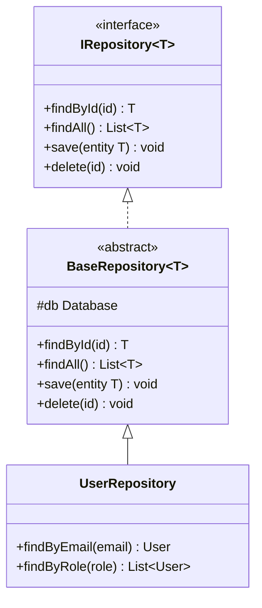
```mermaid
classDiagram
    class IRepository~T~ {
        <<interface>>
        +findById(id) T
        +findAll() List~T~
        +save(entity T) void
        +delete(id) void
    }

    class BaseRepository~T~ {
        <<abstract>>
        #db Database
        +findById(id) T
        +findAll() List~T~
        +save(entity T) void
        +delete(id) void
    }

    class UserRepository {
        +findByEmail(email) User
        +findByRole(role) List~User~
    }

    IRepository~T~ <|.. BaseRepository~T~
    BaseRepository~T~ <|-- UserRepository
```


### Strategy pattern

<!-- mermaid-render: id="common-patterns--block19" -->
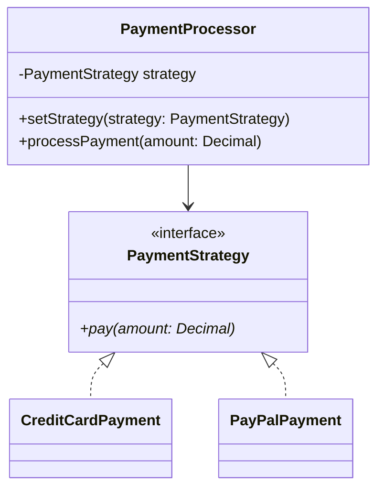
```mermaid
classDiagram
    class PaymentProcessor {
        -PaymentStrategy strategy
        +setStrategy(strategy: PaymentStrategy)
        +processPayment(amount: Decimal)
    }

    class PaymentStrategy {
        <<interface>>
        +pay(amount: Decimal)*
    }

    PaymentStrategy <|.. CreditCardPayment
    PaymentStrategy <|.. PayPalPayment
    PaymentProcessor --> PaymentStrategy
```


## Tips for using these templates

1. Customize names, entities, and relationships to the real system before publishing.
2. Simplify: remove nodes the diagram's point doesn't need.
3. Validate with `mmdc` after customizing (see `SKILL.md`).
4. Keep each diagram focused on one concept; split rather than merge.
