# Configuration and theming

Applies to every diagram type.
Config comes from three layers, applied in order: the default config,
a site-wide `initialize()` call (out of scope for a text-only agent),
and per-diagram frontmatter (the layer this skill uses).

## Frontmatter config

Put a YAML block at the top of the `.mmd` file or fenced code block:

<!-- mermaid-render: id="configuration--block1" -->
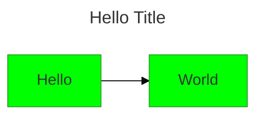

## Themes

Five built-in themes: `default`, `neutral` (good for print/black-and-white), `dark`, `forest`,
`base`.
**`base` is the only theme whose variables you can override** — use it whenever you need custom colors.

<!-- mermaid-render: id="configuration--block2" -->
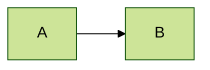


### Customizing with themeVariables

<!-- mermaid-render: id="configuration--block3" -->
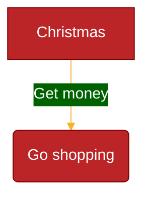

Mermaid only recognizes hex colors in theme variables, not named colors (`#ff0000` works,
`red` does not).
Many derived variables (`primaryBorderColor`, `secondaryColor`,
etc.) are calculated from `primaryColor` unless set explicitly.

Key global variables: `darkMode` (bool), `background`, `fontFamily`, `fontSize`, `primaryColor`,
`primaryTextColor`, `secondaryColor`, `tertiaryColor`, `lineColor`, `noteBkgColor`,
`noteTextColor`, `errorBkgColor`.
Diagram-specific variable groups exist for flowcharts (`nodeBorder`, `clusterBkg`, ...),
sequence diagrams (`actorBkg`, `signalColor`, ...), pie charts (`pie1`-`pie12`, `pieTitleTextSize`,
...), state diagrams, class diagrams, and user journeys (`fillType0`-`fillType7`).
When in doubt, override `primaryColor` and let the rest derive,
or look up the specific variable name for the diagram type you're styling.

## Directives (deprecated, prefer frontmatter)

Older diagrams may still use the `%%{init: {...}}%%` directive syntax instead of frontmatter `config:`.
It still works but frontmatter is preferred for new diagrams (from Mermaid v10.5.0+):

<!-- mermaid-render: id="configuration--block4" -->
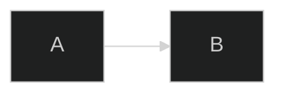

Directives apply general (`theme`, `fontFamily`, `logLevel`,
`securityLevel`) and diagram-specific (`flowchart.curve`, `sequence.mirrorActors`,
and similar) configuration.
Multiple `%%init%%`/`%%initialize%%` blocks are merged, later values win.

## Layout engines

| Layout | Best for |
|---|---|
| `dagre` (default) | Classic layered graphs, balanced default |
| `elk` | Larger/more complex flowcharts and ER diagrams where dagre produces crossed lines |
| `tidy-tree` | Hierarchical diagrams, primarily mindmaps |
| `cose-bilkent` | Force-directed graphs |

<!-- mermaid-render: id="configuration--block5" -->
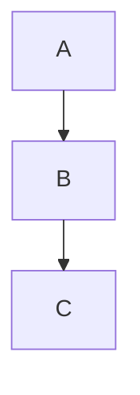

Architecture diagrams (`architecture-beta`) use their own fcose-based layout with separate tuning knobs (`nodeSeparation`,
`idealEdgeLengthMultiplier`, `edgeElasticity`, `numIter`, `seed`);
see `references/architecture-diagram.md`.

## Look

<!-- mermaid-render: id="configuration--block6" -->
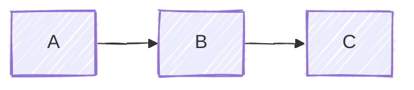


`look: classic` (default) is the traditional style; `look: handDrawn` is a sketch-like style.
Not every newer diagram type supports hand-drawn mode (railroad and Wardley maps, for instance,
don't).

## Math (KaTeX)

Surround an expression with `$$` inside a node or message label,
in flowcharts and sequence diagrams:

<!-- mermaid-render: id="configuration--block7" -->
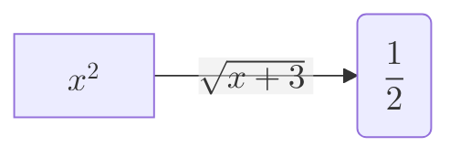

MathML is used by default.
Set `legacyMathML: true` (and supply KaTeX's own stylesheet) if a target renderer doesn't support MathML.

## Node/edge styling recap

These apply across most diagram types (flowchart, class, ER, state, block, treemap):

```
classDef className fill:#f9f,stroke:#333,stroke-width:4px
```

Apply with `id:::className` inline, or a trailing `class id1,id2 className` statement.
A class named `default` applies to every node without an explicit class.
See `references/style-standard.md` for the full palette convention and edge-ID styling used in this skill's canonical diagrams.

## Limits and safety

- `maxTextSize` (default 50000) and `maxEdges` (default 500) cap how large a diagram Mermaid will render at all;
  past these limits it fails silently or refuses to render rather than producing a garbled result.
  A diagram hitting either limit should be split, not force-rendered,
  consistent with the node-count guidance in `references/style-standard.md`.
- `securityLevel` controls how much of a diagram's text is trusted: `strict` (default,
  HTML-encodes labels, recommended for diagrams built from any external or user-supplied text),
  `loose` (allows some HTML in labels), `antiscript` (filters `<script>` but allows other HTML),
  `sandbox` (renders in an isolated iframe).
  Leave this at `strict` unless a specific diagram genuinely needs HTML labels.
- `deterministicIds: true` makes generated SVG element IDs reproducible across renders of the same source,
  useful when diagrams are rendered as part of a build and you want stable diffs.
- `htmlLabels` (default false) allows HTML inside node labels;
  leave off unless a label genuinely needs rich formatting a plain string can't express.

## Validating without a CLI

`mermaid.parse()` checks syntax without rendering,
for a JavaScript runtime with no shell access to run `mmdc`:

```javascript
import mermaid from 'mermaid'

try {
  await mermaid.parse(diagramSource)
  // valid
} catch (err) {
  // invalid, err.message has the parse error
}
```

`parse()` only checks grammar;
some errors surface only during the later render/layout step that it does not exercise.

**Note:** unverified whether this parse/render distinction (e.g. the packet contiguity check) holds across all Mermaid versions — confirm against the version in use if it matters for a specific diagram.

See `references/cli-usage.md` for CLI-based validation (`mmdc -i diagram.mmd -o /dev/null`).

## Rendering and exporting

This section covers config that affects rendering (frontmatter,
`themeVariables`) — see `references/embedding.md`'s non-browser rendering section for which platforms render Mermaid natively,
and `references/cli-usage.md` for CLI-based rendering and exporting (`mmdc -o file.svg`,
icon packs, and similar).
