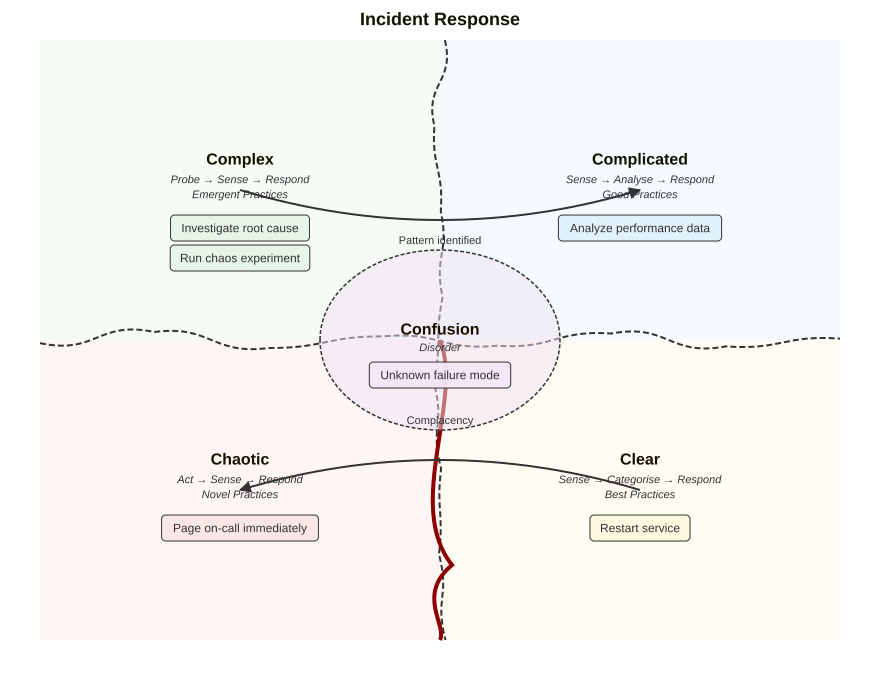

# Cynefin framework diagram

**Use for:** categorizing problems into Dave Snowden's five complexity domains, to help a team match its response style to the nature of a situation (incident response posture, strategy categorization). v11.16+, `cynefin-beta`.
**Avoid for:** happy-path architecture or anything that isn't fundamentally a sense-making/decision-framework exercise.

## The five domains

- **Clear** (formerly Obvious/Simple): cause and effect are obvious. Sense → Categorise → Respond. Apply best practices.
- **Complicated**: cause and effect need analysis or expertise. Sense → Analyse → Respond. Apply good practices.
- **Complex**: cause and effect are only clear in retrospect. Probe → Sense → Respond. Apply emergent practices.
- **Chaotic**: no perceivable cause and effect. Act → Sense → Respond. Apply novel practices.
- **Confusion/Disorder**: the domain itself is unclear; the goal is to move items out of this state into one of the other four.

Signature visual: a wavy organic boundary between the ordered half (Clear, Complicated) and unordered half (Complex, Chaotic), plus a "cliff" between Clear and Chaotic representing complacency risk.

## Core syntax

<!-- mermaid-render: id="cynefin--block1" -->
```mermaid
cynefin-beta
  title Incident Response

  complex
    "Investigate root cause"
    "Run chaos experiment"

  complicated
    "Analyze performance data"

  clear
    "Restart service"

  chaotic
    "Page on-call immediately"

  confusion
    "Unknown failure mode"

  complex --> complicated : "Pattern identified"
  clear --> chaotic : "Complacency"
```


- Domain keywords (`complex`, `complicated`, `clear`, `chaotic`, `confusion`) are fixed and can appear in any order; their screen position is always the same regardless of declaration order (Complex top-left, Complicated top-right, Chaotic bottom-left, Clear bottom-right, Confusion center).
- Items are quoted strings on their own line inside a domain block.
- `-->` between two domain names (with an optional quoted label) declares a transition representing movement of items over time. Self-loops are silently ignored.
- Domains render even with zero items, useful as a blank worksheet template.

## Common transitions

Complex → Complicated (a pattern becomes understood enough to analyze), Chaotic → Complex (a crisis stabilizes enough to probe), Clear → Chaotic (the cliff: complacency causes collapse), Complicated → Clear (analysis codifies a standard practice).

## Configuration

`config.cynefin` covers `width`/`height`/`padding`, `showDomainDescriptions` (per-domain subtitle), and `boundaryAmplitude`/`seed` for the wavy boundary rendering (deterministic by default, same input always renders the same). Theming lives under `themeVariables.cynefin` (`complexBg`, `complicatedBg`, `clearBg`, `chaoticBg`, `confusionBg`, `boundaryColor`, `cliffColor`, `arrowColor`, and text/font variables).

## Common pitfalls

- The `confusion` domain caps its visible items at 3 with a `+N more` overflow badge; keep it deliberately sparse, its purpose is surfacing unknowns to move elsewhere, not housing a long list.
- Hand-drawn mode is not supported.
