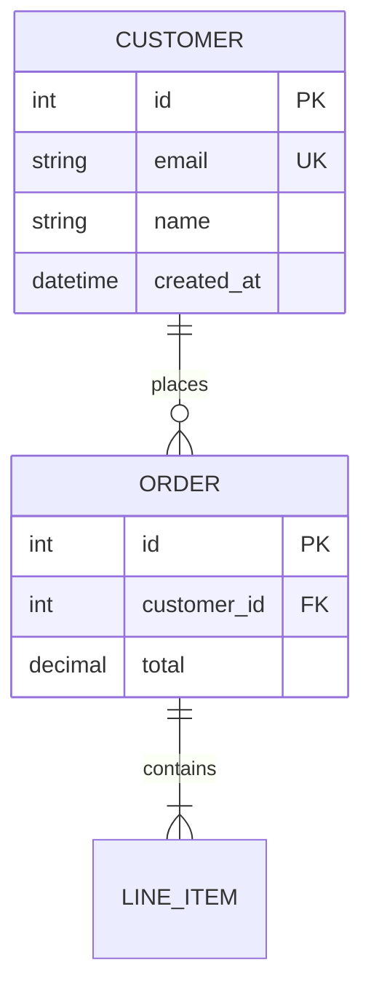
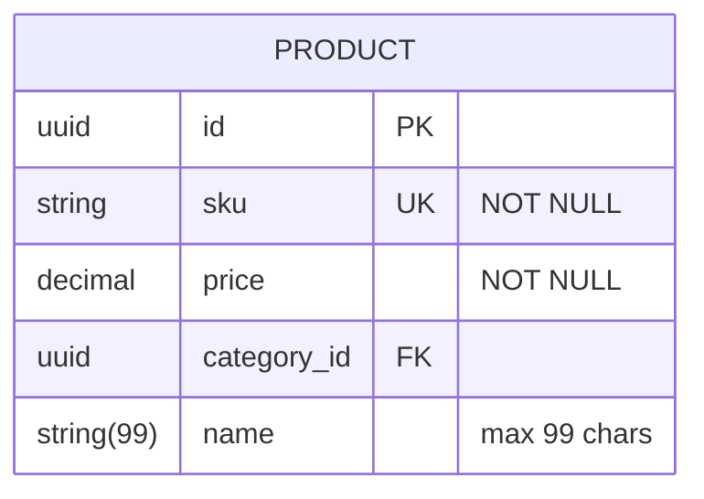
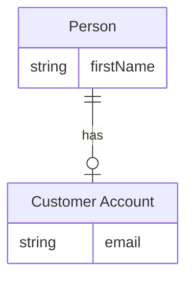
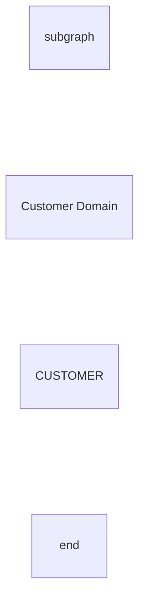

# Entity relationship diagram (ERD)

**Use for:** database schemas, table relationships, data modeling, both abstract logical models and physical relational-table models.
**Avoid for:** non-database flows or a non-technical audience (use a birds-eye flowchart).

## Core syntax

<!-- mermaid-render: id="erd--block1" -->

Only the first entity in a statement is mandatory, letting you declare a bare entity (`CUSTOMER`) with no relationship, useful while iterating. Entity names conventionally use UPPERCASE and singular nouns (`CUSTOMER` not `CUSTOMERS`).

## Cardinality

Each side of a relationship has an outer character (maximum) and inner character (minimum):

| Left | Right | Meaning |
|---|---|---|
| `\|o` | `o\|` | Zero or one |
| `\|\|` | `\|\|` | Exactly one |
| `}o` | `o{` | Zero or more |
| `}\|` | `\|{` | One or more |

Combine for the common cases: `||--o{` (one-to-many), `||--||` (one-to-one), `}o--o{` (many-to-many). English aliases also work (`CAR 1 to zero or more NAMED-DRIVER : allows`).

Line style carries meaning too: `--` (solid) is an *identifying* relationship (the child can't exist without the parent); `..` (dashed) is *non-identifying* (both can exist independently).

## Attributes and keys

<!-- mermaid-render: id="erd--block2" -->

Attribute format is `type name [key] ["comment"]`. Keys: `PK` (primary), `FK` (foreign), `UK` (unique); combine with a comma (`PK, FK`). A trailing quoted string is a free-form comment/constraint note. Optional/nullable types can end in `?` (`string? middleName`, v11.16+).

## Aliases, unicode, markdown

<!-- mermaid-render: id="erd--block3" -->

Square-bracket aliases display a friendlier name than the internal identifier. Entity names, relationships, and attributes support unicode and basic markdown formatting when quoted.

## Direction, subgraphs, styling

<!-- mermaid-render: id="erd--block4" -->

`direction` sets `TB`/`BT`/`LR`/`RL`. Subgraphs (v11+) group entities and can be nested; reference a subgraph by its `id`, quoting it if it contains spaces. `style`/`classDef`/`class`/`:::` styling works the same as flowcharts.

## Common pitfalls

- Omit FK attributes in a purely logical model (relationship lines already convey the association); include them in a model meant to mirror physical tables.
- Junction/many-to-many relationships are clearer modeled explicitly with a join entity (see `common-patterns.md`) than left as a bare `}o--o{`.
- Match attribute types to the real database's types, not generic placeholders, when documenting an actual schema.

## Common patterns

See `common-patterns.md` for self-referencing (hierarchical), junction-table, polymorphic, soft-delete, and audit-trail ER shapes.
