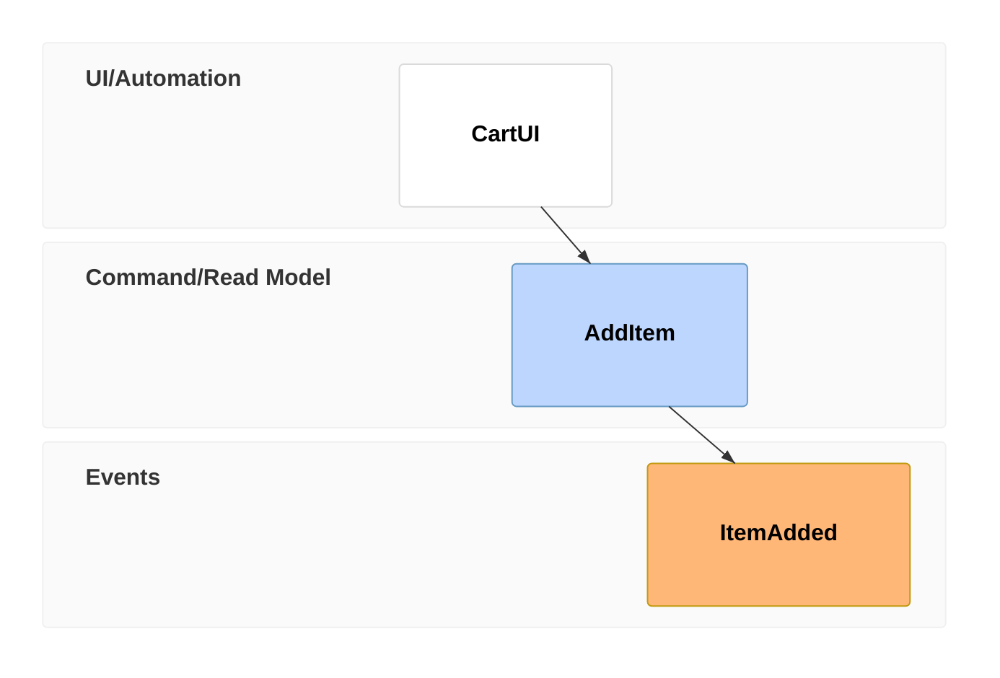
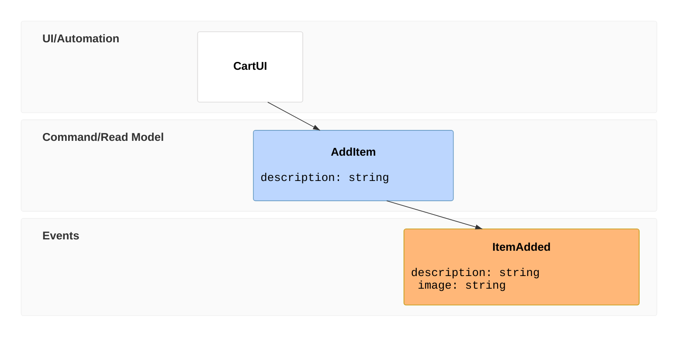

# Event modeling diagram

**Use for:** DDD-style Event Modeling, describing a system by how information changes over time (UI/trigger → command → event → read model), organized into swimlanes on a timeline. v11.15+.
**Avoid for:** a generic sequence of calls with no event-sourcing angle, use `sequence-diagram.md` instead.

## Core entities

- **Trigger** (UI or Processor/automation)
- **Command**
- **View / Read Model**
- **Event**

## Core syntax (compact notation)

<!-- mermaid-render: id="event-modeling--block1" -->

Each line is a **Time Frame**: `tf <unique-number> <entity-type> <EntityIdentifier>`. The number just needs to be unique in the timeline, order of appearance doesn't matter, ordering on the diagram follows the numbers. The relaxed (more verbose) notation uses `timeframe` instead of `tf`, and full type names (`command` instead of `cmd`, `event` instead of `evt`, `ui` stays `ui`, `processor` instead of `pcr`, `readmodel` instead of `rmo`).

## Entity types and swimlanes

| Compact | Relaxed | Swimlane |
|---|---|---|
| `ui` | `ui` | UI/Automation |
| `pcr` | `processor` | UI/Automation |
| `cmd` | `command` | Command/Read Model |
| `rmo` | `readmodel` | Command/Read Model |
| `evt` | `event` | Events |

A **Namespace** prefix on an entity id (`Inventory.InventoryChanged`) creates additional swimlanes beyond the three defaults, one per namespace+type combination, ordered by first appearance in the text.

## Inline data and data blocks

<!-- mermaid-render: id="event-modeling--block2" -->

Small examples go inline in `{ }` right after the time frame. Larger or reused shapes go in a separate `data <name> { ... }` block, referenced from the time frame via `[[name]]` (wiki-link style). A data value or block can be prefixed with a type in backticks (`` `json`{ ... } ``); supported types are `json`, `jsobj`, `figma`, `salt`, `uri`, `md`, `html`, `text` (cosmetic only, no special rendering per type).

## Resetting the flow and multiple relations

`rf`/`resetframe` breaks the default inference between adjacent time frames, needed whenever the next entity isn't a natural continuation of the previous one (e.g. an externally-triggered event). `->>` chains a read model to multiple upstream events explicitly: `tf 01 rmo CartUI ->> 02 ->> 03`.

## The three named patterns

- **State Change:** `ui → command → event` (a user action produces a fact).
- **State View:** `event → read model → ui` (a fact is projected into something the user sees).
- **Translation:** `event → processor → command → event` (one system's fact triggers another's command).
