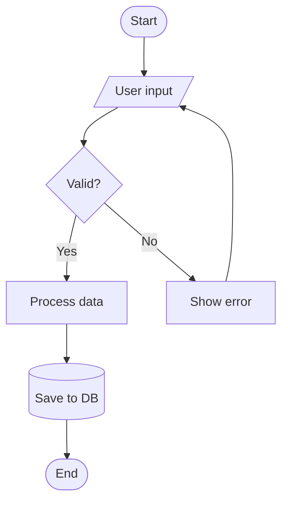
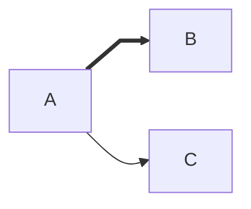
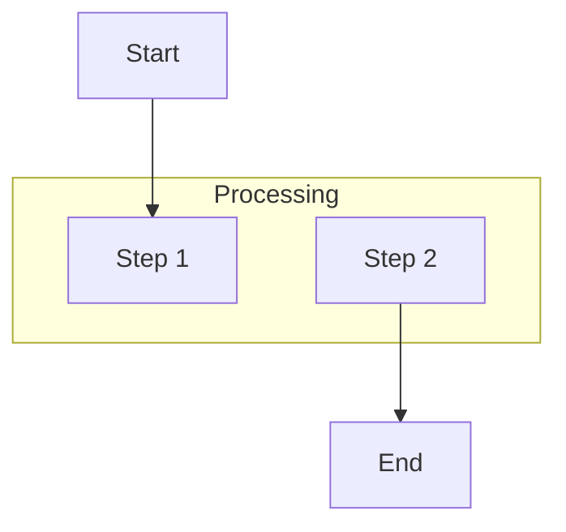
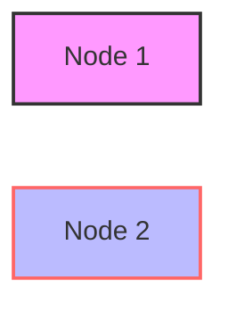

# Flowchart

**Use for:** processes, algorithms, decision trees, control flow, deployment pipelines, birds-eye system overviews.
**Avoid for:** a single short call chain over time (use `sequenceDiagram`), pure schema (use `erDiagram`), or anything where "who owns this step" matters more than sequence (use `swimlanes`, see `swimlanes.md`).

## Core syntax

<!-- mermaid-render: id="flowchart--block1" -->

Directions: `TD`/`TB` (top-down, default), `BT` (bottom-up), `LR` (left-right), `RL` (right-left). `graph` is an accepted alias for `flowchart`.

## Node shapes

| Syntax | Shape | Typical use |
|---|---|---|
| `id[Text]` | Rectangle | Process step |
| `id([Text])` | Stadium/pill | Start/end |
| `id(Text)` | Rounded rectangle | Step or event |
| `id{Text}` | Rhombus | Decision |
| `id{{Text}}` | Hexagon | Preparation/condition |
| `id[[Text]]` | Subroutine (double border) | Predefined process |
| `id[(Text)]` | Cylinder | Database |
| `id((Text))` | Circle | Connector |
| `id(((Text)))` | Double circle | Terminal/stop marker |
| `id>Text]` | Asymmetric/flag | Special marker |
| `id[/Text/]` | Parallelogram | Input/output |
| `id[\Text\]` | Parallelogram (alt) | Output/input |
| `id[/Text\]` | Trapezoid | Manual operation |
| `id[\Text/]` | Trapezoid (alt) | Priority action |

Mermaid v11.3+ also supports a generic shape syntax with ~40 additional named shapes (`A@{ shape: manual-input, label: "..." }`, `A@{ shape: doc, label: "..." }`, and more), plus `icon` and `image` shapes for embedding icons/images in a node. Use the classic bracket shapes above for anything portable; reach for `@{ shape: ... }` only when a target renderer is confirmed to support v11.3+.

## Connections

| Syntax | Meaning |
|---|---|
| `A --> B` | Arrow |
| `A --- B` | Line, no arrow |
| `A -.-> B` | Dotted arrow |
| `A ==> B` | Thick arrow |
| `A ~~~ B` | Invisible link (layout hint only) |
| `A --o B` | Circle-ended edge |
| `A --x B` | Cross-ended edge |
| `A <--> B` | Bidirectional |
| `A -->|text| B` or `A -- text --> B` | Labeled arrow |

Chain multiple links on one line: `A --> B --> C`. Fan patterns: `A --> B & C`, `A & B --> C`. Don't overuse this for anything that needs per-edge styling; see the "split compound edges" section in `style-standard.md`.

Extra dashes lengthen an edge across ranks: `---->` spans further than `-->`. Same pattern applies to thick (`=`) and dotted (`.`) edges.

### Edge IDs (v11.10+)

Prepend an ID before the arrow: `A e1@--> B`. This lets you style or animate one edge by identity instead of by definition-order index (which `linkStyle` uses). See `style-standard.md` for the full edge-ID and palette convention this skill standardizes on.

<!-- mermaid-render: id="flowchart--block2" -->

## Subgraphs

<!-- mermaid-render: id="flowchart--block3" -->

Give a subgraph an explicit id with `subgraph id [Title]`. Set a subgraph's own direction with `direction TB` as its first line; that direction is ignored if any node inside links directly to a node outside the subgraph (the subgraph then inherits the parent's direction). Edges to/from a subgraph as a whole are allowed (`one --> two` where `one`/`two` are subgraph ids).

A subgraph can be collapsed into a single node with `id@{ view: collapsed }`, useful for hiding internals while keeping cross-boundary edges visible.

## Styling

<!-- mermaid-render: id="flowchart--block4" -->

- `classDef name <css props>` defines a reusable style; apply with `id:::name` inline or `class id1,id2 name` afterward. **Declare all `classDef`s before nodes and edges** (this skill's convention; also easier to scan).
- `style id <css props>` styles one node directly.
- `linkStyle N <css props>` styles the Nth edge by definition order (fragile, fallback only, see `style-standard.md`).
- A class named `default` applies to every unstyled node.

## Markdown labels, fontawesome icons, click events

- Markdown-formatted text in a label: `` id["`**bold** and _italic_`"] `` (needs double quotes + backticks). Auto-wraps long text; disable with `markdownAutoWrap: false` in config.
- Font Awesome icon: `` B["fa:fa-twitter some text"] `` (requires the FA CSS or icon pack registered on the render target).
- Click events (disabled under `securityLevel: strict`): `click nodeId "https://example.com" "tooltip"` or `click nodeId call callback()`.

## Common pitfalls

- **The word "end"** (all lowercase) as a node id or bare text breaks the parser. Capitalize it (`End`, `END`) or wrap it (`(end)`, `[end]`).
- A node id starting with lowercase `o` or `x` right before `---` can be parsed as a circle/cross edge (`A---oB`). Add a space or capitalize.
- Labels containing `()`, `{}`, `"`, or other punctuation need double quotes: `id1["This is the (text) in the box"]`.
- Comments use `%%` on their own line, and anything after `%%` on that line is ignored, including diagram syntax, so don't put a real link on the same line as a comment.
- External CSS selectors targeting Mermaid's rendered SVG classes don't reliably override its inline `!important` styles; use `classDef`/`style` instead.

## Common patterns

See `common-patterns.md` for feature-flow, bug-workflow, CI/CD, microservices, and layered-architecture flowchart templates.
