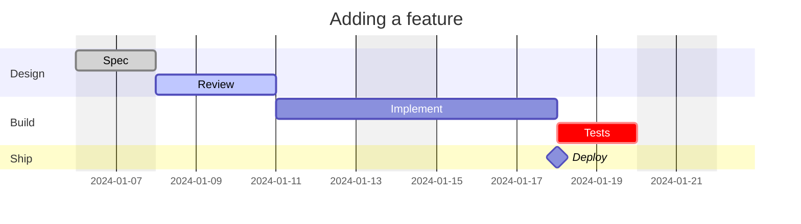
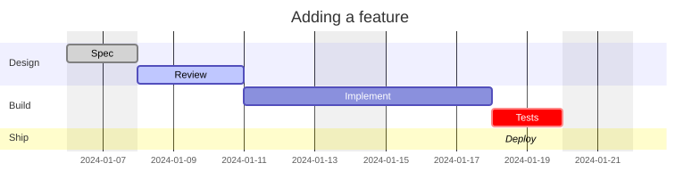

# Gantt chart

**Use for:** project timelines, release/migration schedules, task dependencies over calendar time.
**Avoid for:** runtime behavior (use a sequence diagram or flowchart).

## Core syntax

<!-- mermaid-render: id="gantt--block1" -->

A colon separates the task title from its metadata; metadata items are comma-separated. Optional tags (`done`, `active`, `crit`, `milestone`) must come first if used. After tags, remaining items are: end date/duration alone; or start (`after <taskId>` or an explicit date) + end; or `<taskId>, start, end` for a task you'll reference later.

## Duration units

`ms`, `s`, `m`, `h`, `d`, `w`, `M`, `y` (e.g. `3d`, `1.5w`). Decimal durations are supported.

## Dates and excludes

- `dateFormat` sets the input format (default `YYYY-MM-DD`); `axisFormat` sets the rendered output format (`%Y-%m-%d` style tokens).
- `excludes weekends` (or explicit dates, or a weekday name) skips those dates from duration calculations, extending the task rather than leaving a visual gap. Multiple `excludes` lines concatenate.
- `weekend friday` changes which two days count as the weekend (default Saturday/Sunday).
- `tickInterval 1week` (optionally with `weekday monday`) controls axis tick spacing.

## Sections, milestones, vertical markers

- `section <name>` groups subsequent tasks visually and starts a new color band.
- `milestone` tags a zero-duration point in time.
- `vert` (a vertical marker, no row) highlights a date like a deadline without occupying a task row.

## Display and styling

- `displayMode: compact` (set in YAML frontmatter or inline) packs multiple tasks per row.
- `todayMarker stroke-width:5px,stroke:#0f0,opacity:0.5` styles the current-date line; `todayMarker off` hides it.
- Click interactions: `click taskId call callback(args)` or `click taskId href URL` (disabled under `securityLevel: strict`).

## Common pitfalls

- Tasks are sequential by default: a task with no explicit start date begins where the previous task ended.
- `until <otherTaskId>` sets an end date equal to another task's *start*, useful for "runs until X begins."
- A malformed duration token (e.g. `3dX`) is silently ignored and the task gets zero duration; validate rendered output if a task looks collapsed.
