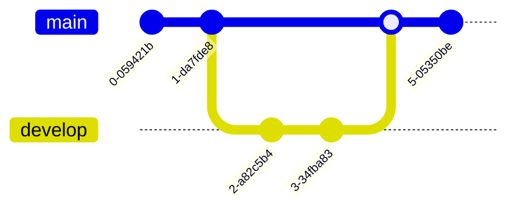

# Git graph

**Use for:** documenting a git branching/merging strategy, release flow,
or history of a specific incident's commits.
**Avoid for:** deployment topology (use an architecture or C4 deployment diagram instead).

## Core syntax

<!-- mermaid-render: id="gitgraph--block1" -->



Every gitgraph starts on an implicit `main` branch.
`checkout` and `switch` are interchangeable.
Commits, by default, get a random id; branches, by default, are drawn in order of first appearance.

## Commit options

```
commit id: "Alpha" type: NORMAL tag: "v1.0.0"
```

- `id:` sets a custom commit id (needed if the commit will be referenced later,
  e.g. via `cherry-pick`).
- `type:` is `NORMAL` (default, solid circle), `REVERSE` (crossed circle),
  or `HIGHLIGHT` (filled rectangle).
- `tag:` decorates the commit like a release tag.

## Branch, merge, cherry-pick

```
branch develop order: 2
merge develop id: "customID" tag: "customTag" type: REVERSE
cherry-pick id: "MERGE" parent: "B"
```

- `branch <name>` creates and checks out a new branch;
  quote the name if it could be confused with a keyword.
- `merge <name>` joins another branch's head into the current branch,
  producing a merge commit (filled double circle);
  accepts the same `id`/`tag`/`type` decorations as `commit`.
- `cherry-pick id: "<id>"` copies a commit from another branch onto the current one;
  the source commit must exist, must not already be on the current branch,
  and the current branch must have at least one commit.
  Cherry-picking a merge commit requires a `parent:` argument identifying which parent to pick from.
- `order: N` on a `branch` statement controls left-to-right/vertical ordering (main defaults to `order: 0`,
  overridable via `mainBranchOrder` in config).

## Configuration highlights

Set under `config.gitGraph` in frontmatter:

| Option | Effect |
|---|---|
| `showBranches` | Hide branch names/lines when `false` |
| `showCommitLabel` | Hide commit labels when `false` |
| `mainBranchName` | Rename the default branch |
| `mainBranchOrder` | Reposition the main branch among others |
| `parallelCommits` | Render same-distance commits at the same visual level instead of by strict temporal offset |
| `rotateCommitLabel` | `true` (default) rotates labels 45°; `false` renders them horizontally, better for short labels |

Orientation: `gitGraph LR:` (default), `gitGraph TB:`,
or `gitGraph BT:` (v10.3+/v11+) after the keyword.

## Theming

Branch colors: `git0`-`git7` theme variables (cyclic past 8 branches); branch label colors:
`gitBranchLabel0`-`gitBranchLabel7`; commit label color/background:
`commitLabelColor`/`commitLabelBackground`; tag styling:
`tagLabelColor`/`tagLabelBackground`/`tagLabelBorder`; highlighted-commit color per branch:
`gitInv0`-`gitInv7`.
