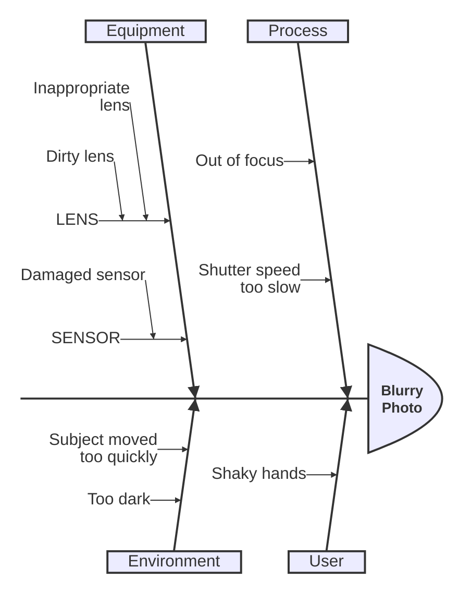
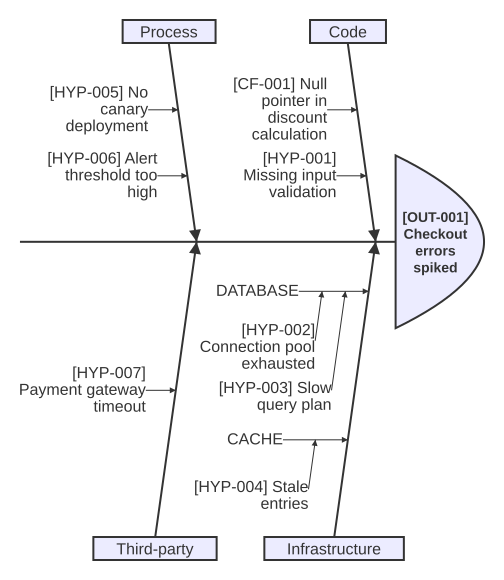

# Ishikawa diagram

**Use for:** root-cause analysis of a specific event or problem (also called a fishbone,
herringbone, or cause-and-effect diagram). v11.12+, `ishikawa-beta`.
**Avoid for:** happy-path architecture,
or root causes that don't naturally group into a handful of categories.

**Experimental:** this is a new diagram type; its syntax may still evolve,
confirm render support before relying on it in a canonical doc.

## Core syntax

<!-- mermaid-render: id="ishikawa--block1" -->

- The first line (no indentation) is the event/problem, drawn at the fish's head.
- Each subsequent top-level indented line is a cause category,
  forming one "bone" branching off the spine.
- Deeper indentation nests sub-causes under a category, to any depth.

## Common pitfalls

- Keep category counts modest (4-6 is typical);
  an ishikawa diagram with too many top-level bones becomes as unreadable as an overcrowded flowchart.
