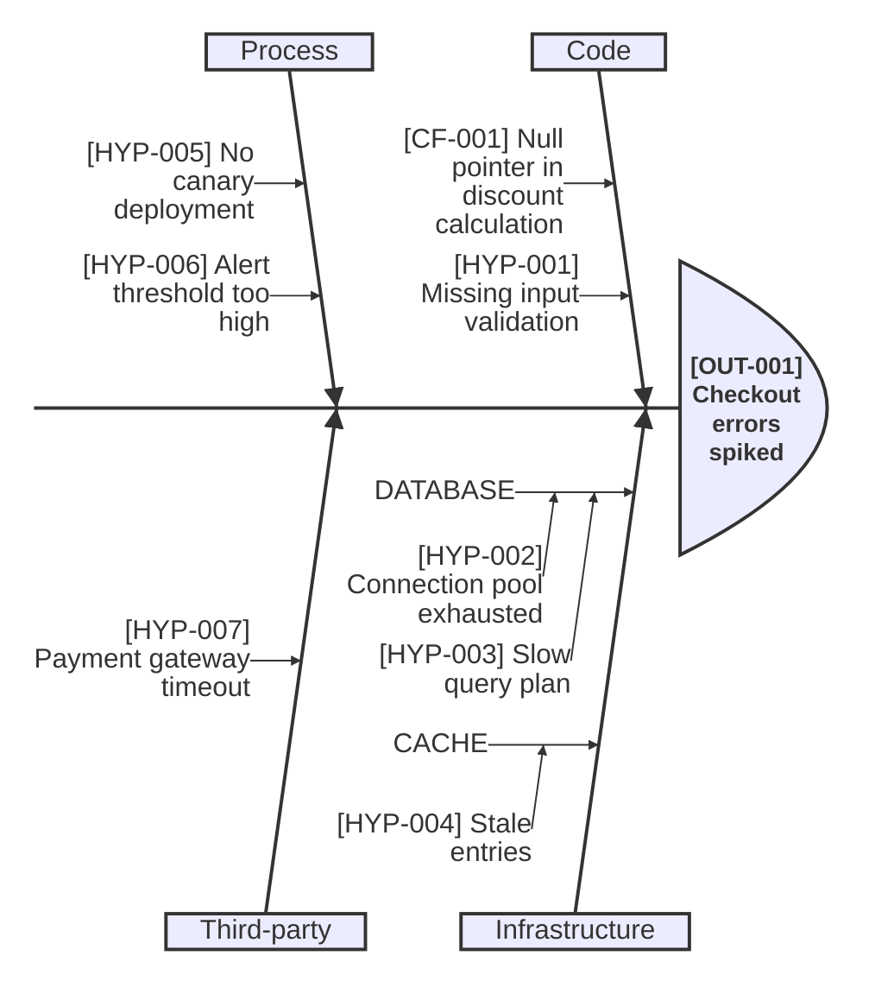

# Ishikawa diagram

An Ishikawa or fishbone diagram organizes candidate or evidence-supported contributing factors around a defined outcome.
Inclusion in the diagram does not prove causation.
Label unsupported candidates as hypotheses and keep stable claim or hypothesis IDs in labels when the diagram belongs to a causal analysis or RCA record.
Category bones group factors and carry no ID, because a category is not a claim.

Use the diagram to answer "Which factors should the reader compare or investigate?"
It does not encode temporal order, causal strength, sufficiency, or interaction.
Use a timeline for chronology, an evidence-backed flowchart for supported causal links, or a fault-tree flowchart for explicit AND/OR combinations.

`ishikawa-beta` requires Mermaid 11.12.3 or newer and remains experimental.
Validate it against the target renderer before using it in a canonical document.
A diagram set that combines Ishikawa with timelines, causal flowcharts, or fault-tree flowcharts uses Mermaid 11.16 as its compatibility floor.

**Use for:** organizing candidate or evidence-supported contributing factors for a specific event or problem.
The type is also called a fishbone, herringbone, or cause-and-effect diagram.
Mermaid 11.12.3 and newer use `ishikawa-beta`.
**Avoid for:** happy-path architecture,
or factors that don't naturally group into a handful of categories.

**Experimental:** this is a new diagram type; its syntax may still evolve,
confirm render support before relying on it in a canonical doc.

## Core syntax

<!-- mermaid-render: id="ishikawa--block1" -->

- The first line (no indentation) is the event/problem, drawn at the fish's head.
- Each subsequent top-level indented line is a candidate-factor category,
  forming one "bone" branching off the spine.
- Deeper indentation nests candidate factors under a category, to any depth.
  Test each candidate outside the diagram before calling it causal.

## Common pitfalls

- Keep category counts modest (4-6 is typical);
  an ishikawa diagram with too many top-level bones becomes as unreadable as an overcrowded flowchart.
- Keep category labels to one or two short words.
  The layout alternates categories above and below the spine and spaces the bones by their leaf text, not by the category box, so a long category label collides with its neighbour.
  In these renders, some neighbouring category labels of 15 to 32 characters overlapped; none of 14 characters or fewer did.
- Keep consecutive leaf labels on the same bone from both running long.
  Leaf text wraps at a fixed width, and the gap between leaves does not grow with the number of wrapped lines, so a long leaf prints over the next one.
  Pairs whose first label ran 66 to 69 characters, claim ID included, overprinted; pairs led by labels of 57 characters or fewer rendered cleanly.
  Shorten the earlier label of a colliding pair.
- A larger output size does not fix an overlap.
  `--size` and `--scale` enlarge the finished layout, so the overlap grows with it.
- Render the diagram and look at it before relying on it.
  A clean parse does not mean a clean layout.

These layout limits were observed with Mermaid CLI 11.16.0 and 12.0.0 on Windows 11 Home build 26200 on 2026-09-26.
