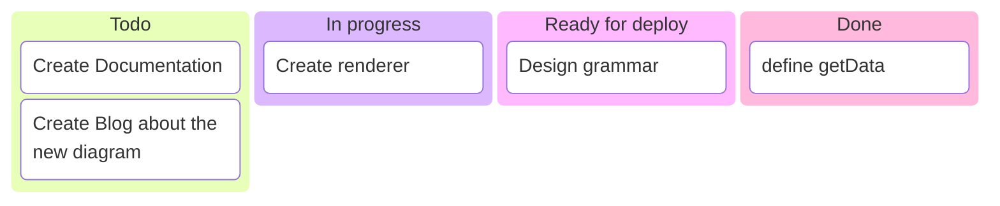
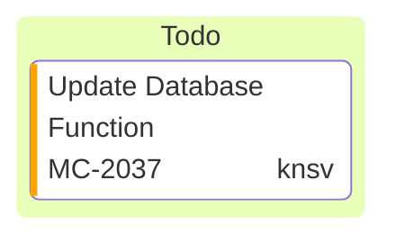
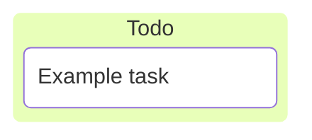

# Kanban

**Use for:** a task board across workflow stages (Todo/In Progress/Done), lightweight project-status snapshots.
**Avoid for:** anything needing dependency arrows or dates (use `gantt.md`).

## Core syntax

<!-- mermaid-render: id="kanban--block1" -->

- A column is `columnId[Column Title]` (or a bare word if the id and title are the same single word).
- A task is indented under its column: `taskId[Task description]`.
- Both columns and tasks need unique identifiers within the diagram.

## Task metadata

<!-- mermaid-render: id="kanban--block2" -->

Metadata is a `@{ key: value, ... }` block after a task. Supported keys: `assigned` (who owns it), `ticket` (an issue/ticket reference), `priority` (`'Very High'`, `'High'`, `'Low'`, `'Very Low'`).

## Configuration

<!-- mermaid-render: id="kanban--block3" -->

When a task has an `assigned` ticket, `ticketBaseUrl` turns the rendered ticket number into a link, with `#TICKET#` substituted for the task's ticket value.
A frontmatter block always needs an actual diagram body after its closing `---`; frontmatter alone is not a valid diagram.

## Common pitfalls

- Proper indentation is what assigns a task to its column; a mis-indented task silently attaches to the wrong (or no) column.
- Reusing a task id across columns (as in the metadata example's `id3`) is allowed by the parser but confusing to read; prefer unique ids throughout.
