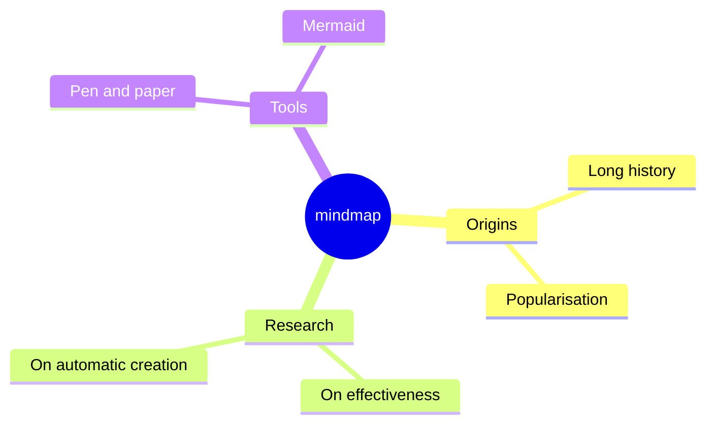
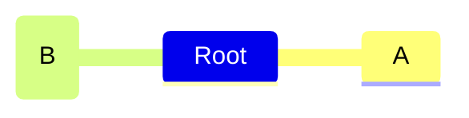

# Mindmap

**Use for:** hierarchical brainstorms, knowledge maps, a folder/topic tree radiating from one central concept.
**Avoid for:** runtime data flow or anything with cross-links (a mindmap is a strict tree, not a graph).

**Experimental:** Mermaid marks mindmap as experimental; the icon-integration syntax in particular may still change.

## Core syntax

Indentation defines the hierarchy, no explicit edges:

<!-- mermaid-render: id="mindmap--block1" -->

If indentation is ambiguous (a line's indent doesn't clearly match an ancestor's), Mermaid resolves it against the nearest smaller-indented ancestor, so keep indentation consistent to avoid surprises.

## Node shapes

Shapes mirror a subset of flowchart shapes: `id[Square]`, `id(Rounded square)`, `id((Circle))`, `id))Bang((`, `id)Cloud(`, `id{{Hexagon}}`, or bare text for the default shape.

## Icons and classes

<!-- mermaid-render: id="mindmap--block2" -->

`::icon(...)` attaches a font icon to the preceding node (the icon font must be registered by the site/renderer). `:::class1 class2` attaches CSS classes the same way flowcharts do, space-separated for multiple classes.

## Markdown strings and layout

Markdown-formatted labels (`` id1["`**bold** text`"] ``) support bold/italic and auto-wrap long text. For large mindmaps, `layout: tidy-tree` in config produces a cleaner non-overlapping tree than the default layout, see `configuration.md`.

## Common pitfalls

- A mindmap has no cross-links between branches; if you need that, use a flowchart instead.
- Because it's marked experimental, confirm render support on the target platform before relying on it in a canonical doc.
