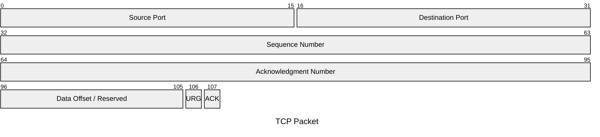
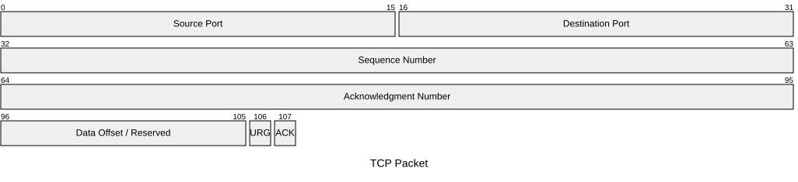
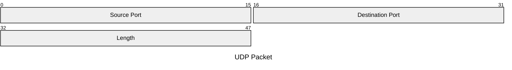

# Packet diagram

**Use for:** documenting the byte/bit-level structure of a network packet or binary format (v11.0+).
**Avoid for:** anything above byte-level exactness, this is the deepest rung (L4) of the detail-level ladder in `style-standard.md`.

## Core syntax

<!-- mermaid-render: id="packet-diagram--block1" -->

Each line after the title is one field: a bit range (`start-end`) or a single bit position, followed by a colon and a quoted description.
Fields must be contiguous, covering every bit from 0 with no gaps; a jump straight from `32-63` to `106` fails to render.

## Auto-incrementing bit counts (v11.7+)

<!-- mermaid-render: id="packet-diagram--block2" -->

`+<count>` sets a field's width in bits, automatically starting where the previous field ended. Mixing `+count` and manual `start-end` ranges on different lines is fine.

## Configuration

See the packet-diagram config schema for `showBits` and related options if the target renderer's config docs are available; theme variables for packet diagrams (byte/label/title colors) are documented as diagram-specific.

## Common pitfalls

**Note:** theme variables for packet diagrams have had rendering bugs in some Mermaid versions; verify visually rather than assuming they apply.
