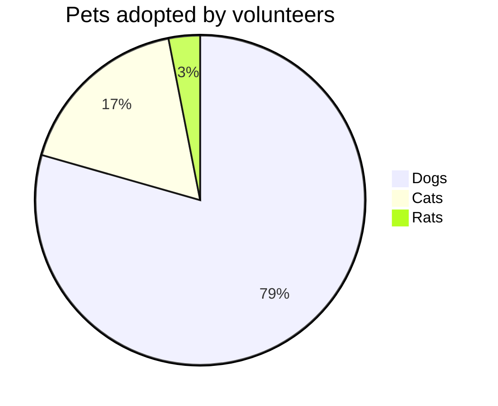
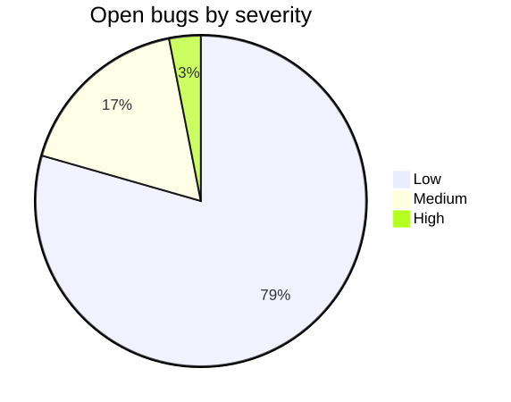
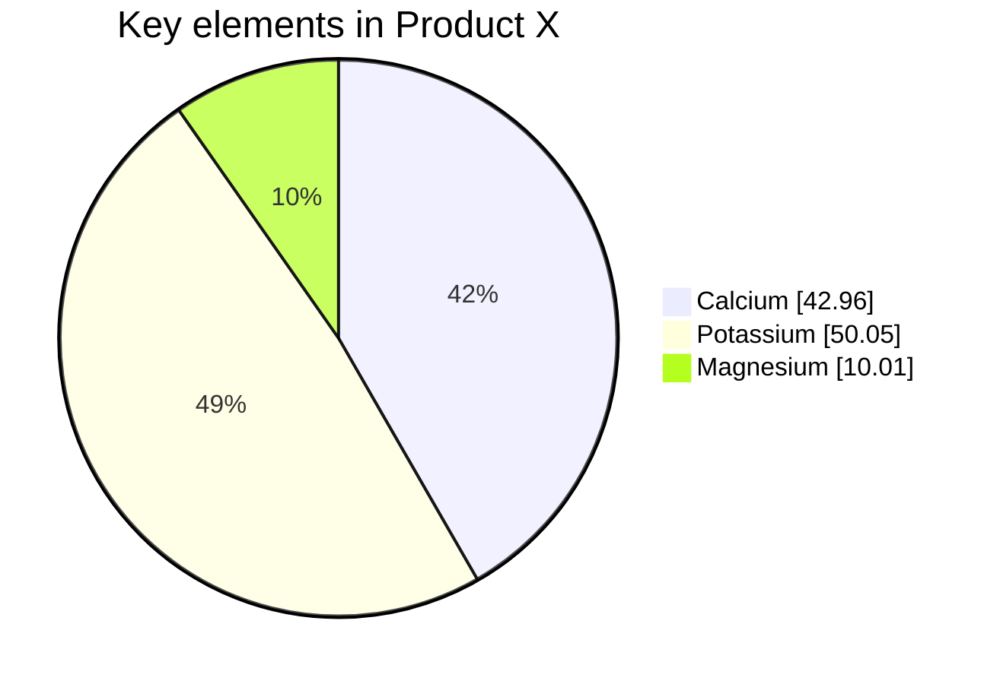
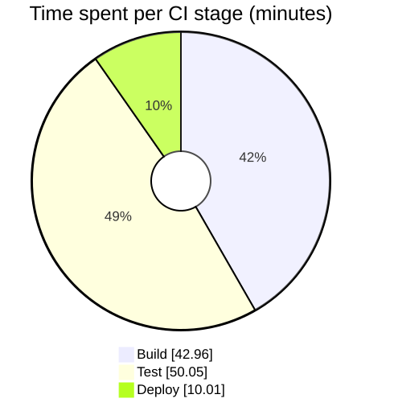

# Pie chart

**Use for:** proportions of a whole, share of volume, simple distribution comparisons.
**Avoid for:** exact routing logic,
or more than a handful of categories (a bar/xychart reads better past 5-6 slices).

## Core syntax

<!-- mermaid-render: id="pie-chart--block1" -->

- `pie` starts the diagram; `showData` (optional) renders the numeric value after each legend label.
- `title` is optional.
- Each data row is `"label" : value`;
  values must be **positive numbers greater than zero** (up to two decimal places).
  Negative values error.
- Slices render clockwise in the order labels are listed.

## Donut mode and legend position (v11.16+)

<!-- mermaid-render: id="pie-chart--block2" -->

- `donutHole` (0-0.9) turns the pie into a donut.
- `legendPosition`: `top`, `bottom`, `left`, `right`, `center`.
- `highlightSlice`: highlight one slice by matching label,
  or `'hover'` to highlight whichever is hovered.
- `textPosition` (0.0 center to 1.0 edge) moves slice labels radially.

## Theming

`pie1` through `pie12` theme variables set slice fill colors in order;
`pieStrokeColor`/`pieStrokeWidth` set slice borders;
`pieOuterStrokeWidth`/`pieOuterStrokeColor` style the outer circle;
`pieTitleTextSize`/`pieLegendTextSize` control text sizing.
See `configuration.md`.
