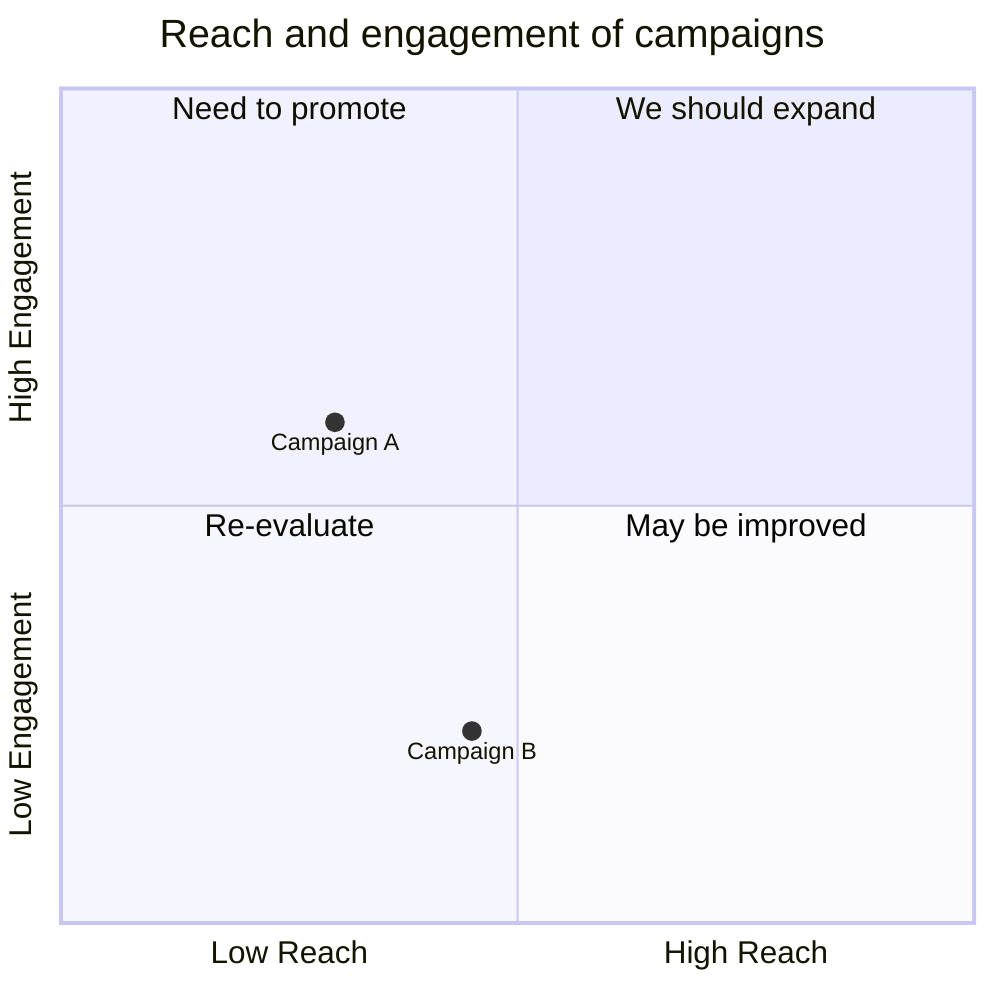
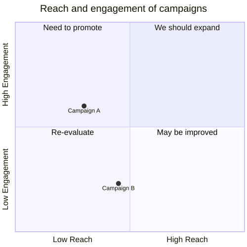

# Quadrant chart

**Use for:** four-quadrant prioritization or analysis (effort vs. impact, reach vs. engagement).
**Avoid for:** exact routing logic, or when a single clear answer is the point (a quadrant chart implies a spread of options).

## Core syntax

<!-- mermaid-render: id="quadrant-chart--block1" -->

- `x-axis <left> --> <right>` and `y-axis <bottom> --> <top>` label the axes; the right/top half of the label is optional (`x-axis Urgent` alone labels only the left end).
- `quadrant-1` through `quadrant-4` label the four regions: 1 = top-right, 2 = top-left, 3 = bottom-left, 4 = bottom-right.
- Points are `"label": [x, y]` with x and y each in `0`-`1`.

## Point styling

Direct: `Point A: [0.9, 0.0] radius: 12` (also `color`, `stroke-width`, `stroke-color`). Class-based: define with `classDef class1 color: #109060, radius: 10` and apply with `Point A:::class1: [0.9, 0.0]`. Precedence is direct style > class style > theme.

## Configuration and theming

`config.quadrantChart` controls `chartWidth`/`chartHeight`, padding, and font sizes for axis/quadrant/point text. Theme variables `quadrant1Fill`-`quadrant4Fill` and `quadrant1TextFill`-`quadrant4TextFill` set per-quadrant background/text colors; `quadrantPointFill`/`quadrantPointTextFill` style points.

## Common pitfalls

- If no points are given, axis and quadrant text render centered in each quadrant; adding points shifts axis labels to the chart edges.
