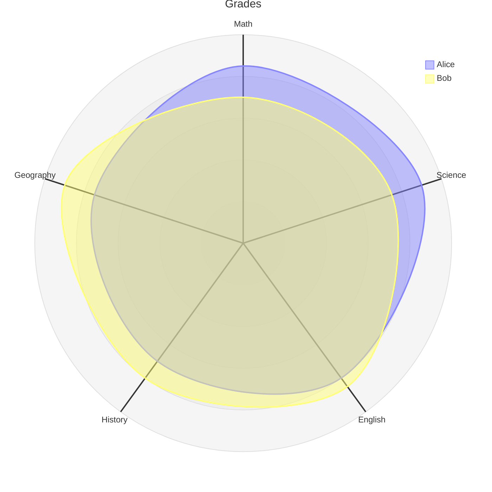
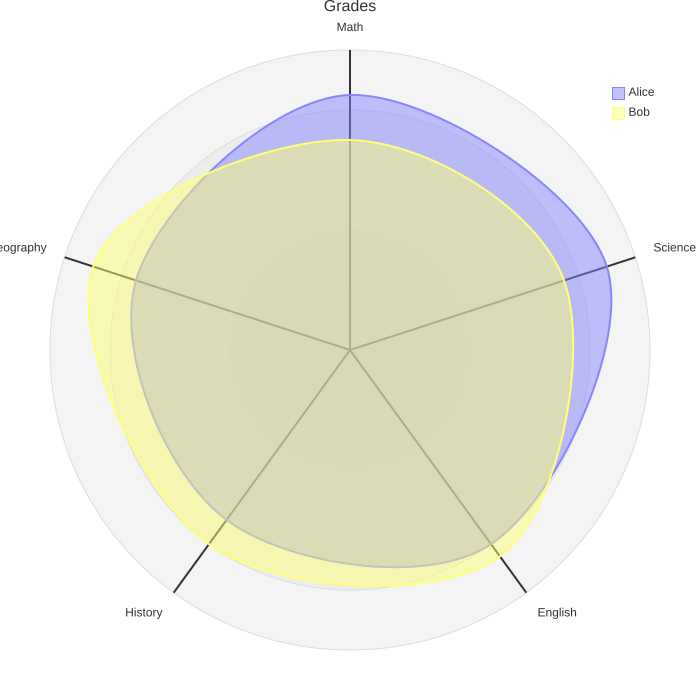

# Radar chart

**Use for:** multi-dimensional comparison across a handful of entities (also called spider/star/cobweb/polar chart or Kiviat diagram), v11.6+.
**Avoid for:** more than a few axes or curves, readability drops fast past 6-8 axes or more than 4-5 overlapping curves.

## Core syntax

<!-- mermaid-render: id="radar-chart--block1" -->

- `axis id["Label"]` defines one spoke; multiple axes can be comma-separated on one line.
- `curve id["Label"]{v1, v2, ...}` plots one series, values in axis-declaration order, or as key-value pairs (`curve id4{ axis3: 30, axis1: 20 }`) if you'd rather not rely on order.
- `max`/`min` set the scale explicitly (otherwise inferred from the data).
- `graticule circle` (default) or `graticule polygon` sets the background grid shape.
- `ticks N` sets how many concentric rings are drawn (default 5).
- `showLegend true|false` toggles the legend (shown by default).

## Theming

Color scales use `cScale0`-`cScale11` (curve colors, up to the theme's max, usually 12), set globally under `themeVariables`. Radar-specific styling (`axisColor`, `curveOpacity`, `curveStrokeWidth`, `graticuleColor`, and similar) lives under `themeVariables.radar`.
