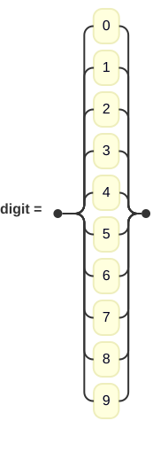
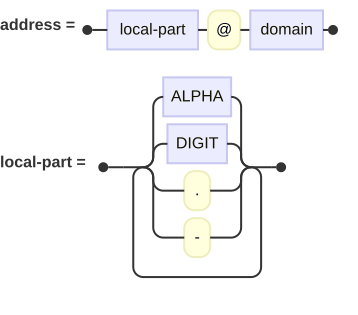
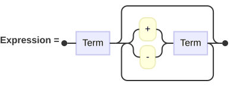

# Railroad diagram

**Use for:** documenting a formal grammar (syntax diagrams), popularized by Niklaus Wirth's Pascal manual and still used today (e.g. json.org). v11.16+.
**Avoid for:** anything that isn't literally describing a context-free grammar.

Pick the keyword matching the notation you're writing in:

| Diagram type | Keyword | Notation |
|---|---|---|
| EBNF | `railroad-ebnf-beta` | Extended Backus-Naur Form (W3C or ISO 14977 style) |
| ABNF | `railroad-abnf-beta` | Augmented BNF (RFC 5234) |
| PEG | `railroad-peg-beta` | Parsing Expression Grammar |
| IR primitives | `railroad-beta` | Mermaid's own constructors, written explicitly |

All four share the same outer shape: the type keyword on line one, optional `title "..."`, optional `accTitle:`/`accDescr:`, then one rule per statement, each ending in `;`.

## EBNF

<!-- mermaid-render: id="railroad--block1" -->
```mermaid
railroad-ebnf-beta
title "Digit Definition"

digit = "0" | "1" | "2" | "3" | "4" | "5" | "6" | "7" | "8" | "9" ;
```


Rules: `rule = definition ;` (`::=` also accepted). Terminals are quoted strings; non-terminals are bare identifiers. Sequence is juxtaposition (`A B` in W3C style, `A , B` in ISO style). Choice is `|`. Optional is `A?` (W3C) or `[ A ]` (ISO). Repetition: `A*` zero-or-more, `A+` one-or-more (W3C only), `{ A }` zero-or-more (ISO). Grouping uses `( )`. Comments: `/* ... */` (W3C) or `(* ... *)` (ISO). Exception: `A - B` (match A but not B).

## ABNF

<!-- mermaid-render: id="railroad--block2" -->
```mermaid
railroad-abnf-beta
title "Email Address"

address = local-part "@" domain ;
local-part = 1*( ALPHA / DIGIT / "." / "-" ) ;
```


Alternation is `/` not `|`; repetition is a numeric prefix (`*A` zero-or-more, `1*A` one-or-more, `2*4A` between 2 and 4, `3A` exactly 3); optional is `[ A ]`; terminals can be quoted or numeric (`%x41`, `%d65`, ranges like `%x30-39`); comments start with `;`.

## PEG

<!-- mermaid-render: id="railroad--block3" -->
```mermaid
railroad-peg-beta
title "Calculator Grammar"

Expression <- Term (("+" / "-") Term)* ;
```


Rules use `<-`. Ordered choice is `/` (tries left-to-right). Suffix operators `?`/`*`/`+` work as usual. Prefix predicates: `&A` (lookahead), `!A` (negative lookahead). `.` matches any character. Comments start with `#`.

## IR primitives (`railroad-beta`)

Explicit constructors when you want direct control over structure: `terminal("text")`, `nonterminal("name")`, `sequence(a, b, ...)`, `choice(a, b, ...)`, `optional(a)`, `zeroOrMore(a)`, `oneOrMore(a)`, `special("text")`.

## Common pitfalls

- Stick to one notation (and its matching keyword) throughout a single diagram.
- Hand-drawn look is not supported for railroad diagrams.
- Terminals render as rounded rectangles, non-terminals as regular rectangles, both inherit the active theme's colors.
