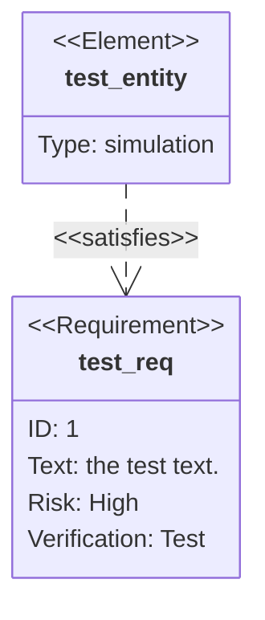

# Requirement diagram

**Use for:** requirements traceability, following the SysML v1.6 modeling spec, showing requirements, elements (e.g. test suites, documents), and the relationships between them.
**Avoid for:** anything without a formal requirements-traceability need; the syntax is specialized and verbose relative to the information it conveys.

## Core syntax

<!-- mermaid-render: id="requirement-diagram--block1" -->



## Requirement block

```
<type> user_defined_name {
    id: user_defined_id
    text: user_defined text
    risk: <risk>
    verifymethod: <method>
}
```

| Field | Allowed values |
|---|---|
| type | `requirement`, `functionalRequirement`, `interfaceRequirement`, `performanceRequirement`, `physicalRequirement`, `designConstraint` |
| risk | `Low`, `Medium`, `High` |
| verifymethod | `Analysis`, `Inspection`, `Test`, `Demonstration` |

## Element block

```
element user_defined_name {
    type: user_defined_type
    docref: user_defined_ref
}
```

An element is a lightweight reference to something outside the requirement hierarchy, a test suite, a design doc, and so on. `docref` links it to that external document.

## Relationships

```
{source} - <type> -> {destination}
```

Relationship type is one of: `contains`, `copies`, `derives`, `satisfies`, `verifies`, `refines`, `traces`. The arrow can also be written reversed: `{destination} <- <type> - {source}`.

## Direction and styling

`direction LR` (also `TB`, `BT`, `RL`) sets layout. Styling uses the same `style`/`classDef`/`class`/`:::` mechanism as flowcharts; multiple requirement/element names and multiple class names can each be listed comma-separated in one `class` statement.

## Markdown formatting

User-defined text (names, requirement text, docref) can be quoted and include basic markdown (`**bold**`, `*italic*`).
