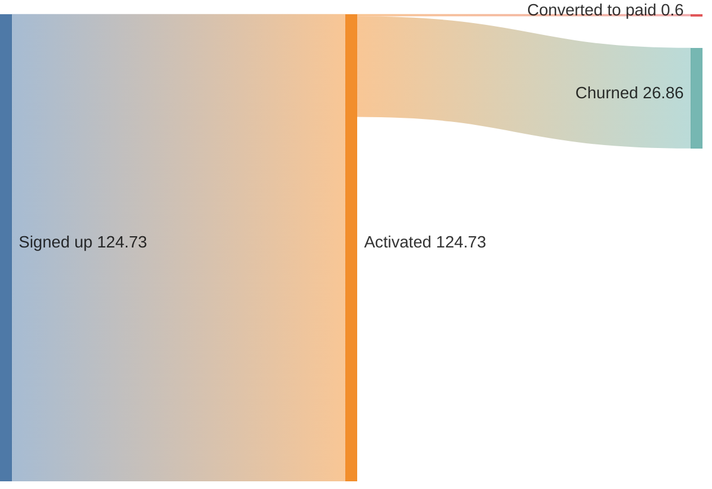
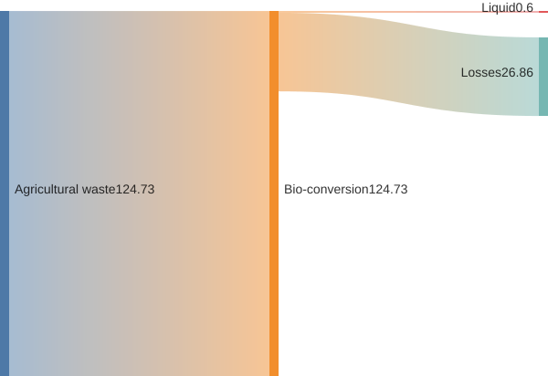

# Sankey diagram

**Use for:** flow or volume moving between categories, energy conversion, budget allocation,
funnel/conversion tracking.
**Avoid for:** exact routing logic where discrete named connections matter more than proportional flow (use a flowchart).

**Experimental:** syntax is close to plain CSV and may be extended in future Mermaid releases.

## Core syntax

The diagram body is raw CSV with exactly three columns: `source,target,value`.

<!-- mermaid-render: id="sankey--block1" -->

- Empty lines are allowed for visual grouping (not standard CSV, but Mermaid accepts it here).
- `%%` comments work as a leading line, e.g. `%% source,target,value` as a header hint.

## Configuration

Set under `config.sankey`:

| Option | Values |
|---|---|
| `linkColor` | `source`, `target`, `gradient`, or a hex color |
| `nodeAlignment` | `justify`, `center`, `left`, `right` |
| `labelStyle` (v11.15+) | `legacy` (default, plain text) or `outlined` (background stroke, better readability) |
| `nodeWidth` (v11.15+) | node rectangle width in px (default 10) |
| `nodePadding` (v11.15+) | vertical gap between nodes in px (default 12) |
| `nodeColors` (v11.15+) | map of node name → CSS color, overriding the default palette for named nodes |
| `showValues` | whether to render numeric values alongside labels |

## Common pitfalls

- A value containing a comma must be quoted: `Signed up,"Onboarding, in progress",193.026`;
  an unquoted comma is parsed as an extra CSV column and breaks the row.
- A literal double quote inside a quoted value is escaped by doubling it:
  `"Onboarding, ""paused"""`.
