# Codebase orientation

**Use for:** showing how a codebase is organised, which team owns which part, and where a new piece of work belongs.
These are the diagrams a team opens to onboard a new joiner, or to settle an argument about where code should live.
**Avoid for:** generic workflow templates (feature development, bug fix, CI/CD, OAuth, REST request/response), which live in `common-patterns.md`.
Also avoid for per-type syntax questions; each `references/<type>.md` file covers those.

Find the scenario that matches the question you were asked, copy the block, and swap the names.
Every example states the one question it answers, so if the question in the heading is not your reader's question, keep scrolling.

---

## Structure and dependency

### Which package may import which

**Answers:** "What is allowed to depend on what, and what are we breaking right now?"
**Use when:** you are writing the layering rule down for the first time, reviewing a change that adds an import across a layer boundary, or backing an architecture argument with the current state of the import graph.
**Don't use when:** the reader wants the order calls happen in at runtime; use the sequence diagram in [Tracing one feature from entry point to data store](#tracing-one-feature-from-entry-point-to-data-store) instead.
A dependency graph says what *may* call what, not what *does* call what, and the two are different pictures.
**Detail level:** L2

<!-- mermaid-render: id="scenario-codebase--block1" -->
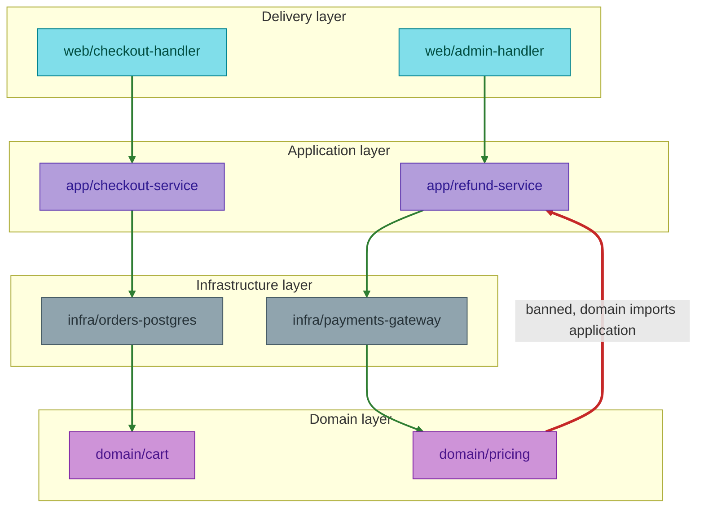

**Adapt it:** rename the four layer subgraphs to your own layers and replace the eight package names with real import paths a reader can grep for.
Keep the rule visible in one sentence next to the diagram: here it is "a package may import only packages in a layer below it, and nothing in `domain/` imports anything at all".
Every allowed edge here drops exactly one layer, which is what keeps the four bands stacked cleanly.
If your rule also permits skipping a layer downward, say so in the prose rather than drawing the skip edge, because a skip edge pulls two bands onto the same row and the downward reading collapses.
Draw at most one or two violation edges.
A diagram with six red arrows stops being an argument and becomes wallpaper, so split the rest into a tracked list.
Edges here point at nodes rather than at the surrounding subgraph, which is the straight-pipeline exception in `style-standard.md`: the layers are one top-down stack and naming the box would hide the package that actually breaks the rule.
Delete the violation edge and its `edgeViolation` class once the import is gone, in the same change that removes it.

### Tracing one feature from entry point to data store

**Answers:** "What actually runs when a shopper submits a checkout with a discount code?"
**Use when:** onboarding someone onto one feature, or writing up a bug where the fault could be in any of four layers.
**Don't use when:** the flow has many independent branches that do not depend on each other; a flowchart handles fan-out better than `alt` blocks do.
**Detail level:** L3

Trace this by reading the code, not by guessing from the layer names.
Every participant and every method below is a name a reader can search for.

<!-- mermaid-render: id="scenario-codebase--block2" -->
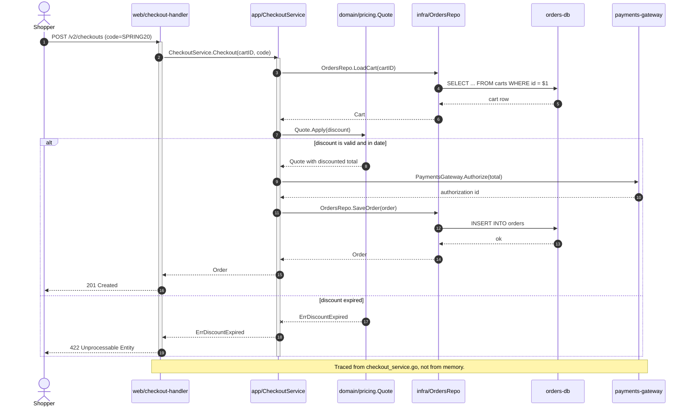
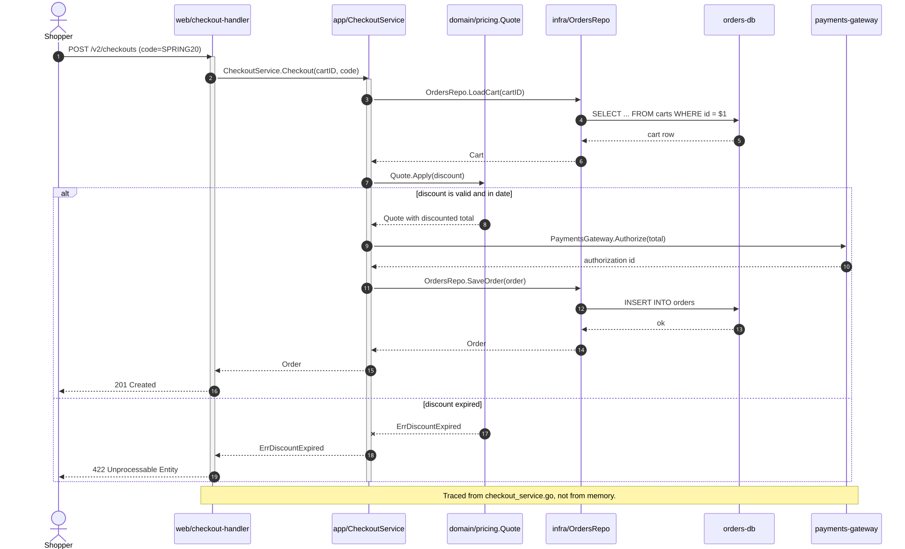

**Adapt it:** replace the participants with your own module names and the messages with real method signatures and real SQL or endpoint names.
Keep `activate`/`deactivate` pairs outside the `alt` block so both branches stay balanced; putting a `+` or `-` inside one branch and not the other produces a lopsided activation bar.
One diagram, one feature.
If your trace needs a second `alt` nested inside the first, the feature is two features and deserves two diagrams.
Put the source file name in a `Note` so the next reader can check the trace instead of trusting it.
`common-patterns.md` has a generic layered REST request template; this one goes further by naming the actual packages and the actual failure path.

---

## Ownership and placement

### Who owns what, and where the seams are

**Answers:** "Whose code is this, and who do I have to talk to before I change it?"
**Use when:** a new team member needs the map on day one, or two teams are arguing about which side of a seam a change belongs on.
**Don't use when:** the question is about packages inside one system; `C4Context` is deliberately too coarse for that, so use [Which package may import which](#which-package-may-import-which).
**Detail level:** L0

<!-- mermaid-render: id="scenario-codebase--block3" -->
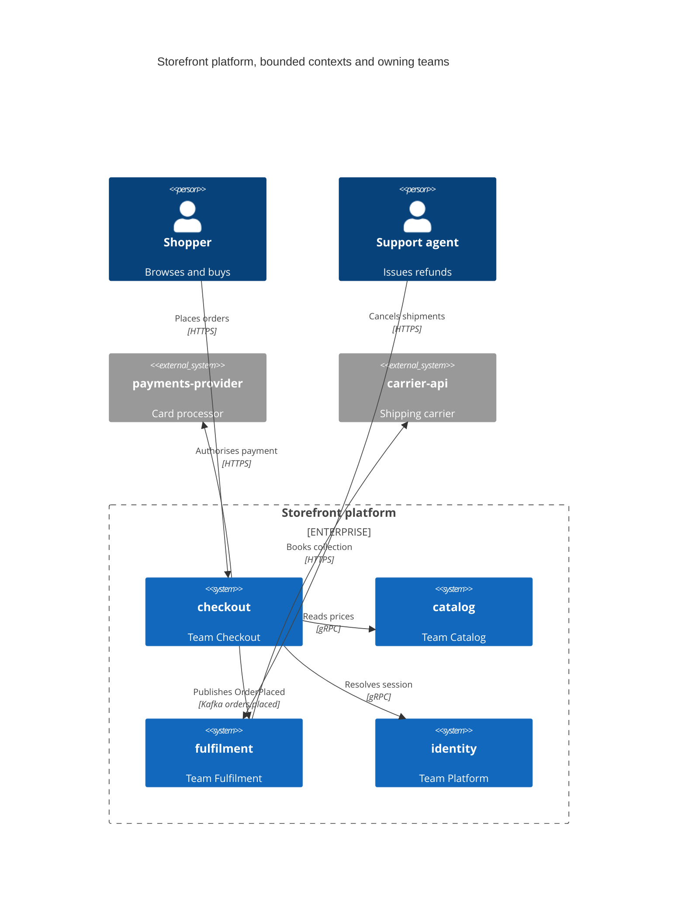
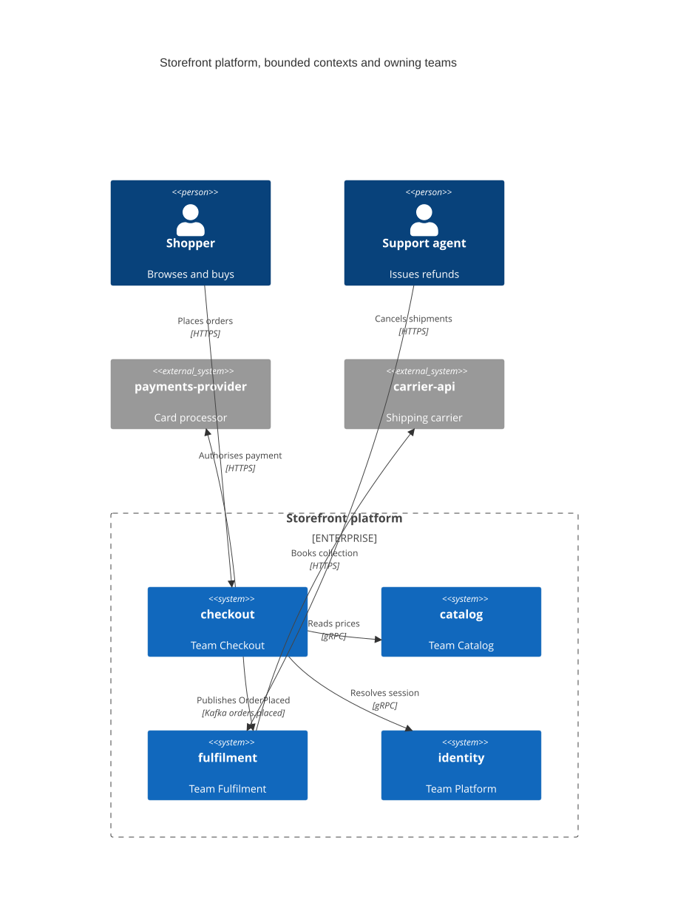

**Adapt it:** put the owning team in the description field of every `System` and nothing else, because that field is the whole point of this diagram.
Keep those descriptions to two or three words.
A long description widens the shape, and wide shapes force Mermaid to stack the boundary one system per row, which is how this diagram turns into an unreadable column.
Set `UpdateLayoutConfig($c4ShapeInRow="2", $c4BoundaryInRow="1")` to get the grid, and raise the number only if your labels stay short.
Name the protocol or the topic on every `Rel`, since the seam is where the protocol is, and "uses" tells a reader nothing.
The `UpdateRelStyle` lines at the bottom exist only to move relationship labels off the boxes they landed on; tune `$offsetX` and `$offsetY` last, once the elements are settled, and delete them if your labels already sit clear.
Keep third-party systems as `System_Ext` black boxes and never draw their internals.
Put each system's responsibilities in prose beside the diagram rather than in the shape.
Stay under about 15 elements; past that, split by team and let each team draw its own `C4Container` diagram.
See `c4.md` for the full element syntax and for the rule on when a microservice is a `Container` and when it is promoted to its own `System`.

### Where does this new code go

**Answers:** "I have a new type to add. Which folder does it belong in?"
**Use when:** the same placement question keeps arriving in review, and you want an answer people can apply without asking.
**Don't use when:** the real question is "who has to approve this", which is an ownership question; use [Who owns what, and where the seams are](#who-owns-what-and-where-the-seams-are).
**Detail level:** L1

<!-- mermaid-render: id="scenario-codebase--block4" -->
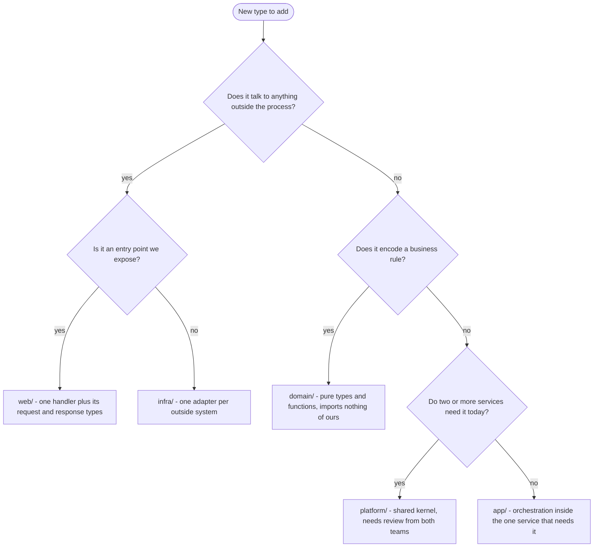

**Adapt it:** the questions in the diamonds are the load-bearing part, so rewrite them to match the distinctions your codebase actually makes.
Order them so the cheapest question comes first.
"Does it do I/O" is one anybody can answer in five seconds, which is why it is at the top.
Note the deliberate "today" in the shared-kernel question: it stops speculative code landing in `platform/` because someone might need it later.
Keep this at L1 with no palette.
If a leaf needs more than one line of explanation, that explanation belongs in prose under the diagram, not in the node.

---

## Lifecycle and surface

### The lifecycle of a published document

**Answers:** "What states can a document be in, and which transitions are legal?"
**Use when:** the entity has a status column and the rules for changing it are spread across several handlers.
**Don't use when:** who performs each transition matters more than which state the record is in; use a swimlane flowchart, see `swimlanes.md`.
**Detail level:** L2

<!-- mermaid-render: id="scenario-codebase--block5" -->
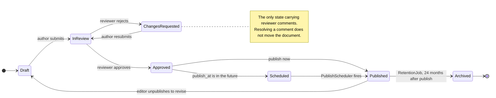

**Adapt it:** the state names must be the exact values stored in the column, here `documents.status`, so a reader can query for them.
Label every transition with what triggers it, and name the job or the handler when the trigger is automatic.
Transitions you did not draw are transitions the code should reject, so add the missing-transition check to the test suite in the same change.
`common-patterns.md` already has order-lifecycle and user-account templates; this one adds a scheduled state and a reversible publish, which is the shape most content and subscription entities have.

### What the public API promises, and for how long

**Answers:** "When does v1 stop working, and what do I move to?"
**Use when:** consumers need the removal date, or you are writing the deprecation note that goes in the changelog.
**Don't use when:** the question is what each lifecycle stage means and which transitions any endpoint may make; that is a rules question, not a calendar question, so use a `stateDiagram-v2` with `Experimental`, `Stable`, `Deprecated` and `Removed` states instead.
A timeline tells one reader when to act.
A state diagram tells every future endpoint how to behave.
**Detail level:** L2

<!-- mermaid-render: id="scenario-codebase--block6" -->
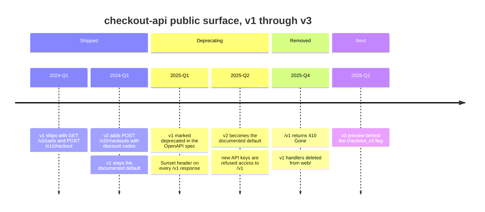
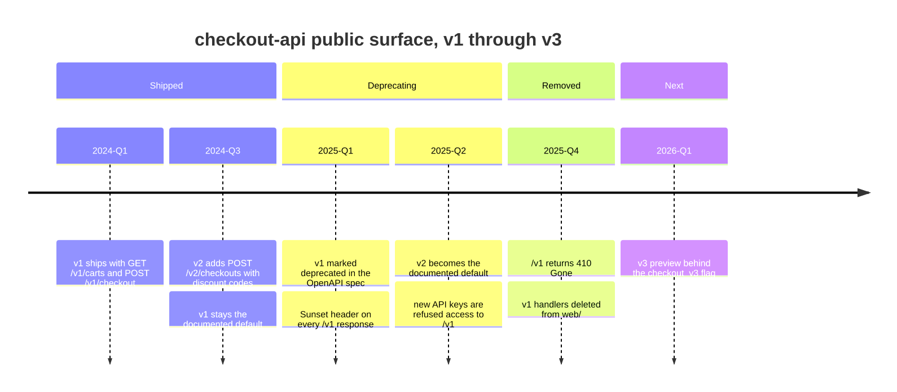

**Adapt it:** use real quarters or real dates, and name the exact routes, headers, and flags.
"Deprecated" with no removal date is not a deprecation, so every deprecating entry needs a matching removal entry further right, even if the date is provisional.
Each colon starts a new event, so keep colons out of the event text itself.
Put the future entries in their own `section` so a reader can see at a glance which part of the diagram is a promise and which part is history.

---

## Build and verification

### What each test level actually covers

**Answers:** "If this test passes, what do I still not know?"
**Use when:** someone asks why a bug reached production with green tests, or you are deciding which level a new test belongs at.
**Don't use when:** you want the order stages run in and what fails the build; use [What must build before what](#what-must-build-before-what), or the CI/CD pipeline template in `common-patterns.md`.
**Detail level:** L1

<!-- mermaid-render: id="scenario-codebase--block7" -->
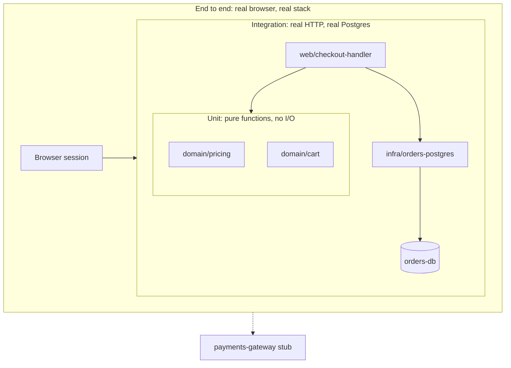

**Adapt it:** containment is the message here, so put a component inside the innermost box that exercises it for real.
Anything left outside every box is never covered, and anything faked at every level, like the payments gateway above, sits outside on its own.
That outside node is usually the most useful thing on the diagram, because it names the risk nobody tests.
Keep the level names as your test commands spell them so a reader can run the right one.
Edges are secondary here: the one crossing into a nested box names the box, per the subgraph rule in `style-standard.md`.

### What must build before what

**Answers:** "Why does a one-line change in this package rebuild half the repo?"
**Use when:** the build is slow and you need to show where the fan-out is, or a new package needs slotting into the graph.
**Don't use when:** the reader wants dates, durations, or who is blocked; use a `gantt` chart, see `gantt.md`.
**Detail level:** L2

<!-- mermaid-render: id="scenario-codebase--block8" -->
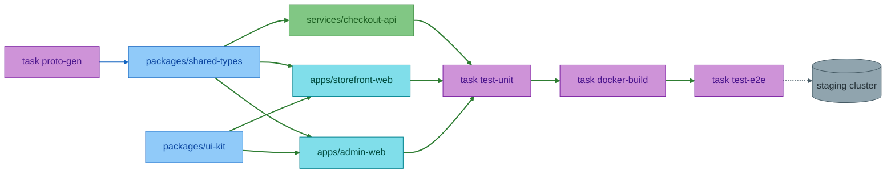

**Adapt it:** an arrow means "must finish before", so read it as the build tool does and keep the direction consistent across the whole diagram.
Use your task runner's real task names, because the value of this diagram is that a reader can run any node on it.
Separate generated artefacts from hand-written ones, as `proto-gen` to `shared-types` does here, since generated inputs are where stale-cache bugs come from.
Fan out from the shared packages, fan back in at the first task that needs everything, and keep the tail after that point linear.
A graph that crosses itself in the middle is usually a graph whose real order you have not decided yet.
If the graph passes 20 nodes, draw the packages only and put the per-package task graph in a second diagram.

### The repo map

**Answers:** "What is in here, and what is each top-level folder for?"
**Use when:** it is someone's first hour in the repo, or a README needs one picture at the top.
**Don't use when:** the relationships between the folders matter more than the listing; use [Which package may import which](#which-package-may-import-which), because a tree cannot show that `domain/` depends on nothing.
**Detail level:** L0

<!-- mermaid-render: id="scenario-codebase--block9" -->

**Adapt it:** one line per folder and two levels below the root is the whole budget.
The moment a reader has to scroll, the map has stopped being a map.
Put the purpose of each folder in prose beside the tree rather than in the labels, since `treeView-beta` labels cannot hold spaces unless you quote them.
`treeView-beta` is a beta type, so confirm your documentation platform renders it before committing this; a fenced `tree` command output is the fallback that always works.
A trailing `/` marks a directory and renders bold, which is what separates this from a plain list.
