# Delivery, from a branch to production and back

**Use for:** how a change travels from a developer's branch into production, and how it is reversed when it goes wrong.
Branching strategy, hotfixes, required checks, environment promotion, progressive rollout, feature flags, zero-downtime schema change, deployment topology, and release schedules.
**Avoid for:** how the running system serves a request.
That is `common-patterns.md`, which also holds the basic linear CI/CD pipeline this file deliberately does not repeat.
Per-type syntax lives in the sibling file for each diagram type.

Find the scenario your reader is actually asking about, copy the block, and replace the names.
Every example states the one question it answers, so if that is not the question in the room, keep scrolling.

---

### Where do I branch from, and what gets tagged

**Answers:** "I am starting work.
What do I branch off, where does it merge back, and which commit becomes the release?"
**Use when:** onboarding a new engineer, or writing the paragraph in CONTRIBUTING that says how work starts and ends.
**Don't use when:** the reader wants to know what runs where once the tag exists.
Use the deployment topology example below.
**Detail level:** L1

<!-- mermaid-render: id="scenario-delivery--block1" -->
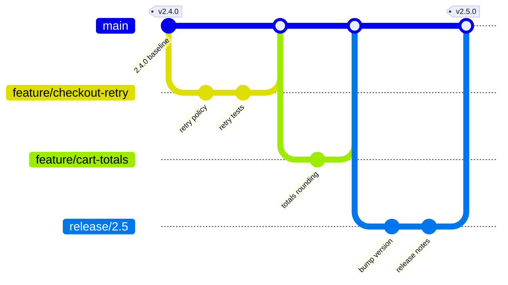

**Adapt it:** the branch names and commit ids are placeholders, swap them for two real features from your last release.
If you deploy straight from main, delete the `release/2.5` branch and its two commits and tag the last merge into main instead.
If you run a long-lived `develop` branch, add it as the first branch off main and point the feature branches at it.
Keep the tag on the commit your pipeline actually builds from, because that is the fact readers get wrong.

---

### The hotfix path, next to the normal path

**Answers:** "Production is broken.
Where does the fix branch from, and what do I have to merge it back into so the next release does not undo it?"
**Use when:** writing the incident runbook, or explaining why a hotfix is not just a small feature.
**Don't use when:** the question is who approves the hotfix and what the freeze rules are.
Use the swimlane in the next example, with a hotfix lane.
**Detail level:** L2

<!-- mermaid-render: id="scenario-delivery--block2" -->
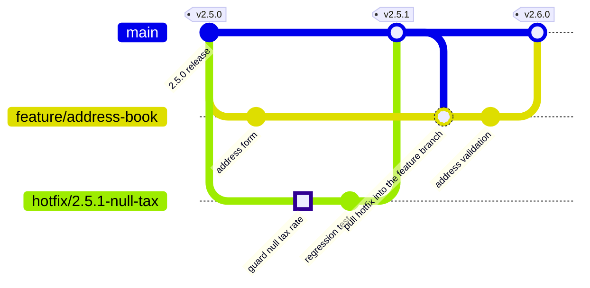

**Adapt it:** the highlighted commit is the actual fix, keep it highlighted so a reader spots it in one second.
The load-bearing edge is `merge main` back into the in-flight feature branch.
Delete that and the diagram stops explaining why the bug came back in v2.6.0.
If you cut hotfixes from the release tag rather than from main, add `branch hotfix/... ` right after the tagged commit and merge it into both main and the release branch.

---

### A required check is red, who unblocks it

**Answers:** "CI failed on my pull request.
Do I fix it, or am I waiting on somebody?"
**Use when:** documenting required checks, code owner rules, and who may grant a waiver.
**Don't use when:** only the order of pipeline stages matters and ownership does not.
Use the linear CI/CD pipeline in `common-patterns.md`.
**Detail level:** L2

<!-- mermaid-render: id="scenario-delivery--block3" -->
```mermaid
swimlane-beta TB
  accTitle: Who unblocks a failed required check
  accDescr: A pull request runs unit, scan and performance checks. A test or scan failure returns to the author. A performance regression instead goes to release management for a documented waiver before code owners can approve.
  subgraph Author
    open[Open pull request]
    fix[Push a fix]
    merge[Merge when all checks green]
  end
  subgraph CI [CI pipeline]
    unit[Unit and contract tests]
    scan[Dependency and secret scan]
    perf[Performance budget check]
  end
  subgraph Owners [Code owners]
    review[Review and approve]
  end
  subgraph Release [Release management]
    waive[Grant a documented waiver]
  end

  open --> unit
  unit -->|fail| fix
  unit -->|pass| scan
  scan -->|fail| fix
  scan -->|pass| perf
  perf -->|regression| waive
  perf -->|pass| review
  waive -->|waiver logged| review
  review -->|approved| merge
  fix --> unit
```

**Adapt it:** the lanes are the placeholders, replace them with the teams your org actually has.
Every cross-lane arrow is a handoff, so label each one with the condition that triggers it.
Add a lane only for a group that can block or unblock the merge, not for everyone who gets notified.
`swimlane-beta` needs Mermaid 11.16 or newer, so confirm your renderer before committing this one; a plain `flowchart` with the same nodes is the fallback if lanes will not draw.

---

### What has to be true before this build moves up

**Answers:** "The build passed in staging.
What has to happen before it is allowed into production?"
**Use when:** writing down the promotion rules, or proposing that one of the gates change.
**Don't use when:** the reader needs calendar dates rather than conditions.
Use the schedule example at the end of this file.
**Detail level:** L1

<!-- mermaid-render: id="scenario-delivery--block4" -->
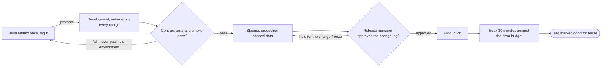

**Adapt it:** name your real environments and your real gates.
The point of the diagram is that one artifact moves and nothing is rebuilt per environment, so keep the single `Build` node even if you add environments.
Delete the `Soak` node first if you do not gate on an error budget.
Add a fourth environment as another pair of an environment node and a gate node, and stop at twelve nodes; past that, split the pre-production hops into their own diagram.

---

### How much traffic is on the new build

**Answers:** "We are halfway through a rollout.
What is being measured, and what makes us stop and go back?"
**Use when:** writing the rollout policy, or arguing about how long each step should bake.
**Don't use when:** exposure is controlled by a flag per user rather than by traffic share.
Use the feature flag state machine below.
**Detail level:** L2

<!-- mermaid-render: id="scenario-delivery--block5" -->
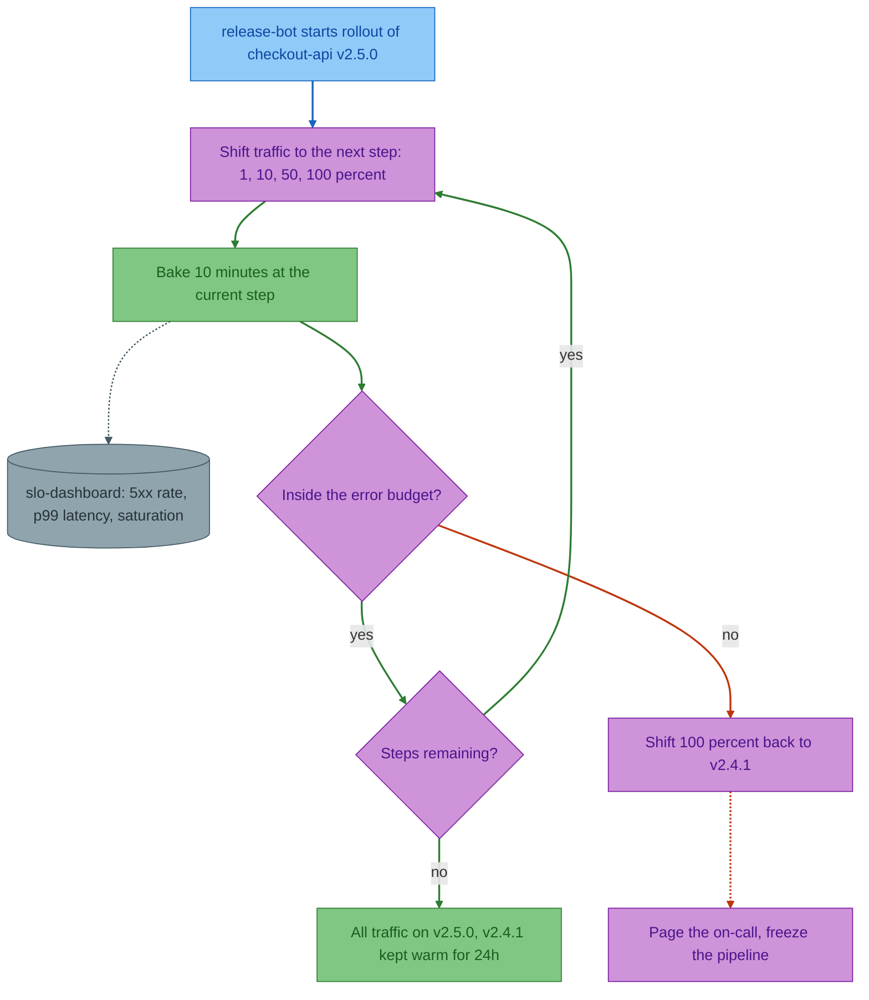

**Adapt it:** the step percentages, the bake time and the three metrics are the placeholders, and they are the numbers your team will argue about, so put the real ones in.
The loop back from `Steps remaining?` to `Shift` is what keeps this at nine nodes instead of one node per step; do not unroll it.
Name the previous version explicitly in the rollback node, because "roll back" without a target is the instruction people get wrong at 3am.
Delete `Page` if rollback is automatic and silent, but then say so somewhere.

---

### Will anybody ever delete this flag

**Answers:** "This flag has been at 100 percent for a year.
What is supposed to happen to it?"
**Use when:** introducing a flag, or running a cleanup sweep and needing to show that the flag is not done until the code is gone.
**Don't use when:** you are showing traffic percentages during a single deploy.
Use the canary rollout above.
**Detail level:** L2

<!-- mermaid-render: id="scenario-delivery--block6" -->
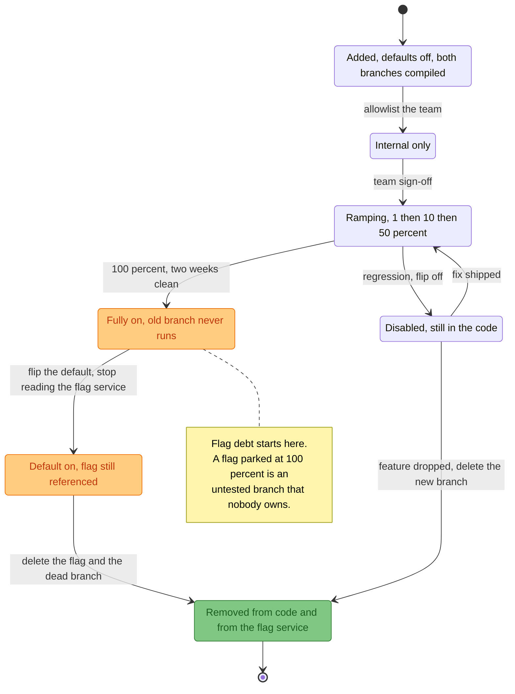

**Adapt it:** the two orange states are the debt, and `Removed` is the only terminal state, so keep that shape whatever you rename.
A lifecycle that ends at `Fully on` is the bug this diagram exists to expose.
Swap the ramp percentages for yours, and add an expiry transition out of `DefaultOn` if your flag service enforces one.
Delete the `Disabled` state only if you have never turned a flag off, which is unlikely.

---

### Changing a column without taking the site down

**Answers:** "We need to replace a column on a hot table.
In what order do the schema change and the deploys go out, and where is the last point I can still roll back?"
**Use when:** planning or reviewing a schema change on a table that is being written to while you change it.
**Don't use when:** the reader needs the finished table shape rather than the order of operations.
Use an `erDiagram`, see `erd.md`.
**Detail level:** L3

<!-- mermaid-render: id="scenario-delivery--block7" -->
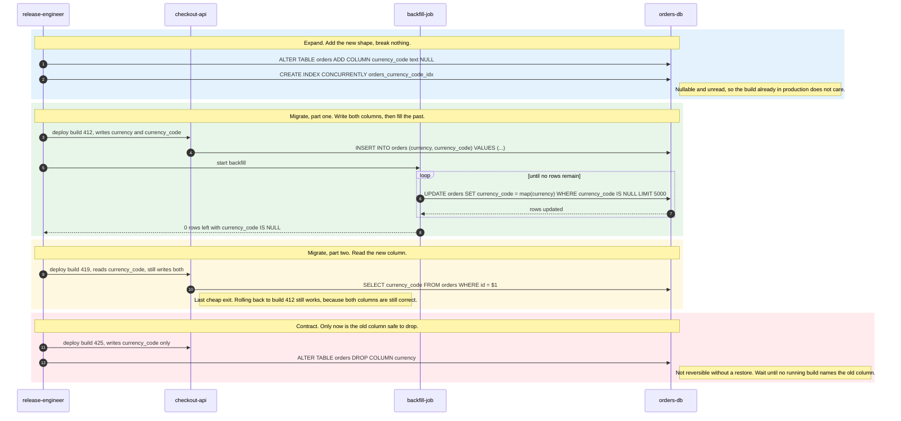
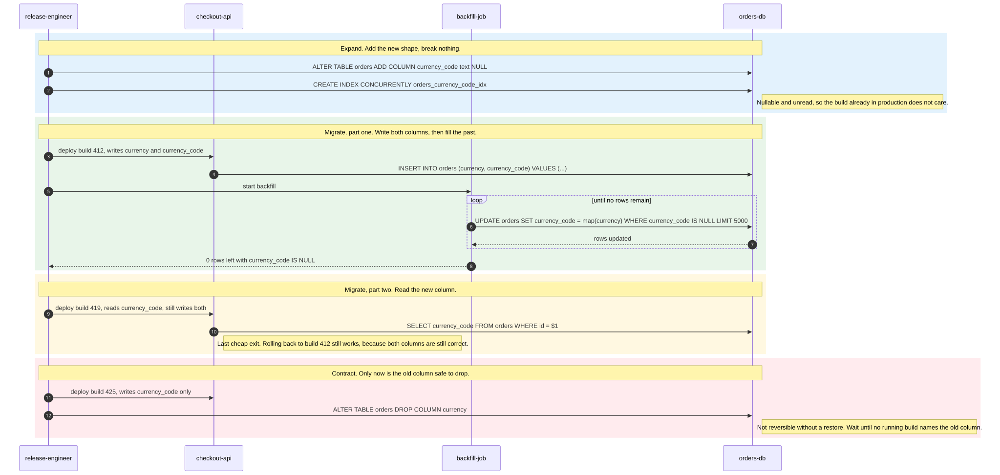

**Adapt it:** swap `orders`, `currency` and `currency_code` for your table and columns, and swap the build numbers for yours.
Keep the four colored phases and keep them in this order, because the order is the whole technique.
Keep the note at the end of phase three; that sentence is the one people need when they are deciding whether to proceed on a Friday.
The `loop` is not decoration, batched backfill with a row limit is what keeps the table writable while it runs, so keep the `LIMIT` visible.
If the change is a column rename with no type change, you still need all four phases; only the `map()` call goes away.
If the two columns cannot both be correct at once, this pattern does not apply, and you need a maintenance window instead.

---

### What is running in each region

**Answers:** "Which version is running where, and what happens if a region goes away?"
**Use when:** onboarding to the production estate, planning a failover test, or proposing a new region.
**Don't use when:** each connection needs a label such as a protocol or a failover trigger.
`architecture-beta` draws unlabeled edges, so use `C4Deployment` from `c4.md` instead.
**Detail level:** L2

<!-- mermaid-render: id="scenario-delivery--block8" -->


**Adapt it:** replace the region names, the node counts and the pod counts with yours.
Because edges carry no labels here, push the facts into the service labels, as `accepts writes`, `read only` and `idle until failover` do.
`align column euapi euwork` stops two siblings that both point at the database from stacking on top of each other; drop it and they overlap.
`architecture-beta` is a beta type, so render it on your documentation platform before you commit it.
Delete the standby region entirely if you run one region, and the diagram is then three services and still worth drawing.

---

### When does each step actually happen

**Answers:** "What is this migration blocked on this week, and when can we promise the release?"
**Use when:** planning a migration that spans weeks, or giving a stakeholder a date.
**Don't use when:** order matters and dates do not.
Use the environment promotion flowchart above.
**Detail level:** L1

<!-- mermaid-render: id="scenario-delivery--block9" -->
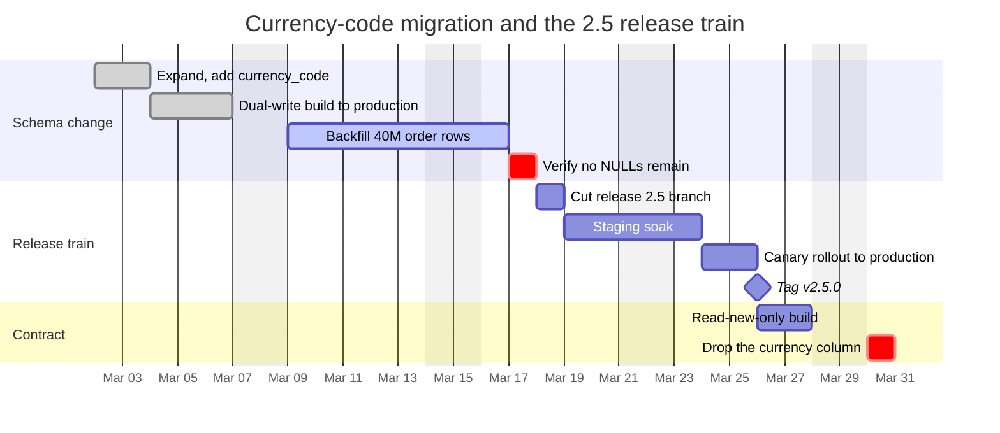
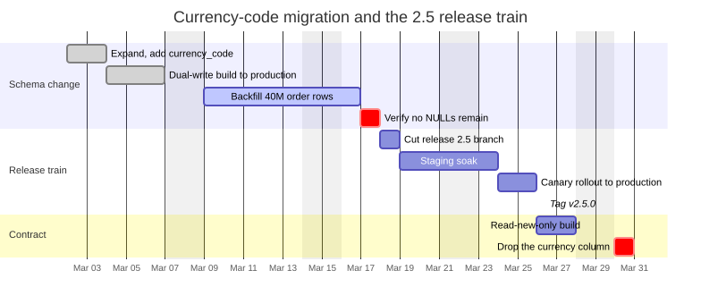

**Adapt it:** replace the dates, the durations and the row count.
Never put a colon inside a task title, because the colon is what separates the title from the metadata and your task will silently collapse to zero duration.
`after <id>` chaining is what makes this survive a slip, so prefer it over hard-coded start dates for everything except the first task.
Mark the irreversible steps `crit` so a reader can see at a glance which days have no undo.
Delete the `Contract` section if you are only scheduling the release, and keep the sections named after phases rather than after teams.
