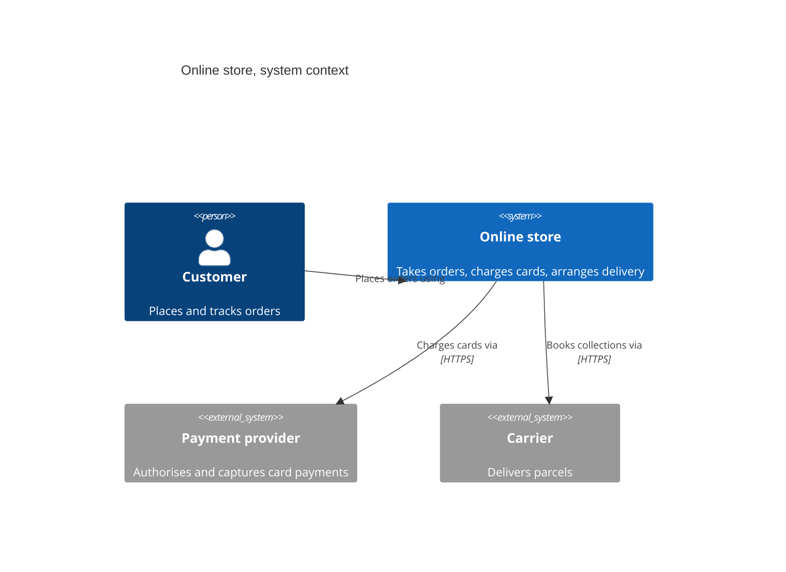
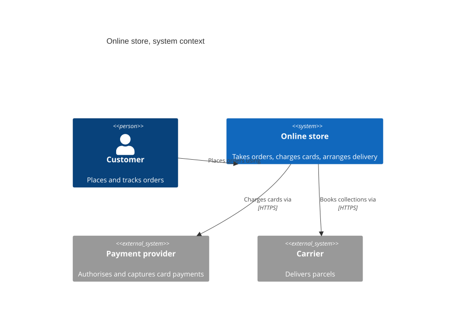
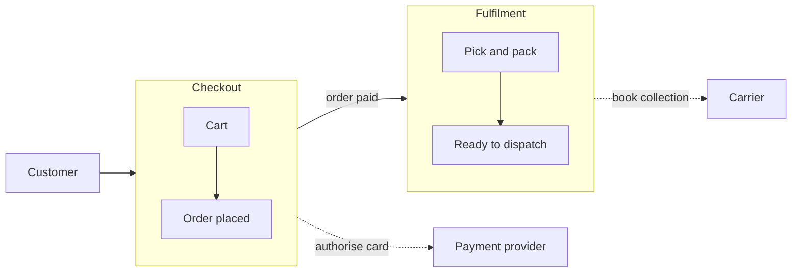
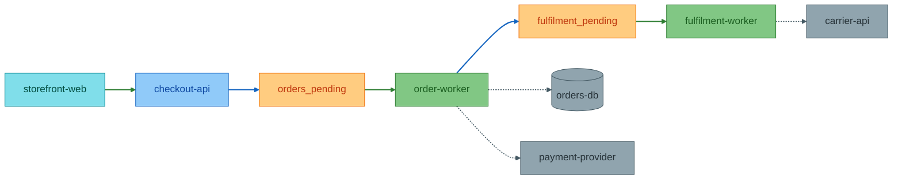
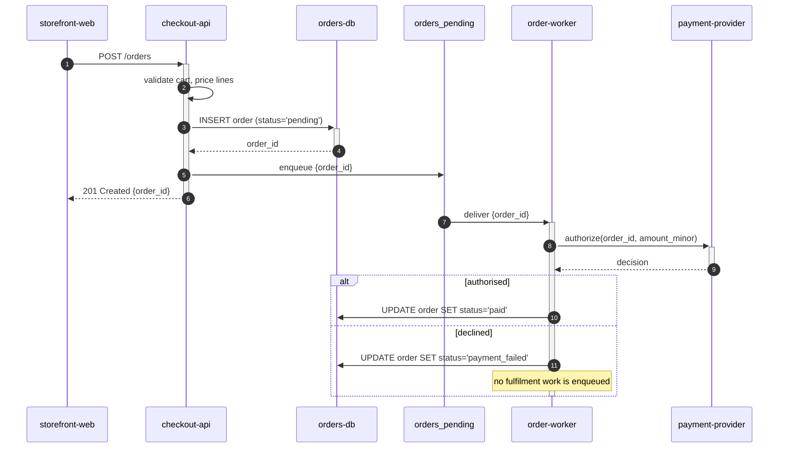
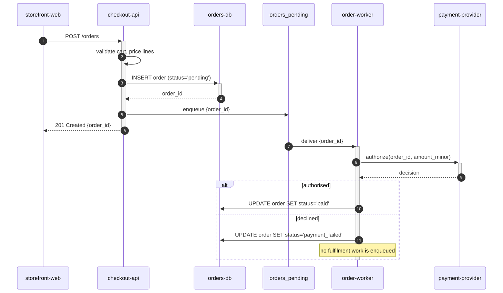
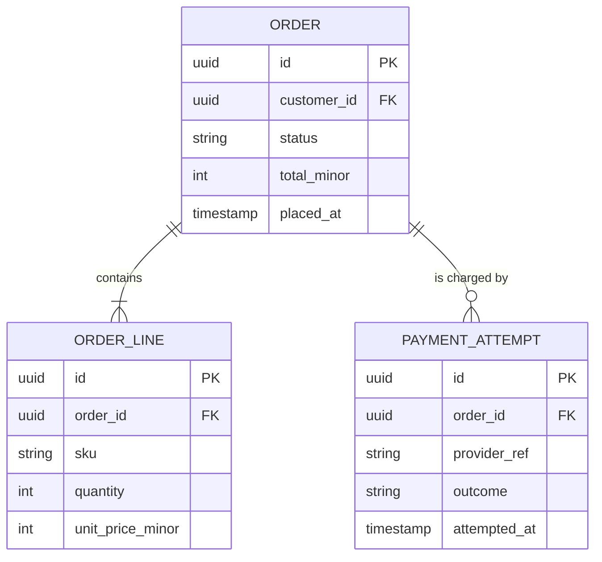

# Detail levels, one system at four zooms

**Use for:** deciding how much detail a diagram needs, and showing one system at more than one zoom level in a single document.
**Avoid for:** per-type syntax (see the type reference files) and the styling conventions themselves (see `style-standard.md`).

Most bad diagrams are not wrong, they are pitched at the wrong zoom.
A diagram that answers "what is this system" cannot also answer "which worker retries the payment", and trying to make it do both produces something that answers neither.

This file draws **the same system four times**, once per rung of the detail-level ladder in `style-standard.md`.
Read the four in order.
The point is not any one diagram, it is what changes between them.

## The ladder in one table

| Rung | The reader's question | Typical diagram |
|------|----------------------|-----------------|
| L0 | "What is this thing and who does it talk to?" | `C4Context`, or a 5-node flowchart |
| L1 | "How does work move through it?" | `flowchart` with subgraphs as phases |
| L2 | "Which service or queue handles this?" | `flowchart` with the full palette and edge IDs |
| L3 | "What calls what, and what is stored?" | `sequenceDiagram`, `erDiagram`, `classDiagram` |

L4 exists for byte and wire-format exactness; see `packet-diagram.md`.
It is out of scope here.

**Use the lowest rung that answers the question.**
Link down to the next rung, don't pre-empt it.
See the full ladder and the doc-type mapping in `style-standard.md`.

## The running example

An online store.
A customer places an order, the store charges a card through an external payment provider, and a warehouse hands the parcel to a carrier.

---

### L0, what is this system

**Answers:** "What is this thing, and who is outside it?"
**Use when:** an exec summary, a readme opening, the first slide, onboarding day one.
**Don't use when:** the reader already knows what the system is and wants to know how it works. Go to L1.
**Detail level:** L0

<!-- mermaid-render: id="scenario-detail-levels--block1" -->



**Adapt it:** swap the one `System` for yours and keep every `System_Ext` you genuinely call.
Four to six boxes is the whole budget.
If you are tempted to add a fifth internal box, you have left L0.
Mermaid's C4 layout is not configurable and sometimes drops a relationship label across a box;
a plain 5-node `flowchart` is the fallback when that matters, see `c4.md`.

---

### L1, how does work move through it

**Answers:** "What happens to an order, in order?"
**Use when:** onboarding, a design doc overview, explaining the system to a product manager.
**Don't use when:** the reader needs to know which deployable service owns a step. Go to L2.
**Detail level:** L1

<!-- mermaid-render: id="scenario-detail-levels--block2" -->



**Adapt it:** name the subgraphs after **phases** of the work, not after teams or repositories.
Cross-boundary edges name the subgraph, edges inside a phase name the nodes; see "Subgraph edges" in `style-standard.md`.
Keep it to 6-10 nodes and skip the colour palette, readability beats convention on an overview.

---

### L2, which service or queue handles this

**Answers:** "Which deployable thing owns this step, and what is the queue called?"
**Use when:** a design doc detail section, a change that alters an enqueue or consume path, explaining ownership to another team.
**Don't use when:** the reader needs the actual call sequence or the schema. Go to L3.
**Detail level:** L2

<!-- mermaid-render: id="scenario-detail-levels--block3" -->



**Adapt it:** use the names people actually grep for.
`orders_pending` must be the real queue or table name, not "Order Queue".
This is the rung where a wrong name costs someone an hour, so verify every identifier against config or code.

---

### L3, what calls what

**Answers:** "In what order do these calls happen, and what happens when the card is declined?"
**Use when:** reviewing a change to the path, debugging, writing the code.
**Don't use when:** you have not traced the real code. A plausible-looking L3 diagram is worse than none, because it reads as authoritative.
**Detail level:** L3

<!-- mermaid-render: id="scenario-detail-levels--block4" -->



**Adapt it:** trace one real path, a request handler or a test, to get the participant order and the message names.
Show the failure branch.
An L3 diagram with only the happy path hides the case the reader came to understand.

---

### L3, what is stored

**Answers:** "Which tables back this, and how do they relate?"
**Use when:** a migration, a schema review, onboarding someone onto the data model.
**Don't use when:** the question is about behaviour over time. Use the sequence diagram above.
**Detail level:** L3

<!-- mermaid-render: id="scenario-detail-levels--block5" -->



**Adapt it:** derive these from migration files or ORM models, never from guessed table names.
Include only the columns that carry the relationship or the state, not every column.

---

## The same concept at each rung

This is the table to internalise.
One idea, "we take the customer's money", named four ways.

| Rung | How payment appears |
|------|---------------------|
| L0 | `Payment provider`, one external system box |
| L1 | A dotted edge labelled `authorise card` leaving the `Checkout` phase |
| L2 | `payment-provider` as an `external` node, reached by `order-worker` over a dotted `edgeExternal` edge |
| L3 | `Pay->>Worker: decision` in the sequence, plus the `PAYMENT_ATTEMPT` table |

Climbing a rung does not add boxes to the previous diagram.
It replaces the diagram with a different one that answers a different question.
If your L2 looks like your L1 with more nodes crammed in, you have not changed zoom, you have just made the overview worse.

## Putting more than one rung in one document

Order them shallow to deep and let the reader stop early.

```
## Overview          <- L0 or L1, always
## How it works      <- L2, most readers stop here
## Reference         <- L3, for whoever is changing the code
```

Each diagram gets one sentence above it saying what it shows.
Link down to the next rung, never up.

## Common mistakes

| Mistake | Why it fails | Instead |
|---------|--------------|---------|
| One diagram carrying two rungs | Answers neither question, and is too crowded to read | Split into two diagrams under two headings |
| Starting at L3 because it looks thorough | The reader cannot orient without L0 or L1 first | Draw the overview, then link down |
| L2 with invented service or queue names | Costs the reader an hour when they grep and find nothing | Verify every identifier against config or code |
| L1 with class or module names as the subgraphs | Groups by code layout, not by what the work does | Name subgraphs after phases of the work |
| Climbing a rung to show off detail nobody asked for | More to maintain, more to go stale | Use the lowest rung that answers the question |
