# Scenario: operations, incidents, and postmortems

**Use for:** running a live system, responding to an incident while it is happening, and explaining afterwards what happened.
Escalation paths, ownership of incident steps, triage trees, telemetry flow, incident timelines, contributing factors, error budget burn, and follow-up tracking.
**Avoid for:** building the system or shipping the change.
Feature flow, bug-fix workflow, CI/CD pipelines, architecture templates, and API request/response patterns live in `common-patterns.md`.

Find the question your reader is asking, copy that block, and swap the names.
Every example here describes one running incident, a latency regression in `checkout-api`, seen at a different zoom level, so the blocks can be read as a set or lifted one at a time.
Each block names the detail level it sits at; use the lowest rung that answers the question, per the ladder in `style-standard.md`.
Several examples use newer diagram types (`swimlane-beta`, `ishikawa-beta`, `kanban`, `xychart-beta`), which need Mermaid 11.16 or later.

---

### Where our logs, metrics, and traces actually go

**Answers:** "I have a trace ID from a 503. Which system do I open to see it, and who ships it there?"
**Use when:** onboarding someone to on-call, or deciding where to add a new signal.
**Don't use when:** the reader wants the request path through the services themselves; draw the microservices architecture flowchart in `common-patterns.md` instead.
**Detail level:** L2

For incident or RCA visuals, distinguish observed events, candidate factors, supported contributing factors, failed controls, and unresolved hypotheses.
A fishbone groups factors for investigation; it does not prove that a listed factor caused the outcome.
Put stable claim or hypothesis IDs in every event and factor node so the diagram maps back to its evidence record; fishbone category bones group claims and carry no ID.

<!-- mermaid-render: id="scenario-operations--block1" -->
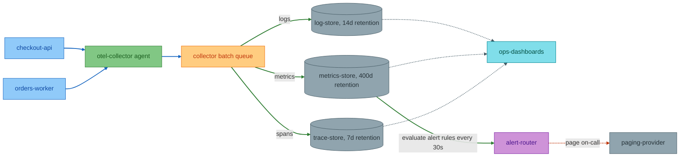

**Adapt it:** Replace the two producer nodes with your own services and keep the count at two or three, one per deployment shape, not one per service.
Put your real retention windows in the store labels; that is the number people actually ask for mid-incident.
Delete the `Batch` node if your agent ships without buffering, because a queue node that does not exist sends people hunting for a backlog that cannot happen.
Add a `sampling` node only if traces are sampled and the sample rate has already confused someone.

---

### Who gets paged, and what happens if nobody answers

**Answers:** "The alert fired at 02:00 and I was asleep. Who gets woken next, and when?"
**Use when:** writing or reviewing an on-call policy, or onboarding a new rotation member.
**Don't use when:** you need to show which human does which task during the response; use the swimlane example below instead.
**Detail level:** L1

<!-- mermaid-render: id="scenario-operations--block2" -->
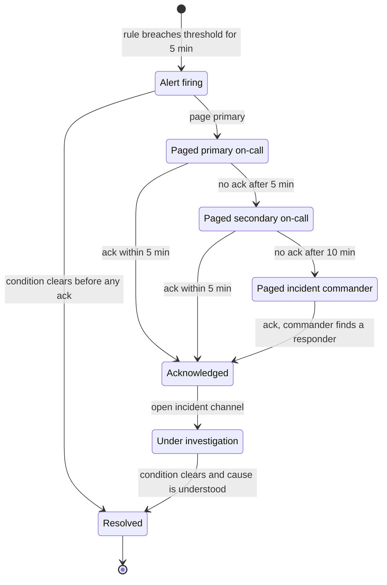

**Adapt it:** Swap the timer labels for your real acknowledgement windows; they are the only numbers on this diagram anyone will argue about.
If your rotation has no secondary, delete that state and point `Primary` straight at `Commander`.
Add a `Suppressed` state only if you actually silence alerts during deploys, and label the edge with what lifts the silence.
The self-clear edge from `Firing` to `Resolved` is worth keeping; a flapping alert that resolves itself is the most common path on most rotations.

---

### Who does what between the page and the all-clear

**Answers:** "I acknowledged the page. What is mine to do, and what am I waiting on someone else for?"
**Use when:** writing the incident response runbook, or reviewing a response where work stalled because nobody owned a step.
**Don't use when:** the sequence of system calls matters more than who acts; use the sequence diagram example below.
**Detail level:** L2

<!-- mermaid-render: id="scenario-operations--block3" -->
```mermaid
swimlane-beta LR
  accTitle: Incident response from alert to all-clear, by owner
  accDescr: Monitoring pages the on-call, who triages impact and declares an incident. The owning team investigates and mitigates. Support and comms publish status updates. The on-call declares the all-clear when the alert clears.

  subgraph Mon [Monitoring automation]
    fire["Alert: checkout p95 over 2s"]
    clear["Alert clear for 15 min"]
  end

  subgraph OnCall [Primary on-call]
    ack["Acknowledge page"]
    impact{"Customer impact?"}
    declare["Declare incident, open channel"]
    allclear["Declare all-clear"]
  end

  subgraph Team [checkout-api team]
    investigate["Find the regression"]
    mitigate["Roll back release 2026.4.1"]
  end

  subgraph Comms [Support and comms]
    status["Post status-page update"]
    close["Post resolution note, schedule postmortem"]
  end

  fire --> ack
  ack --> impact
  impact -->|"No, internal only"| investigate
  impact -->|"Yes"| declare
  declare --> status
  declare --> investigate
  investigate --> mitigate
  mitigate --> clear
  clear --> allclear
  allclear --> close
```

**Adapt it:** Rename the lanes to your real roles and keep one kind of ownership per lane, roles or teams, never a mix of roles and phases.
If your team declares incidents in a tool rather than a chat channel, say so in the `declare` label, because that is the step people skip.
Delete the `Comms` lane for an internal-only service and route `allclear` straight to the postmortem step.
The cross-lane arrows are the point of this diagram; if a lane has no arrow leaving it, that role is not actually doing anything and should come out.

---

### Checkout got slow, where do I look first

**Answers:** "p95 is up four times and nothing is erroring. What do I check, and what does each answer rule out?"
**Use when:** a latency regression is live and the responder needs an ordered search, not a list of suspects.
**Don't use when:** the service is throwing errors rather than running slow; that is a different tree, and the error handling flow in `common-patterns.md` covers the code-level path.
**Detail level:** L2

<!-- mermaid-render: id="scenario-operations--block4" -->
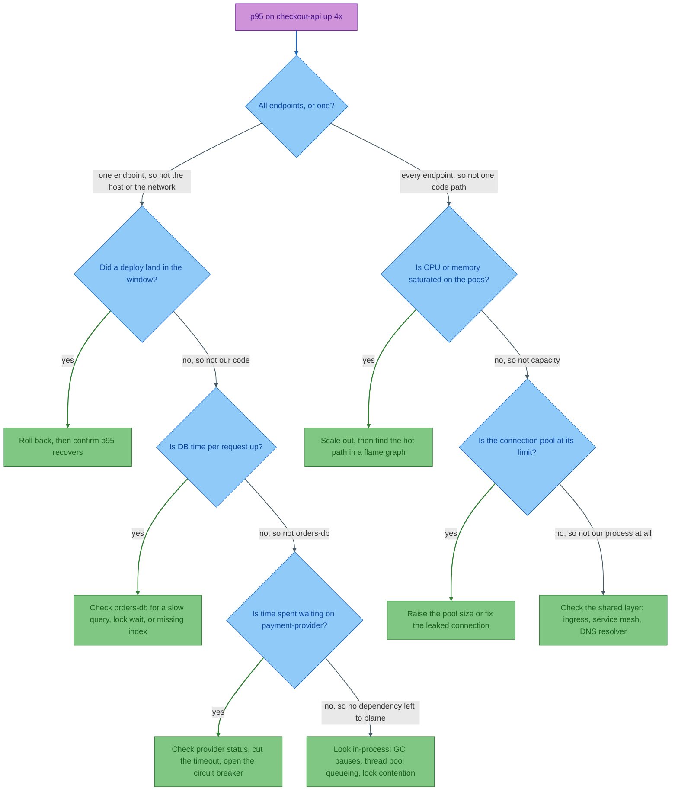

**Adapt it:** Keep the shape and replace the checks with your own dependencies, one check per layer you can actually measure.
A check earns a place only if a "no" eliminates something; if both answers lead to more searching, delete it.
Order the checks by how fast they are to answer, not by how likely they are, because a 10-second dashboard check beats a 5-minute query even at lower odds.
Write each rule-out into the edge label, as here; a responder under pressure reads the arrows, not the prose around the diagram.
The class names here are `check`, `action`, and `start` rather than the palette roles in `style-standard.md`, because a decision tree has no producers or queues to name.
Keep the palette's colors and the legend comment, and go back to the role names the moment the diagram shows components instead of questions.

---

### The exact call sequence that took checkout down

**Answers:** "A slow third party made our own service return 503. How exactly did that happen?"
**Use when:** writing the postmortem's mechanism section, or explaining a cascading failure to people who were not on the call.
**Don't use when:** you only need the order of human events; use the timeline example below, which is far cheaper to read.
**Detail level:** L3

<!-- mermaid-render: id="scenario-operations--block5" -->
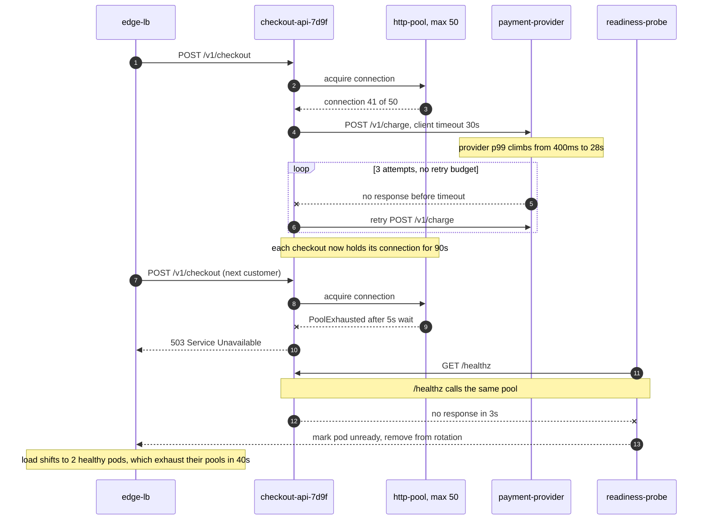
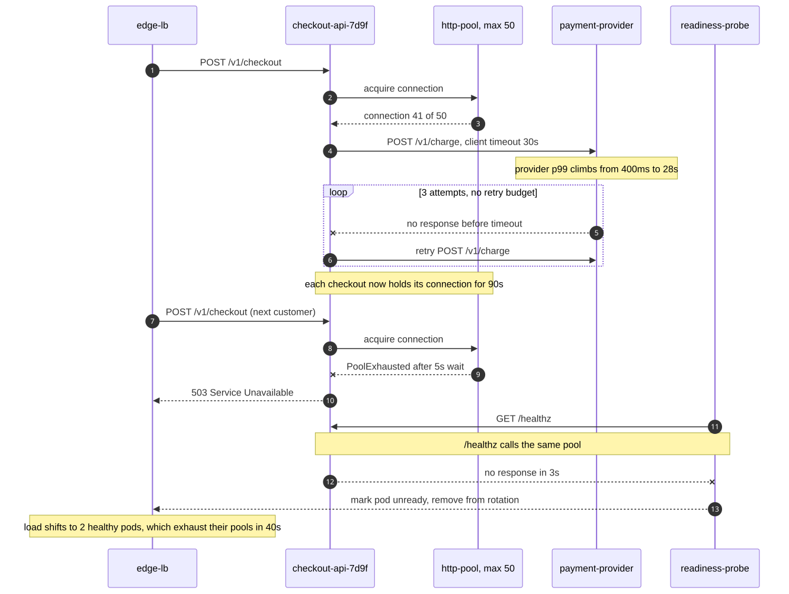

**Adapt it:** Keep the pool as its own participant.
The whole point of this diagram is that the pool, not the third party, is what turned slowness into unavailability, and that is invisible if the pool is hidden inside the service.
Replace the retry loop with your real retry policy and note the missing budget cap in the loop label if that is what made it worse.
Delete the readiness probe messages if your probe does not touch the failing dependency, since that is the difference between a slow service and a service that removes itself from the load balancer.
Cut this diagram at the first pod that fails; showing all three adds nothing.

---

### What happened, minute by minute

**Answers:** "When did we know, when did we act, and how long was each gap?"
**Use when:** opening a postmortem document, or reviewing detection and response time.
**Don't use when:** the reader needs contributing factors rather than order; use the ishikawa example below to organize them.
**Detail level:** L1

<!-- mermaid-render: id="scenario-operations--block6" -->
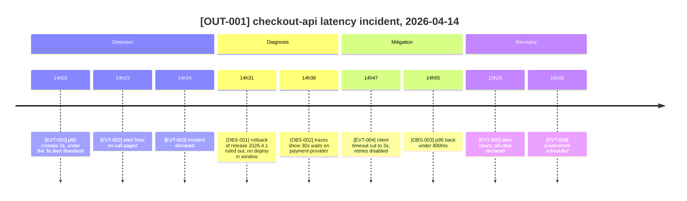
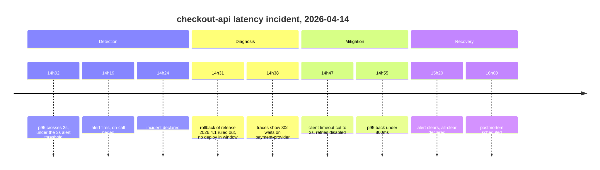

**Adapt it:** Use `14h02`, not `14:02`.
A colon in the period splits the line and the diagram fails to parse, because the parser reads `period : event`.
Keep the entries that mark a gap worth explaining, first signal, first page, first action, and drop the chatter in between.
The 17 minutes between 14h02 and 14h19 is the detection gap; put the line that exposes it in, even when it is unflattering, because that is usually the most valuable line on the page.
Rename the sections to your own phases if your process names them differently, but keep four or fewer.

---

### What contributed to the outage

**Answers:** "Which factors may have turned one slow dependency into a 68-minute outage for us, and which does the evidence support?"
**Use when:** running the postmortem discussion, where the group needs to compare several contributing factors side by side.
**Don't use when:** there is one cause and one fix; write that sentence in the postmortem, or draw the sequence diagram above if the mechanism is the hard part.
**Detail level:** L2

<!-- mermaid-render: id="scenario-operations--block7" -->
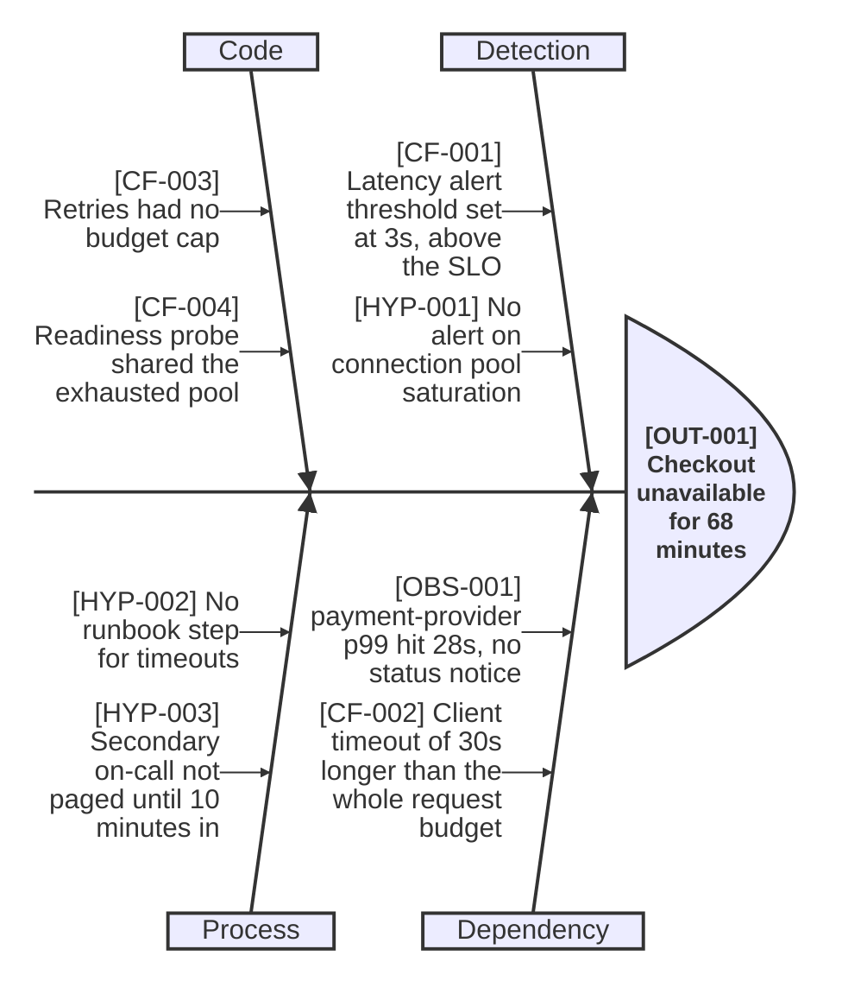
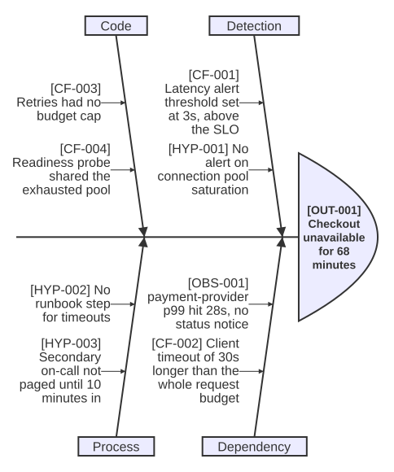

**Adapt it:** Put the customer-visible effect at the head, with a duration.
Name the head after what the customer lost, not after the alert that fired.
Use four to six categories.
`Detection`, `Dependency`, `Code`, and `Process` fit most software incidents; swap in `Data` or `Capacity` when they carry real weight.
Write candidate factors and mark which the evidence supports.
Inclusion does not prove causation.
Every branch should map to the analysis record and be something a change could remove.
If a branch has only one factor and no sub-causes, fold it into a neighbouring category rather than drawing a bone for it.

---

### How much error budget the incident cost us

**Answers:** "Can we still ship risky changes this month, or did the outage spend the budget?"
**Use when:** the monthly service review, or arguing for a freeze on feature work.
**Don't use when:** you are showing a split of error types rather than a burn over time; use a pie chart, see `pie-chart.md`.
**Detail level:** L2

<!-- mermaid-render: id="scenario-operations--block8" -->
```mermaid
---
config:
  themeVariables:
    xyChart:
      plotColorPalette: "#c62828, #90a4ae"
---
xychart-beta
    title "checkout-api error budget, 30-day window, 99.9% SLO"
    x-axis "Day of window" [1, 5, 10, 15, 20, 25, 30]
    y-axis "Budget remaining (%)" 0 --> 100
    line "actual" [100, 96, 91, 88, 41 "outage", 34 "actual", 22]
    line "even burn" [100, 87, 70 "even burn", 53, 37, 20, 3]
```
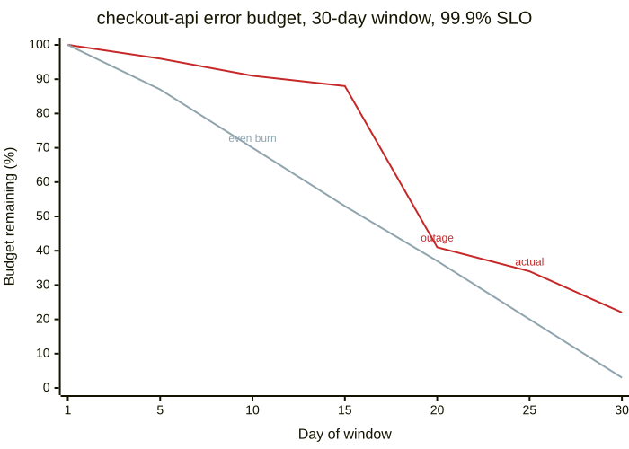

**Adapt it:** Keep both series.
The `even burn` line is what makes the actual line readable, since without it nobody can tell whether 41% on day 20 is fine or alarming.
Keep the `plotColorPalette` override too.
The default palette draws the first series in a pale lavender that is close to invisible on white.
Name each line with a per-point label in the middle of the series, as here, rather than relying on a legend.
`showLegend` renders nothing in Mermaid 11.16, and a label on the last point is cut off at the plot edge.
State the SLO and the window in the title, because a budget number means nothing without them.
If your budget is measured in minutes rather than percent, change the y-axis title and values; do not plot both units on one chart.

---

### Did the postmortem actions actually get done

**Answers:** "We agreed on six follow-ups a month ago. Which ones are still open, and who has them?"
**Use when:** the follow-up review a few weeks after the incident, or a status snapshot in the postmortem document itself.
**Don't use when:** the actions have deadlines and depend on each other; use a `gantt` chart, see `gantt.md`.
**Detail level:** L1

<!-- mermaid-render: id="scenario-operations--block9" -->
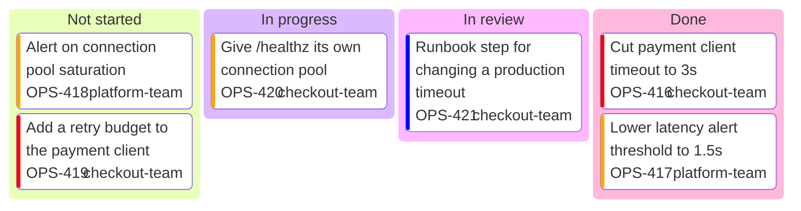

**Adapt it:** Leave `accTitle` and `accDescr` off this one.
The kanban parser does not recognize them and silently renders each line as an extra column, which is worse than having no accessibility text at all.
Give every card an `assigned` and a `ticket`.
An action with no owner is a wish, and this diagram exists to make that visible at a glance.
Set `priority` from the contributing factor it removes, not from how hard the work is.
Add `ticketBaseUrl` in a frontmatter config block, as shown in `kanban.md`, so the ticket numbers render as links.
If half the cards are still in `Not started` a month later, the diagram has done its job; take it to the review rather than redrawing it.
