# Runtime behaviour scenarios

**Use for:** explaining what happens to a live request, message, or job while the system is running: end-to-end lifecycle, timeout budgets, retries and dead letters, breaker states, caching, event fan-out, compensation, deduplication, and load shedding.
**Avoid for:** build-time and delivery-time workflows such as CI/CD pipelines, branching, or release scheduling, and for the generic starter templates in `common-patterns.md`.

Find the scenario whose `Answers:` line matches the question you were actually asked.
Copy the diagram, then work through `Adapt it:` before you show it to anyone.
Every diagram here uses invented but plausible service names, so none of them is correct for your system until you have replaced them.

---

### Where does a checkout request go?

**Answers:** "When a customer clicks Pay, what does the request touch before they see a confirmation?"
**Use when:** onboarding a new joiner, or opening an incident review before anyone drills into one tier.
**Don't use when:** you need message order and who waits on whom; use the timeout scenario below, which is a sequence diagram.
**Detail level:** L1

<!-- mermaid-render: id="scenario-runtime--block1" -->
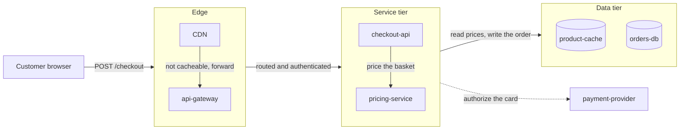

**Adapt it:** Replace the four tier names first, they carry most of the meaning.
Keep the tier count at three or four.
Delete `pricing-service` if your service tier is one service, and add a second subgraph only when a whole tier is missing, not when one more service exists.
`payment-provider` is the placeholder for any third party you do not own, so it stays outside every subgraph and keeps the dotted edge.
The response retraces the same path, so it is not drawn; add return edges only when a different path carries the reply, such as a webhook or a websocket push, and expect them to flip the layout.
This is the zoom level above `common-patterns.md`'s REST request flow and microservices architecture; link down to those, do not merge them into this one.

---

### Who gives up first when checkout is slow?

**Answers:** "The client saw a 504, so which hop ran out of time and how much budget did it have left?"
**Use when:** writing up a timeout incident, or agreeing per-hop timeouts so they add up to less than the client deadline.
**Don't use when:** the question is how often the provider is slow rather than what happens on one slow call; use `xy-chart.md` for a latency series.
**Detail level:** L3

<!-- mermaid-render: id="scenario-runtime--block2" -->
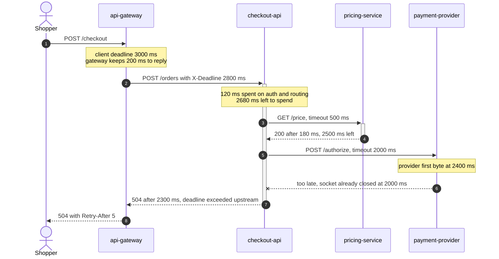
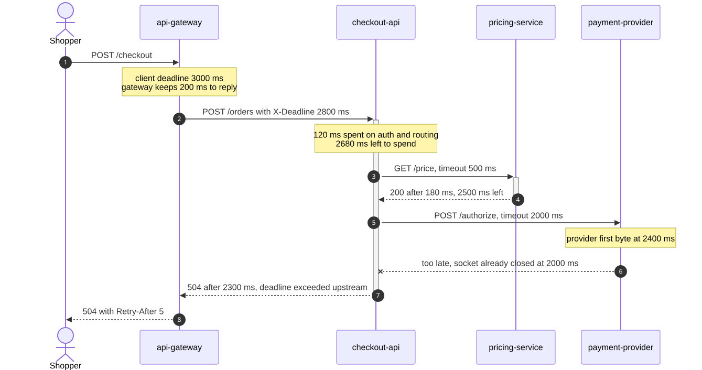

**Adapt it:** Set every number from your own config and traces, they are the whole point of the diagram.
Keep one `Note over` per participant that owns a budget, and delete the notes for hops that just pass the deadline through.
Swap `payment-provider` for whichever dependency actually blew the budget.
If two hops can overrun, draw the diagram twice rather than branching with `alt`, because a reader tracking arithmetic cannot follow two budgets at once.

---

### What happens to an order message that keeps failing?

**Answers:** "When a message fails, how many more times will it run, how long between tries, and where does it end up?"
**Use when:** documenting a queue for on-call, or reviewing a change to retry policy or handler error handling.
**Don't use when:** you only need the message's status values and legal transitions; use `stateDiagram-v2` as in the idempotency scenario below.
**Detail level:** L2

<!-- mermaid-render: id="scenario-runtime--block3" -->
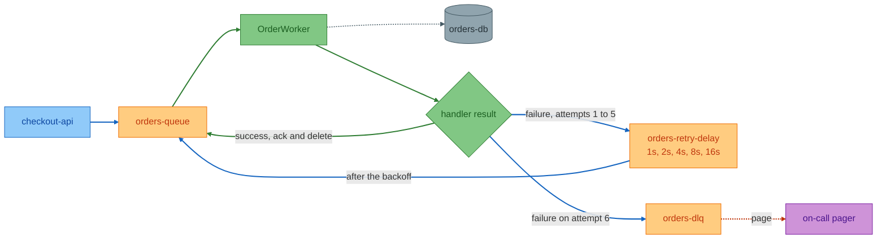

**Adapt it:** Use the real queue, delay-queue, and dead-letter names, because the reader will grep or query for them.
Put your actual attempt cap and backoff series in the `Delay` label.
Delete `Oncall` if nothing watches the dead-letter queue, and treat that as a finding rather than a drawing decision.
If retries happen in process instead of through a delay queue, delete `Delay` and label the edge from `Gate` back to `Worker` with the sleep.

---

### Why did calls to the payment provider start failing instantly?

**Answers:** "The breaker is open, so what opened it and what has to happen before traffic flows again?"
**Use when:** documenting a resilience config, or explaining why an outage kept returning errors after the provider recovered.
**Don't use when:** you need to show the calls and responses around the breaker; use a sequence diagram like the cache scenario below.
**Detail level:** L2

<!-- mermaid-render: id="scenario-runtime--block4" -->
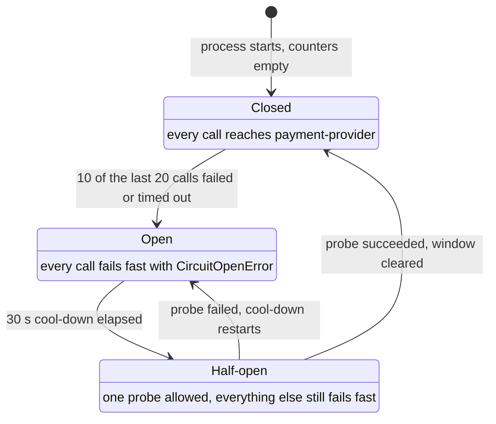

**Adapt it:** Replace the threshold, window size, and cool-down with your library's configured values.
The second line of each state says what a call does while the breaker sits there, which is the part on-call needs, so keep it and reword it rather than deleting it.
Add a `Forced` state only if an operator can open the breaker by hand, and give it transitions to and from `Closed`.
This is a different machine from the order lifecycle in `common-patterns.md`; that one tracks a record, this one tracks one caller's view of a dependency's health.

---

### Why is the catalog showing an old price?

**Answers:** "We committed a new price, so why did the next read still return the old one?"
**Use when:** designing or reviewing a cache-aside path, or explaining a stale-data bug report.
**Don't use when:** the question is which component owns the cache; use the L1 lifecycle diagram at the top of this file.
**Detail level:** L2

<!-- mermaid-render: id="scenario-runtime--block5" -->
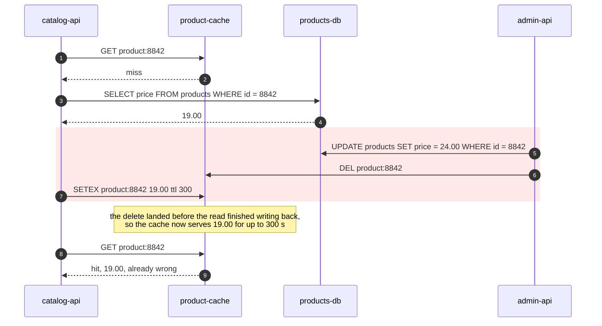
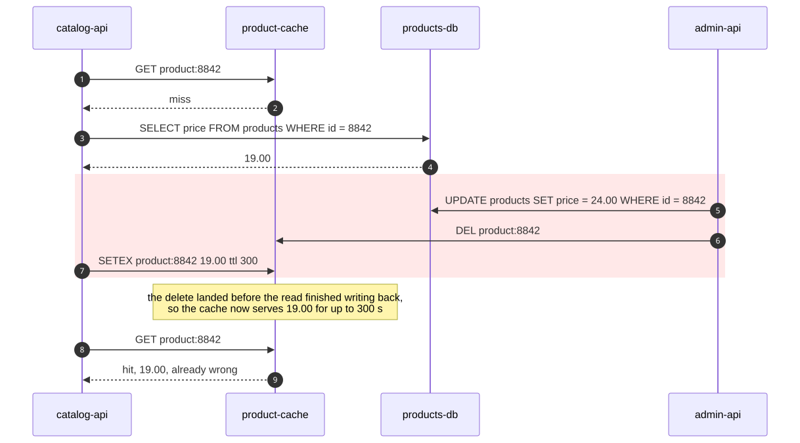

**Adapt it:** Change the key format, the TTL, and the two values to your own.
The shaded block is the hazard window, keep it shaded and keep those three messages in that order or the bug disappears from the picture.
Swap `admin-api` for whatever writes; the hazard needs a reader and a writer, not a particular writer.
If you fix this with a short TTL, a versioned key, or a write-through path, redraw the fixed order and keep this version next to it as the before.

---

### If the email sender is down, does anything else stop?

**Answers:** "If one consumer of order events is broken, are analytics and the warehouse still getting theirs?"
**Use when:** reviewing a new subscriber on an existing topic, or answering blast-radius questions during an incident.
**Don't use when:** consumers must run in a fixed order or hand work to each other; that is a pipeline, so draw it as the L1 lifecycle flowchart instead.
**Detail level:** L2

<!-- mermaid-render: id="scenario-runtime--block6" -->
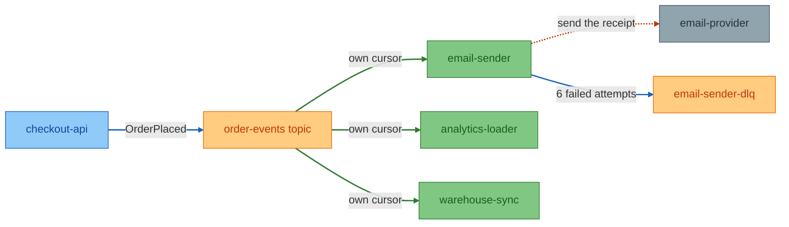

**Adapt it:** Name the real topic and the real subscriptions, one node per subscription rather than one per running instance.
The `own cursor` labels are the claim the diagram is making, so change them to match your broker's wording, or delete them and say nothing if consumers actually share one cursor.
Draw the failure path for one consumer only, the one that fails most, and leave the others clean.
Do not wrap the three consumers in a subgraph; a crossing edge would then stop at the box border and the fan-out would vanish.

---

### What undoes the charge when shipping rejects the order?

**Answers:** "There is no distributed transaction, so what actually reverses steps one and two when step three fails?"
**Use when:** designing or reviewing a multi-service write path, or explaining to support why a refund appeared without a cancellation request.
**Don't use when:** all the steps are in one database transaction; a rollback needs no diagram.
**Detail level:** L3

<!-- mermaid-render: id="scenario-runtime--block7" -->
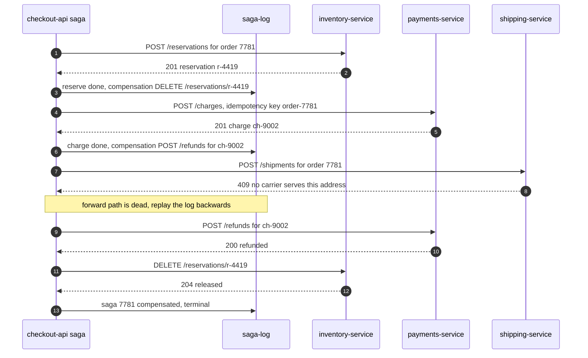
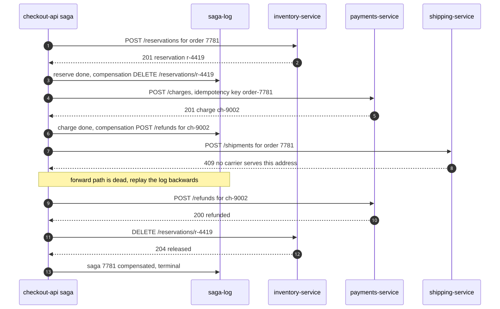

**Adapt it:** Replace the three services with your own steps in forward order, then mirror them in reverse for the compensation half.
Every forward step needs its `saga-log` line naming its compensating call, that pairing is what makes this a saga rather than a call chain.
Delete `saga-log` only if your orchestrator can recover its position from somewhere else, and say where in the surrounding prose.
Add `break` around a compensation that can itself fail, and name the alert or manual queue it lands in.

---

### Why did a redelivered message not charge the customer twice?

**Answers:** "The broker delivered the same message again, so what stopped the handler from running a second time?"
**Use when:** reviewing at-least-once delivery, or explaining a near-miss where a duplicate almost double-applied a write.
**Don't use when:** you want to show the two deliveries racing in real time; use a sequence diagram with two producer participants.
**Detail level:** L3

<!-- mermaid-render: id="scenario-runtime--block8" -->
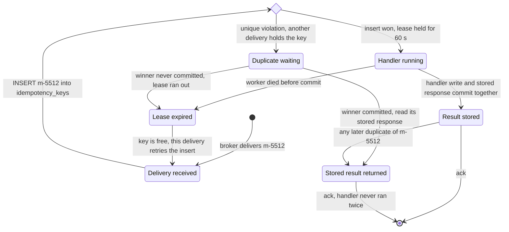

**Adapt it:** Replace the table name, the lease length, and the message id with yours.
The `Running --> Stored` label is the load-bearing claim.
If the handler's write and the stored response do not commit together, this machine is wrong and duplicates can still double-apply.
Delete `Expired` and its two transitions only if you have no lease and rely on the row staying in flight forever, and note that a crashed worker then blocks the key.
Swap `unique violation` for your store's conflict wording, a conditional put or a compare-and-set.

---

### What does a partner see when it sends too fast?

**Answers:** "A partner is over its quota, so who tells it to slow down and what happens to the work we already accepted?"
**Use when:** publishing a rate-limit contract, or explaining why accepted throughput dropped while nothing was erroring.
**Don't use when:** you want the numbers over time rather than the mechanism; use `xy-chart.md` for accepted versus rejected volume.
**Detail level:** L2

<!-- mermaid-render: id="scenario-runtime--block9" -->
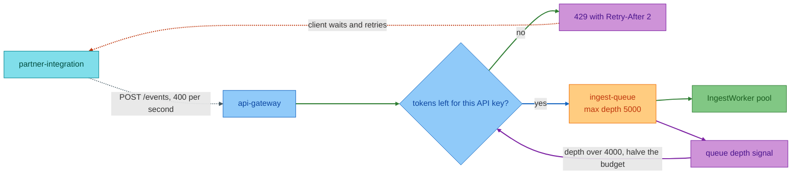

**Adapt it:** Set the quota, the queue cap, the depth threshold, and the `Retry-After` value from your own config.
The two edges through `Depth` are the backpressure claim; delete both if nothing feeds queue depth back into the limiter, and then say plainly that the queue can fill until it drops work.
Replace `partner-integration` with the caller whose traffic you are actually shaping, and add a second client node only if the limits differ per caller.
Keep `Reject` as its own node rather than a label on an edge, because on-call needs to see the exact status and header the partner receives.
