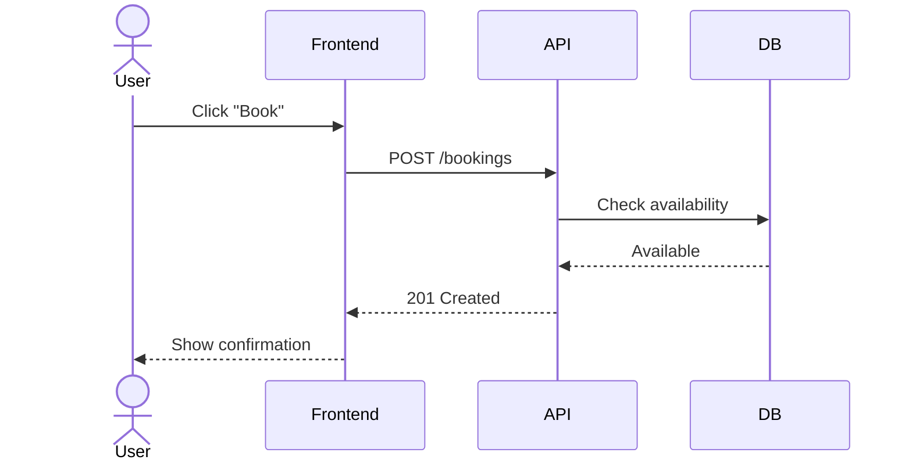
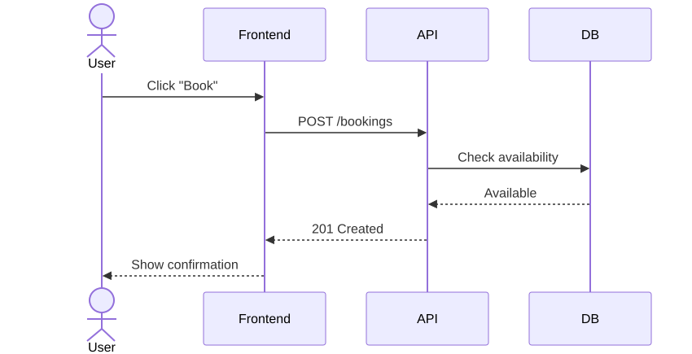
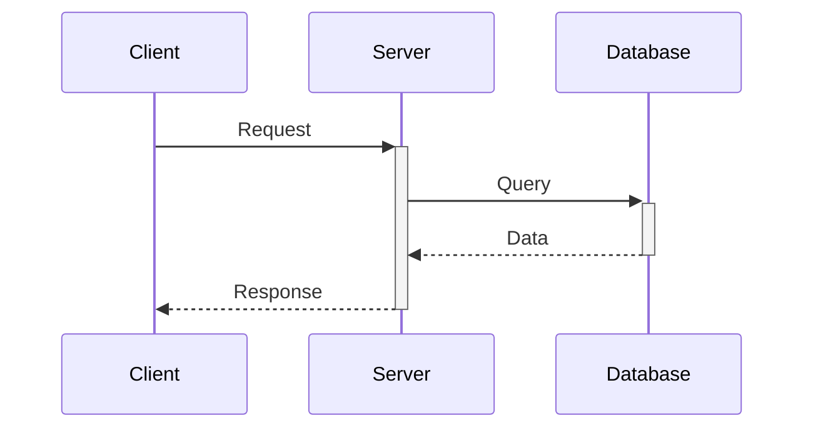
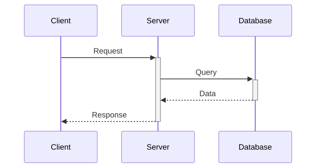
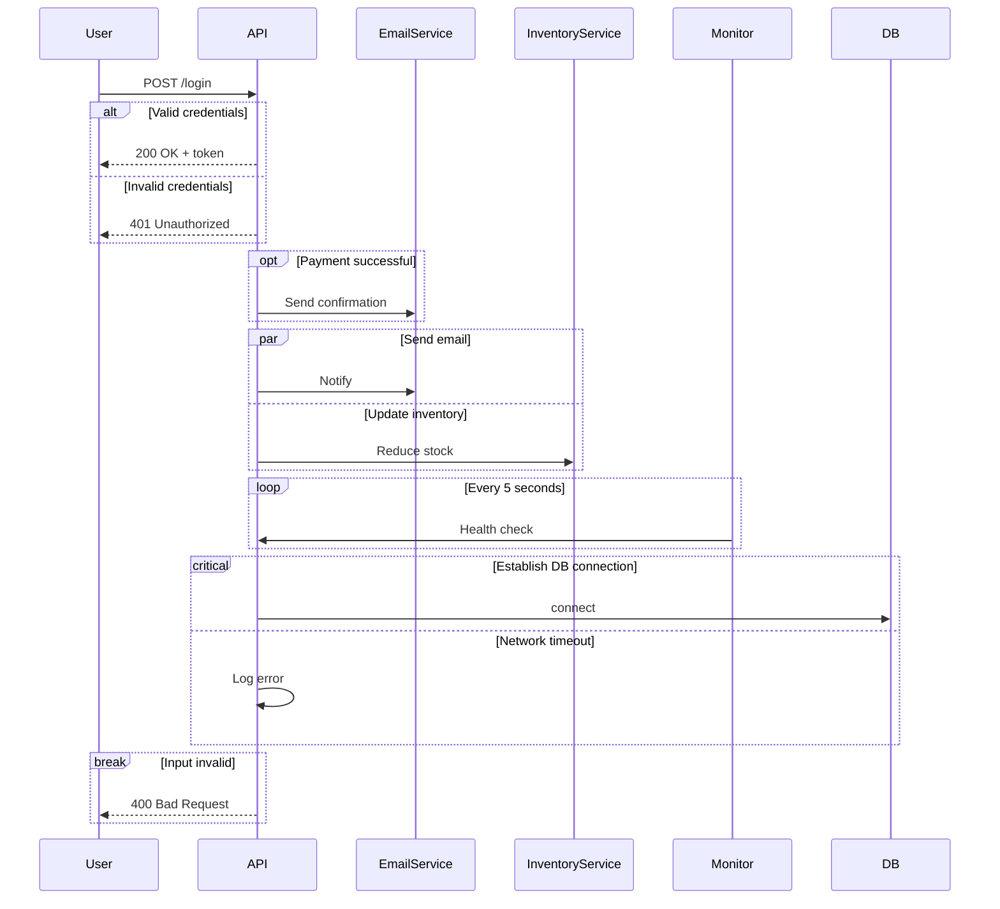
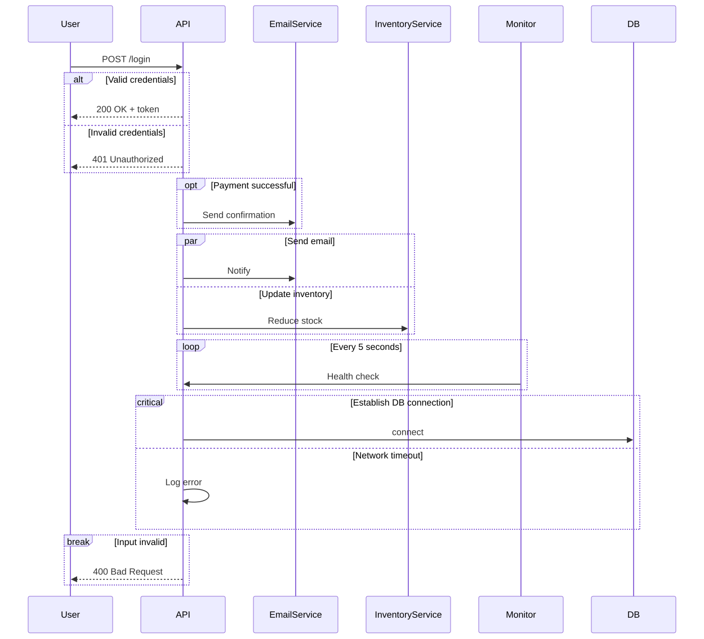
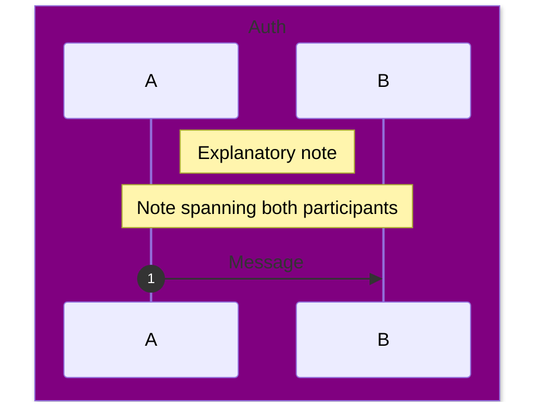
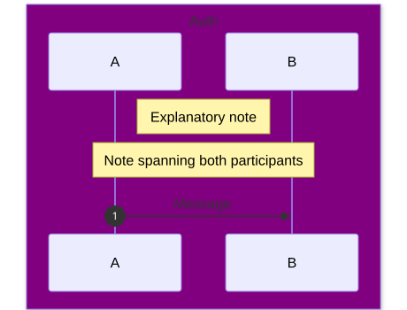
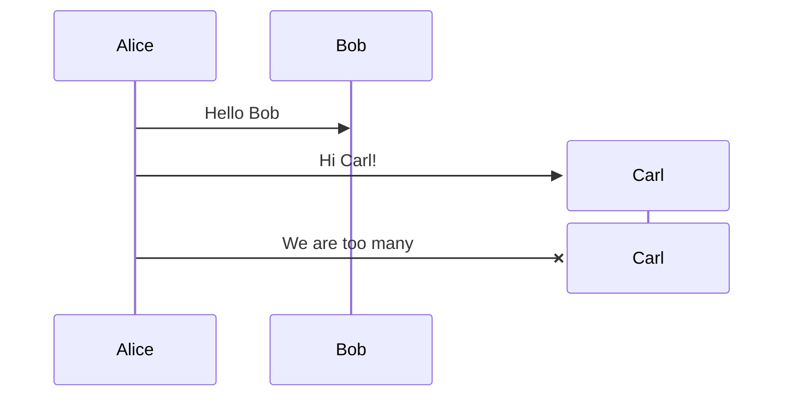
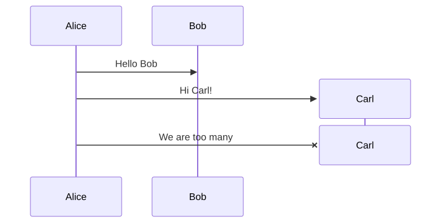

# Sequence diagram

**Use for:** API request/response flows, authentication sequences, message passing between components, any interaction where message order over time is the point.
**Avoid for:** many parallel independent branches (use a flowchart), or when "who owns this step" matters more than call order (use `swimlanes.md`).

## Core syntax

<!-- mermaid-render: id="sequence-diagram--block1" -->

`participant` renders as a box; `actor` renders as a stick figure, use it for humans/external entities, `participant` for systems. Declare participants explicitly to control display order (otherwise order-of-first-appearance is used). Alias a participant with `participant A as Alice`.

## Message arrow types

| Syntax | Meaning |
|---|---|
| `->>` | Solid arrow (sync call/request) |
| `-->>` | Dotted arrow (response/return) |
| `->` / `-->` | Solid/dotted line, no arrowhead |
| `-)` / `--)` | Solid/dotted open arrow (async, fire-and-forget) |
| `-x` / `--x` | Solid/dotted line ending in a cross (message dropped/destroyed) |
| `<<->>` / `<<-->>` | Bidirectional arrowheads (v11+) |

## Activations

<!-- mermaid-render: id="sequence-diagram--block2" -->

`+` after the arrow activates the target (draws an activation bar); `-` before the arrow deactivates the sender. Or use explicit `activate X` / `deactivate X` statements. Activations can stack on the same participant.

## Control-flow blocks

<!-- mermaid-render: id="sequence-diagram--block3" -->

- `alt`/`else`/`end`: mutually exclusive branches.
- `opt`/`end`: single optional branch (no else).
- `par`/`and`/`end`: concurrent branches; nestable.
- `loop`/`end`: repeated block.
- `critical`/`option`/`end`: one action that must happen, with conditional handling of failure circumstances (options are like a switch on outcome, not alternatives to try).
- `break`/`end`: an early exit from the flow, usually modeling an exception.

## Notes, numbering, and grouping

<!-- mermaid-render: id="sequence-diagram--block4" -->

- `autonumber` (optionally `autonumber <start> <increment>`) numbers every arrow automatically.
- `Note left of X` / `Note right of X` / `Note over X,Y`: attach explanatory notes; text can include ` ` for line breaks.
- `box <color> Label ... end`: visually groups participants in a colored vertical band (hex colors aren't supported, use rgb()/named colors or omit the color).
- `rect rgb(r,g,b) ... end`: highlights a region of the diagram with a background rectangle.

## Participant creation/destruction

<!-- mermaid-render: id="sequence-diagram--block5" -->

## Participant stereotypes (v11+)

Use JSON-style config after the participant name for a distinct visual symbol: `participant Alice@{ "type": "boundary" }` (also `"control"`, `"entity"`, `"database"`, `"collections"`, `"queue"`). Combine with `as Label` for a display alias, or an inline `"alias"` field.

## Common pitfalls

- The bare word "end" can break the parser the same way it does in flowcharts; wrap it in parentheses/brackets if unavoidable.
- Hex colors (`#ff0000`) don't work in `box` headers because `#` starts a comment; use `rgb()`/`rgba()`/`hsl()` or a named color.
- A comment (`%%`) consumes the rest of its line, including diagram syntax placed after it.
- Keep each diagram to one scenario; branch with `alt` rather than drawing every path as a separate top-level diagram.

## Common patterns

See `common-patterns.md` for OAuth2, JWT auth, and layered REST request/response templates.
