# State diagram

**Use for:** state machines, record lifecycles,
status transitions (`stateDiagram-v2` is the current, actively-developed syntax;
prefer it over the legacy `stateDiagram`).
**Avoid for:** continuous polling loops (use a sequence diagram) or a process where "who does this step" matters more than which state something is in (use `swimlanes.md`).

## Core syntax

<!-- mermaid-render: id="state-diagram--block1" -->
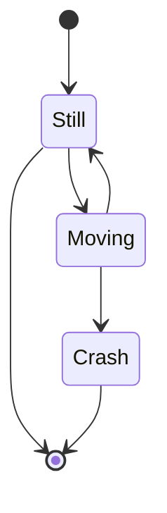

`[*]` is the special start/end pseudostate;
the direction of the arrow to/from it determines whether it's a start or an end.
A transition can carry a label: `s1 --> s2 : A transition`.
A state gets a description either via `state "Description" as s2` or `s2 : Description`.

## Composite (nested) states

<!-- mermaid-render: id="state-diagram--block2" -->
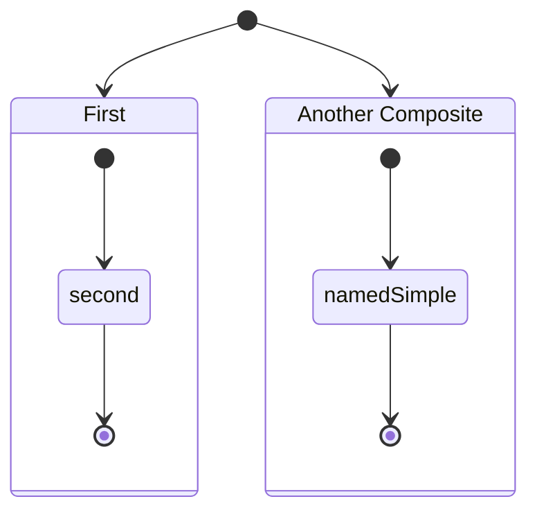

Nesting can go arbitrarily deep.
Transitions between composite states are allowed at the outer level;
transitions between internal states of *different* composite states are not.

## Choice, fork, join

<!-- mermaid-render: id="state-diagram--block3" -->
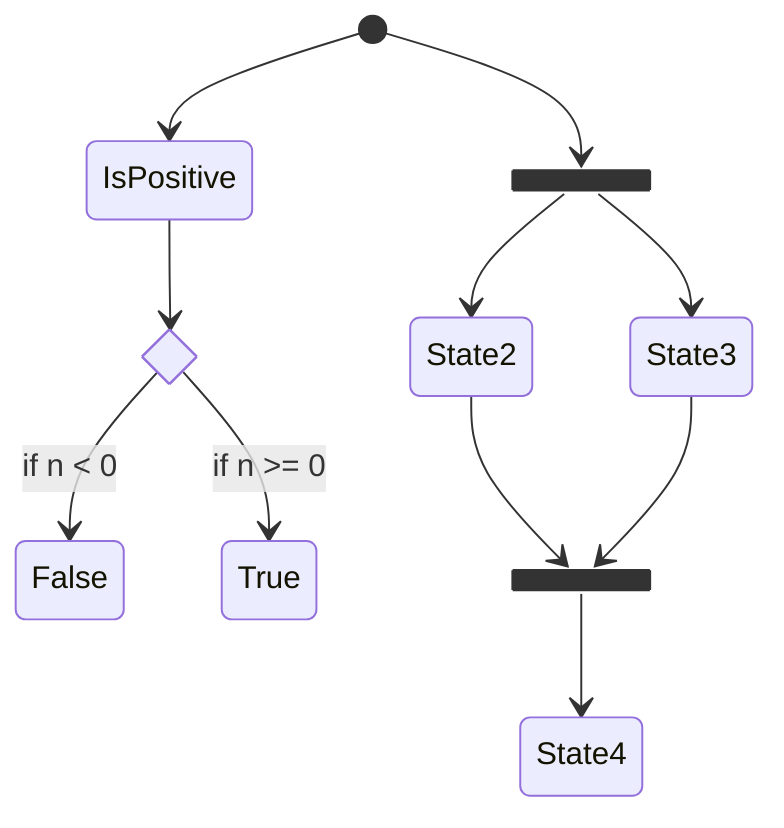

## Concurrency

Within a composite state, separate parallel regions with `--`:

<!-- mermaid-render: id="state-diagram--block4" -->
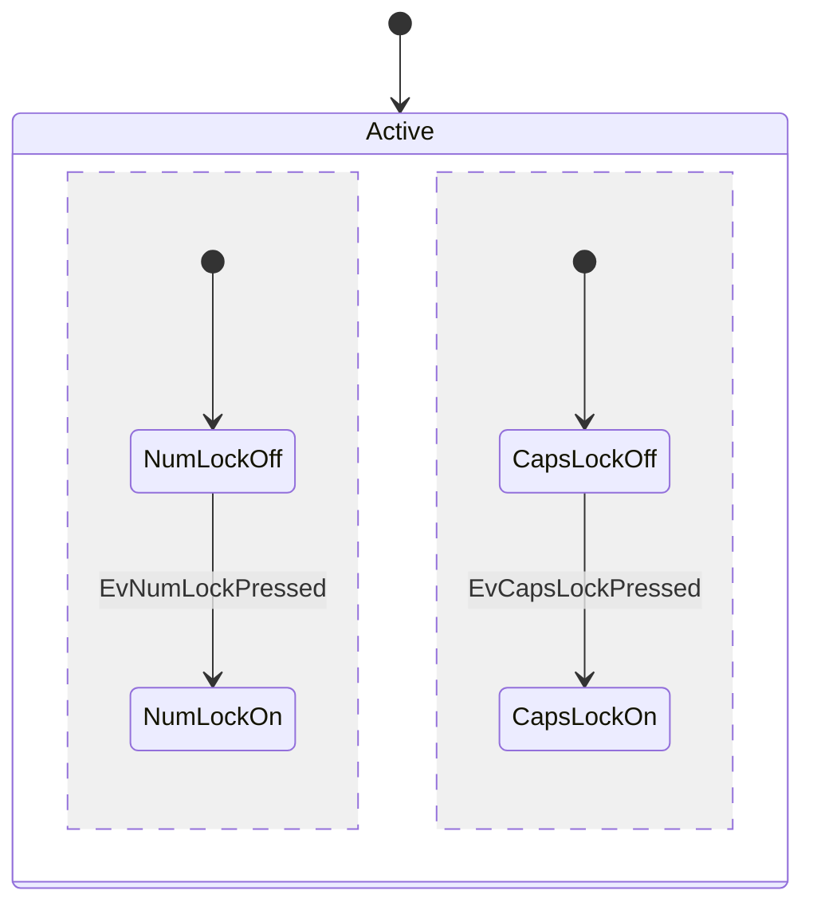

## Notes, direction, comments

<!-- mermaid-render: id="state-diagram--block5" -->
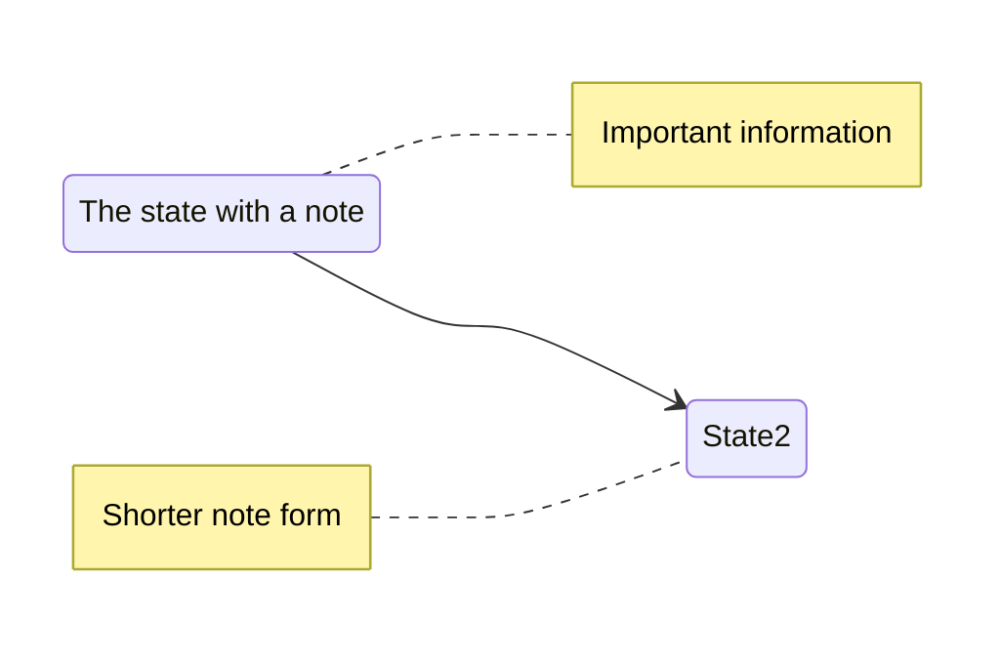

`direction` (`TB`/`LR`/etc.) sets layout,
including per-composite-state via a nested `direction` line.

## Styling

<!-- mermaid-render: id="state-diagram--block6" -->
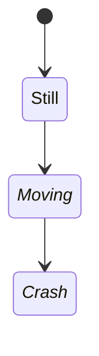

Two ways to apply a `classDef`: the `class` statement (works for start/end states too),
or the `:::` shorthand at the point of use.
**Limitation:** `classDef` styling cannot be applied to or within composite states themselves.

## Common pitfalls

- Spaces in a state's name require defining it with a bare id first (`stateId: Description with spaces`),
  then referencing the id.
- Transitions can't cross between internal states of two different composite states;
  route the transition through the composite states themselves.
- The legacy `stateDiagram` (without `-v2`) still works but has fewer features;
  use `stateDiagram-v2` for new diagrams.
- **A note must name a defined state, never a transition label.**
  `note right of Foo` where `Foo` is the text after a transition's `:` parses cleanly and then dies at layout with `Error: No such shape: undefined`,
  which names neither the note nor the offending target.
  Check that every note target also appears on the left or right of a `-->`.

## Common patterns

See `common-patterns.md` for order-lifecycle and user-account-state templates.
