# Mermaid diagram style standard

Generic conventions for drawing Mermaid diagrams in technical documentation.
Palette, edge syntax, diagram-type selection, and detail-level guidance.
Validated against a weaker model to confirm it can follow this standard unsupervised and produce diagrams that render correctly.

**How to read this doc:** every pattern has **Source** (raw Mermaid to copy) then **Rendered** (live diagram).
Don't/do pairs show one live block each, so the source you read is the diagram you see.
Tables and prose have no rendered block.

**Renderer assumption:** examples target Mermaid 11.x (edge IDs, `@{ curve: ... }`).
For an older renderer, see [linkStyle fallback](#linkstyle-fallback-only).

For full per-type syntax, see the sibling reference files in this folder (`flowchart.md`,
`sequence-diagram.md`, etc.) and the top-level `SKILL.md` selection table.

---

## Two audiences, two defaults

| Audience | Goal | Default diagram | Detail level | Node labels |
|----------|------|-----------------|--------------|-------------|
| **Birds-eye** (operator, PM, new team member) | Where does data go? Who talks to whom? | `flowchart LR` with **subgraphs**, or `C4Context` | 6-10 nodes target, 12 max; group by *phase*, not by *class/module* | Plain language: "Collect", "Process queue", "Customer API" |
| **Technical** (implementer, debugger) | Exact services, queues, code paths | `flowchart` with full palette + edge IDs, or `sequenceDiagram` | Named services, queue/table names, function/API calls | Exact identifiers: `OrderWorker_01`, `IngestQueue_BASE` |

**Rule:** one doc may contain **both**, birds-eye first (§ Overview), technical second (§ Detail).
Don't merge into one overcrowded chart.

**"Birds-eye" and "technical" are this skill's vocabulary for audience and detail level.
They are not Mermaid diagram types**, and they are not something a renderer understands.
Decide which one you are drawing, then pick a real Mermaid type from the table below.

**Before drawing:** decide the audience, and say it in the sentence that introduces the diagram.
Keep it out of `accTitle` and `accDescr`.
Those are read aloud by screen readers and should describe what the diagram *shows*, not which authoring convention produced it.
An `accDescr` that opens "Birds-eye flowchart showing..." leaks authoring vocabulary into the accessible text, and a later reader cannot tell whether "birds-eye" named a diagram type.
If the goal is onboarding or discovery,
default to birds-eye unless the task is debugging a specific path.

---

## Pick a diagram type

| You need to show... | Use | Avoid when... |
|-------------------|-----|-------------|
| Data or job flow across components | `flowchart` | More than ~20 nodes, split or use subgraphs |
| Who/what exists at a system boundary | `C4Context` | Internal queue/mechanics detail, too coarse |
| Request/order over time (client to service to DB) | `sequenceDiagram` | Many parallel branches, use flowchart |
| Class/module responsibilities | `classDiagram` | Non-developer audience, use birds-eye flowchart |
| Record lifecycle (Queued to Running to Done) | `stateDiagram-v2` | Continuous polling, use sequence or flow |
| Tables and FK relationships | `erDiagram` | Non-DB flows |
| Release/migration schedule | `gantt` | Runtime behaviour |
| Operator steps and pain points | `journey` | Developer debugging |
| Share of volume, error types | `pie` / `xychart-beta` | Exact routing logic |
| Candidate factors behind a failure | `ishikawa-beta` | Happy-path architecture |
| Overlap of two approaches | `venn-beta` | Single clear answer |
| Folder/map of docs or components | `mindmap` | Runtime data flow |
| Git/branch strategy | `gitGraph` | Deployment topology |

**Beta types** (`block-beta`, `packet-beta`, `sankey-beta`, `architecture-beta`, and others):
confirm render support on the target platform before using in canonical docs.
Prefer stable types otherwise.

---

## Flowcharts, the workhorse

### Birds-eye flowchart

**When:** onboarding docs, component overview, executive summary,
"how does data move through this system."

**How:**

- `flowchart LR` or `TB`, left-to-right reads as a pipeline.
- **Subgraphs = phases** (Collect, Process, Store, Deliver), not project folders or class names.
- **6-10 nodes** across all subgraphs combined.
  Collapse duplicate *instances* of the same thing ("Workers" not `Worker01`,
  `Worker02`) unless the doc is specifically about scaling.
  Don't collapse genuinely distinct types into one node just to save a slot;
  if the diagram's point is a relationship *between* two kinds of client app,
  each kind needs its own node, or that relationship disappears.
- **Edges:** solid for the main path; dotted only to external systems.
  Skip edge colors, or use one accent,
  readability beats full convention compliance on overview charts.
- **Edge labels:** verb phrases (`enqueue`, `write to DB`, `send to partner`).
- Add `accTitle` + `accDescr` for accessibility.
- **Don't invent relationships.**
  Only draw edges the source material actually states.
  If the trigger between two phases isn't documented,
  name the edge for what the phase *does* (`queue next stage`), not for a guessed mechanism.

#### Worked example

##### Source

```
flowchart LR
  accTitle: Data ingest-process-deliver overview
  accDescr: External source sends data; we collect and process it into storage; we deliver processed output downstream.

  Source[External source]

  subgraph Collect
    Collector[Collector]
    CQueue[Collect queue]
  end

  subgraph Process
    Processor[Processor]
  end

  DB[(Database)]

  subgraph Deliver
    DQueue[Deliver queue]
    Deliverer[Delivery worker]
  end

  Source -.->|send data| Collector
  Collector -->|enqueue| CQueue
  CQueue -->|dequeue| Processor
  Processor -.->|write to DB| DB
  Processor -->|queue output| DQueue
  DQueue -->|dequeue| Deliverer
  Deliverer -.->|deliver| Source
```

##### Rendered

<!-- mermaid-render: id="style-standard--block1" -->
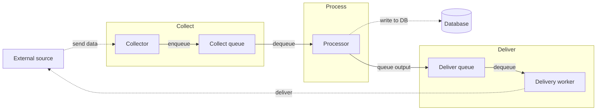

No node palette applied here, birds-eye diagrams may skip it entirely.

This example keeps node-level edges on purpose.
Each subgraph here is one stage of a straight pipeline, so the through-line is the information;
see [Subgraph edges](#subgraph-edges-the-endpoint-decides-the-layout) for when to point at the box instead.

`Process` holding only `Processor` is not a single-node-subgraph violation: it is one phase band in the Collect/Process/Deliver row, and the band stays even at one node so the diagram doesn't need a reshuffle the day `Process` gains a second node.
See the exception under [Don't wrap a single node in a subgraph](#dont-wrap-a-single-node-in-a-subgraph).

### Subgraph edges, the endpoint decides the layout

An edge endpoint is not just a label, it changes how Mermaid lays the diagram out.

- Name the **subgraph** and it becomes a sealed box, laid out on its own, with the arrow stopping at its border.
- Name a **node inside** and the subgraph stays a label drawn over nodes that still take part in the parent's flow.

**Default:** when an edge crosses a subgraph boundary, name the subgraph.

**Exception:** name a node inside when that subgraph is one stage of a straight pipeline and the edge is part of the same through-line.

**Never:** name a node inside a subgraph that sets its own `direction`.
Mermaid clips the arrow at the box border, so the picture cannot show the node the source names.

#### Simple case, one edge into a group

The box is a group, not a pipeline stage, so the edge belongs on the box.

##### Don't

`Ext --> C` drags the group flat into the parent's rank order and cuts the boundary diagonally.

<!-- mermaid-render: id="style-standard--block5" -->
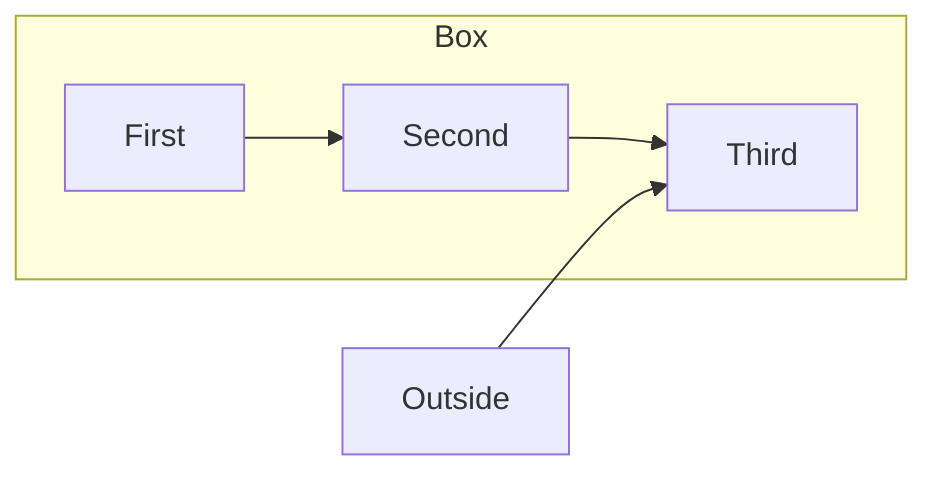

##### Do

`Ext --> Box` seals the group, so it keeps its own stacking and takes one arrow at its edge.

<!-- mermaid-render: id="style-standard--block6" -->
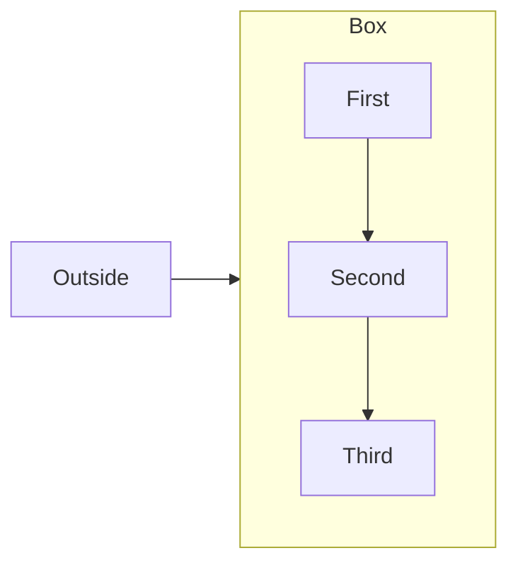

#### Complex case, several edges crossing the same boundary

Two tiers, each with an internal structure the reader does not need in order to follow the tier-to-tier flow.

##### Don't

`Orders --> Cache` and `Orders --> DB` both get clipped at the `Data tier` border,
so they render as two identical stubs that carry no more information than one arrow would.

<!-- mermaid-render: id="style-standard--block7" -->
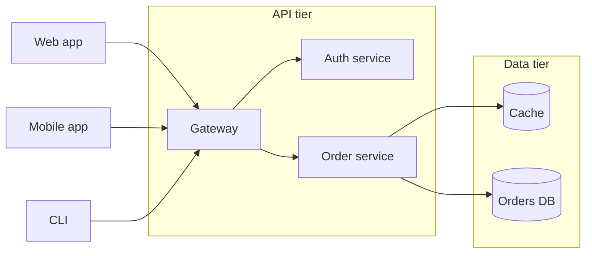


##### Do

Cross-boundary edges name the tier; edges that stay inside a tier keep naming nodes.

<!-- mermaid-render: id="style-standard--block8" -->
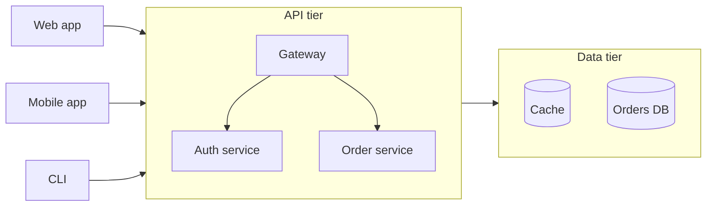

#### When not to point at the subgraph

- The subgraph is one stage of a straight pipeline and the edge continues the flow through a specific node,
  as in the birds-eye worked example above.
  Pointing at the box there fragments one readable pipeline into a chain of separate boxes.
- Exactly one edge crosses the boundary and which node it reaches is the point of the diagram
  (a technical diagram naming the queue that actually receives the write, say).
- The subgraph is a swimlane.
  Lanes are ownership bands, not targets; edges always run node to node across them, see `swimlanes.md`.

#### Pitfall, an edge endpoint needs an explicit id

`subgraph Process the data` gives the subgraph a multi-word id, and `Ext --> Process the data` is a parse error.
Give every subgraph you intend to point at an explicit id.

```
subgraph Proc [Process the data]
  ...
end
Ext --> Proc
```

Edge IDs, edge labels, and edge classes all work on an edge to a subgraph: `Ext e1@-->|submit job| Proc`.

#### Don't wrap a single node in a subgraph

A one-node subgraph with no sibling bands draws two boxes to say one thing.
Delete the subgraph and keep the node, or fold the node's name into the group label.

**Exception:** a phase band in a birds-eye row of phases (Collect, Process, Deliver) stays even when it currently holds only one node.
The parallel structure across bands is the information the diagram carries, and a phase gains nodes later without a reshuffle only if the band is already there.
The anti-pattern is a lone subgraph with no sibling bands, drawn around a single node for no structural reason.

### Technical flowchart

**When:** debugging a queue, documenting a new service hook,
a change that alters enqueue/consume paths.

**How:**

- Apply the [full palette](#node-color-palette): `producer`, `queue`, `consumer`, `external`,
  `client`, `standalone`.
- **One link per line.**
  Never `A & B & C ==> D` when each arrow needs its own color,
  see [split compound edges](#split-compound-edges).
- **Arrow syntax:** `==>` enqueue, `-->` consume/trigger, `-.->` external dependency.
- **Edge colors:** edge IDs by default, `Source id@==> Target` then `class id edgeEnqueue`.
- **Every edge styled**, no default black on critical paths.
- **Legend** as an in-diagram `%% Legend: ...` comment when more than one edge color is used.
- Name queues/tables by their real config or DB name when the reader will grep or query for them.
- **Declare all `classDef`s first**, before any node or edge line.

#### Worked example

##### Source

```
flowchart LR
  classDef producer fill:#90caf9,stroke:#1565c0,color:#0d47a1
  classDef queue fill:#ffcc80,stroke:#ef6c00,color:#bf360c
  classDef consumer fill:#81c784,stroke:#2e7d32,color:#1b5e20
  classDef external fill:#90a4ae,stroke:#455a64,color:#263238
  classDef edgeEnqueue stroke:#1565c0,stroke-width:2px
  classDef edgeConsume stroke:#2e7d32,stroke-width:2px
  classDef edgeExternal stroke:#455a64,stroke-width:1.5px

  App[Web app]:::producer
  Q[IngestQueue_BASE]:::queue
  Worker[OrderWorker_01]:::consumer
  DB[(Orders DB)]:::external

  App enq@==> Q
  Q con@--> Worker
  Worker dep@-.-> DB

  class enq edgeEnqueue
  class con edgeConsume
  class dep edgeExternal

  %% Legend: Blue thick = enqueue; green solid = consume; gray dotted = external dependency.
```

##### Rendered

<!-- mermaid-render: id="style-standard--block2" -->
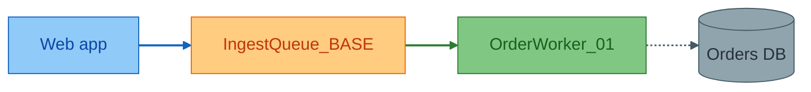

### Shared-stage convergence (same call, multiple callers)

**When:** two or more flows (composer classes, polymorphic implementations, request handlers) call the *exact same* underlying stage/method for a step, differing only in a few surrounding steps,
such as their entry point, their exit point, or one parameter (a destination, a flag).
Common in OOP codebases built from a small set of composers sharing base stages, or any template-method-style composition.

**Discriminator, check before collapsing:** is this the same method/stage reached from two callers, or two different implementations that merely look similar on paper?
Only collapse the former.
If the two calls run different code, even if same name or shape, keep them as separate nodes;
collapsing hides the very difference the diagram exists to show.

**How:**

- Draw each caller's *unique* steps (its own entry point, its own exit or side effect) as distinct nodes.
- Draw the shared steps once, as plain nodes or a named `subgraph` if the shared group is itself a nameable, reusable unit worth calling out.
- Route each caller's unique entry into the shared chain with its own edge;
  style the first-drawn caller's edge as a normal edge and every additional caller's edge with a distinct class (e.g. dashed),
  so a reader can spot at a glance where a second caller joins the shared spine.
- If a shared stage's *behavior* varies by caller (a different destination, a different parameter) but it is still one call, don't duplicate the node.
  Draw one node with multiple labeled outgoing edges, one per caller, converging back onto the next shared node.
  The branch labels carry the difference; the node stays singular.
- Don't wrap every caller in its own `subgraph` just to give it a boundary.
  Reserve `subgraph` for a genuinely nameable, reusable unit (the shared stage group itself, say).
  A caller with only 2-4 unique steps and no meaningful internal boundary reads fine as plain nodes.
- This pattern is one option, not the only correct shape.
  It fits when callers share literal underlying calls; don't force convergence onto flows that only coincidentally look alike.

**Anti-pattern this replaces:** two composers/handlers drawn as two parallel full subgraphs, each redrawing an identical stage sequence (`Load`, `Prepare`, `Convert`, `Validate`, ...) under prefixed IDs (`Load`/`RLoad`, `Conv`/`RConv`).
This doubles the node count for zero new information, and buries the actual difference between the two paths instead of highlighting it.

#### Worked example

Two composers, `Export` and `Recreate`, share every stage except path resolution (entry) and what happens after validation (exit).
`Convert` is one call whose destination differs by caller; both branches converge back onto the same `ValidateArtifacts` node.

##### Source

```
flowchart TB
  classDef target fill:#81c784,stroke:#2e7d32,color:#1b5e20
  classDef shared fill:#4db6ac,stroke:#00695c,color:#003c34
  classDef edgeConsume stroke:#2e7d32,stroke-width:2px
  classDef edgeShared stroke:#00695c,stroke-width:2px,stroke-dasharray: 3 3

  Path["ResolveNewPath -- Export only"]:::target
  RPath["Original catalog path -- Recreate only"]:::target

  Load["Load"]:::shared
  Convert["Convert"]:::shared
  Validate["ValidateArtifacts"]:::shared

  Path e1@--> Load
  class e1 edgeConsume
  RPath e2@--> Load
  class e2 edgeShared
  Load --> Convert
  Convert e3@-->|to the new path -- Export| Validate
  class e3 edgeConsume
  Convert e4@-->|to the original catalog path -- Recreate| Validate
  class e4 edgeShared
```

##### Rendered

<!-- mermaid-render: id="style-standard--block4" -->
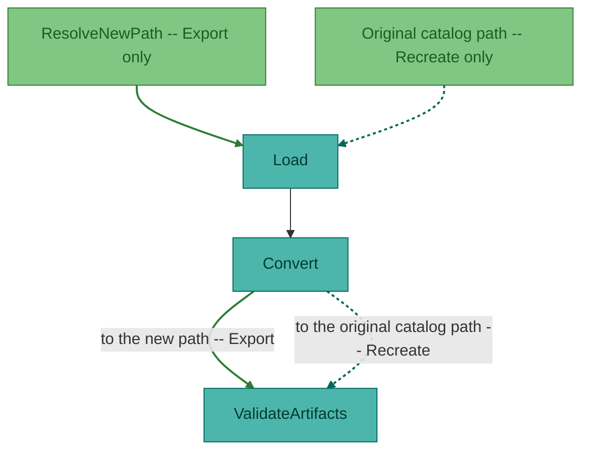

### When not to use a flowchart

- **Single call chain, fewer than 5 steps, one thread** → `sequenceDiagram` is clearer.
- **Only schema** → `erDiagram`.
- **Only "what exists"** → `C4Context` or a bullet list plus one small flowchart.

---

## Node color palette

Medium-lightness fills, darker strokes, explicit text `color` on every `classDef`.
Mermaid does not adapt to viewer theme,
so labels must contrast with the fill in both light and dark mode.

| Role | classDef name | Fill | Stroke | Color (text) | Use for |
|------|----------------|------|--------|--------------|---------|
| **Producer / source** | `producer` | `#90caf9` | `#1565c0` | `#0d47a1` | Enqueues jobs, triggers work, or is a data source (scheduler, upstream service). |
| **Queue** | `queue` | `#ffcc80` | `#ef6c00` | `#bf360c` | DB-backed or in-memory queues and buffers. |
| **Consumer / worker** | `consumer` | `#81c784` | `#2e7d32` | `#1b5e20` | Dequeues and processes. |
| **External system** | `external` | `#90a4ae` | `#455a64` | `#263238` | Databases, file shares, FTP/SFTP, third-party systems and APIs we don't own. |
| **Client / first-party app** | `client` | `#80deea` | `#00838f` | `#004d40` | Our own web, mobile, or desktop application, a UI or first-party endpoint, not a third-party dependency. |
| **Standalone / special** | `standalone` | `#ce93d8` | `#7b1fa2` | `#4a148c` | Notification/communication services, job drivers, anything distinct from a producer. |
| **Service group** | `service` | `#b39ddb` | `#5e35b1` | `#311b92` | Group box for "our" services in dependency-boundary views. |

`client` vs. `external`: if the node is a first-party application built and shipped in-house,
even if, from one diagram's narrow scope, it sits outside the pipeline being documented,
use `client`, not `external`.
Reserve `external` for systems outside the organization's ownership (third-party APIs,
a partner's infrastructure, a database or file share treated as a boundary).
This distinction matters most on diagrams that need to show *which* of several first-party apps talks to what,
collapsing them into `external` erases that.

Omit unused roles.
Always include `color`.

### Source

```
classDef producer fill:#90caf9,stroke:#1565c0,color:#0d47a1
classDef queue fill:#ffcc80,stroke:#ef6c00,color:#bf360c
classDef consumer fill:#81c784,stroke:#2e7d32,color:#1b5e20
classDef external fill:#90a4ae,stroke:#455a64,color:#263238
classDef client fill:#80deea,stroke:#00838f,color:#004d40
classDef standalone fill:#ce93d8,stroke:#7b1fa2,color:#4a148c
classDef service fill:#b39ddb,stroke:#5e35b1,color:#311b92
```

### Rendered

All seven node roles on one row for palette comparison:

<!-- mermaid-render: id="style-standard--block3" -->
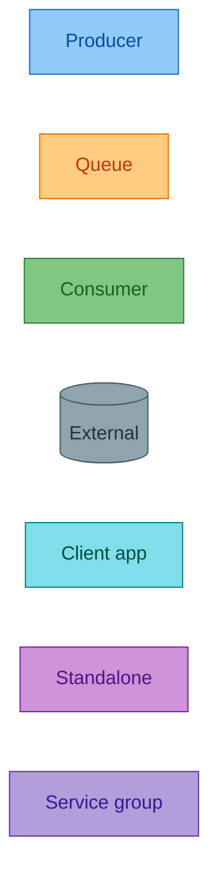

### Assigning node classes

**The rules differ per diagram type.** Check the matrix below before copying a styling line from one diagram into another.
This is the single most common way a correct-looking diagram ends up unstyled or corrupted, because three of these cells fail without an error.

| Form | `flowchart` | `classDiagram` | `stateDiagram-v2` |
|---|---|---|---|
| `X:::style` inline where the node is used | works | works | works, but only in a transition (`[*] --> Idle:::hot`) |
| `X:::style` on a standalone declaration | n/a | works (`class A:::hot`) | **silent no-op** (`state Idle:::hot`) |
| `class X style` (space-separated, trailing) | works | **silent corruption**, adds an empty class named `Xstyle` | works |
| `class X,Y style` (comma-separated list) | works | **parse error** | works |

Verified on mermaid-cli 11.16.
`classDiagram` is the outlier in both directions: it is the only type that rejects the comma list, and the only one where the space-separated form damages the diagram instead of styling it.
See [Applying a style to a class](class-diagram.md#applying-a-style-to-a-class) for the detail.

Only the parse error announces itself.
The two silent cells exit 0 and render a diagram that simply isn't styled, so confirm colour by looking at the output, not at the exit code.

In a flowchart, both forms below are equivalent.

```
App[Web app]:::producer
Q[IngestQueue_BASE]:::queue

class Worker1,Worker2 consumer
class DB external
```

Trailing `class` statements are preferred when grouping several nodes under one role at once,
see [split compound edges](#split-compound-edges) for the same pattern applied to edges.

---

## Edge styling, edge IDs (default)

Prefer edge IDs for per-edge colors.
Color binds to the edge by identity, not definition order.

### Syntax reference

| Part | Rule | Example |
|------|------|---------|
| Placement | **Source**, then ID, then `@`, then arrow | `App enq@==> Q` |
| Invalid | ID before source | `enq@App ==> Q` → **parse error** |
| Thick enqueue | `@==>` | `App e1@==> Q` |
| Solid consume/trigger | `@-->` | `Q e2@--> Worker` |
| Dotted external | `@-.->` | `Worker e3@-.-> DB` |
| Apply class | After all link lines | `class e1 edgeEnqueue` |

### Edge classDef names

| classDef name | Stroke | Width | Use for |
|---------------|--------|-------|---------|
| `edgeEnqueue` | `#1565c0` | 2px | Producer → queue |
| `edgeConsume` | `#2e7d32` | 2px | Queue → consumer, dequeue/process |
| `edgeComm` | `#7b1fa2` | 2px | Standalone/communication-service edges |
| `edgeSend` | `#bf360c` | 2px | Active outbound delivery to a recipient, sending an email, message, or notification, as distinct from a passive dependency |
| `edgeExternal` | `#455a64` | 1.5px | Database, file share, FTP, API, or client app treated as a passive dependency/boundary |
| `edgeData` | `#b0b0b0` | 1.5px | Internal data handoff (dark-theme variant) |
| `edgeExtLight` | `#64b5f6` | 1.5px | External boundary (dark-theme variant) |

`edgeSend` vs. `edgeExternal`:
use `edgeSend` when the edge represents actively delivering something to a recipient (an invoice email,
a push notification, a customer-facing message),
the emphasis is "we are sending." Use `edgeExternal` when the edge represents a dependency or lookup,
the emphasis is "this exists outside our system and we rely on it." Both are typically dotted;
the color, not the arrow shape, carries the distinction.

```
classDef edgeEnqueue stroke:#1565c0,stroke-width:2px
classDef edgeConsume stroke:#2e7d32,stroke-width:2px
classDef edgeComm stroke:#7b1fa2,stroke-width:2px
classDef edgeSend stroke:#bf360c,stroke-width:2px
classDef edgeExternal stroke:#455a64,stroke-width:1.5px
classDef edgeData stroke:#b0b0b0,stroke-width:1.5px
classDef edgeExtLight stroke:#64b5f6,stroke-width:1.5px
```

## Arrow type by connection

Arrow **shape** = connection kind.
Edge **color** = which flow.
Use both on technical diagrams.

| Connection type | Syntax | Edge class (typical) |
|-----------------|--------|----------------------|
| Enqueue / produces | `==>` | `edgeEnqueue` |
| Consume / processes | `-->` | `edgeConsume` |
| Trigger (no queue) | `-->` | same shape as consume; use `edgeComm` if the trigger comes from a standalone/communication service |
| Depends on external | `-.->` | `edgeExternal` |
| Actively sends/delivers to a recipient | `-.->` | `edgeSend` |

---

## Split compound edges

Don't use `A & B & C ==> Q` when each arrow needs its own color, index-based styling is fragile.
Split into one link per line with edge IDs, then group the `class` statement:

### Source (avoid)

```
A1 & A2 & A3 ==> Q
linkStyle 0,1,2 stroke:#1565c0,stroke-width:2px
```

### Source (preferred)

```
A1 e1@==> Q
A2 e2@==> Q
A3 e3@==> Q
Q e4@--> Worker1
class e1,e2,e3 edgeEnqueue
class e4 edgeConsume
```

This applies to any fan-in (multiple producers into one queue) or fan-out (one source triggering several nodes),
group every edge sharing a color into a single `class` line, per the ID list.

---

## Accessibility, accTitle and accDescr

No visual change; screen readers and doc-platform accessibility metadata use these lines.

```
flowchart LR
  accTitle: Ingest-to-process flow
  accDescr: Collector enqueues to the ingest queue; worker consumes and writes to the database.
  ...
```

**Placement is exact: the first line(s) immediately after the diagram-type keyword** (`flowchart LR`, `stateDiagram-v2`, and similar), before `classDef` and nodes.
Not before the diagram-type keyword, and not inside a `---\nconfig:\n---` frontmatter block — both are parse errors, `accTitle`/`accDescr` are diagram-body statements, not frontmatter.

---

## Edge curve override (Mermaid 11.10+)

Optional.
Place after the link line.

```
Driver[Job driver]:::standalone
Q[Queue]:::queue
Retry[Retry buffer]:::queue

Driver eSched@==> Q
Driver eRetry@==> Retry
eSched@{ curve: linear }
eRetry@{ curve: natural }
```

---

## `linkStyle` (fallback only)

Use only when edge IDs aren't supported by the renderer,
or when maintaining an older diagram that hasn't been migrated.
Indices **0, 1, 2, ...** differ across renderers, document index-to-color in a caption if kept.

**Don't use `linkStyle` for new diagrams** if the renderer supports edge IDs.

```
flowchart LR
  A1[Source A]:::producer
  A2[Source B]:::producer
  Q[Queue]:::queue
  Worker[Worker]:::consumer

  A1 ==> Q
  A2 ==> Q
  Q --> Worker

  linkStyle 0 stroke:#1565c0,stroke-width:2px
  linkStyle 1 stroke:#1565c0,stroke-width:2px
  linkStyle 2 stroke:#2e7d32,stroke-width:2px
```

**Legend:** Blue = indices 0-1 (sources → queue); green = index 2 (queue → worker).

---

## Causal-analysis diagrams

Treat causal diagrams as views of an evidence record, not as evidence themselves.
In timelines, Ishikawa or fishbone maps, causal flowcharts, and fault trees, include a stable claim or hypothesis ID in every node or entry.
Ishikawa category bones are the one exception: they group claims and carry no ID.
Use Ishikawa diagrams to organize candidate or evidence-supported contributing factors.
Do not imply causal proof merely by placing a factor on a branch.

Use Mermaid 11.16 as the compatibility floor for a template set that combines timelines, Ishikawa, causal flowcharts, and fault-tree flowcharts.
`ishikawa-beta` requires Mermaid 11.12.3 or newer and remains experimental.

## Detail level ladder

Use the **lowest** rung that answers the reader's question.
Link down, not up.

```
L0  C4Context or 5-node birds-eye flowchart     "What is this system?"
L1  Subgraph flowchart (collect/process/deliver)  "How does data move?"
L2  Named services + queues + edge colors       "Which worker handles X?"
L3  sequenceDiagram + classDiagram + ER          "What calls what in code/DB?"
L4  Packet/format diagrams, exact call/line refs  "Byte/layout/exactness"
```

| Doc type | Typical rungs |
|----------|----------------|
| Component overview | L0-L1 |
| Component deep-dive | L1-L2 (+ L3 on request) |
| Incident or causal-analysis write-up | L2 plus a timeline, evidence-backed causal flow, or Ishikawa candidate-factor map |
| Migration / DB doc | L3 ER + L4 as needed |
| Change/PR description | L2 for behaviour change; L0 if user-visible |

---

## Agent checklist, before adding a diagram

1. **Audience:** birds-eye or technical?
   (If unclear, add both as separate diagrams.)
2. **Question:** flow, time order, structure, state, schema,
   or volume? → pick a type from [Pick a diagram type](#pick-a-diagram-type).
3. **Node budget:** birds-eye 6-10 nodes (12 max); technical 20 or fewer,
   or split into two diagrams.
4. **Duplicate callers:** two or more flows in the diagram calling the same underlying stage/method?
   Don't redraw it per caller — see [Shared-stage convergence](#shared-stage-convergence-same-call-multiple-callers).
5. **Subgraph edges:** does any edge cross a subgraph boundary?
   Name the subgraph, not a node inside it, unless that subgraph is one stage of a straight pipeline —
   see [Subgraph edges](#subgraph-edges-the-endpoint-decides-the-layout).
6. **Naming:** birds-eye = phase/plain language; technical = grep-friendly, exact identifiers.
7. **Styling:** technical flowchart → full palette above; birds-eye → subgraphs OK,
   palette optional.
8. **Ordering:** declare all `classDef`s first, before nodes and edges.
9. **Caption:** one-line legend (as an in-diagram `%%` comment) if colors/arrows encode meaning.
10. **accTitle / accDescr:** set on overview/canonical diagrams.
11. **Placement:** diagram *after* one sentence saying what it shows,
    not instead of prose for non-obvious behaviour.
12. **Update:** diagram changes land in the same change/PR as the behaviour change it documents.

---

## Anti-patterns

| Anti-pattern | Why | Instead |
|--------------|-----|---------|
| One mega-diagram for an entire system | Unreadable | L0 overview + per-component L1/L2 |
| Every instance of a scaled service (`Worker01`...`Worker05`) on an overview | Noise on birds-eye | Subgraph "Workers" with a detail doc linked |
| Collapsing genuinely distinct client/app types into one node when the diagram exists to show a relationship *between* them | Erases the "who talks to whom" the diagram was drawn to answer | Keep distinct types as separate nodes; only collapse repeated instances of the *same* type |
| First-party client app classified as `external` | Hides that it's our own system, not a third-party dependency | Use the `client` role instead |
| `linkStyle` on a new diagram when edge IDs are supported | Index fragility | Edge IDs + named edge classes |
| `id@Source --> Target` edge syntax | Parse error | `Source id@--> Target` |
| Compound edges (`A & B ==> C`) when colors matter | Index fragility | One link per line + edge IDs |
| `classDef` declared after nodes/edges | Inconsistent with every worked example; harder to scan | Declare all `classDef`s first |
| `classDiagram` for a non-developer audience | Wrong abstraction | flowchart + journey |
| Beta diagram type in canonical docs without a render check | May not render on the target platform | Confirm support first |
| Diagram with no surrounding sentence | Hurts search and accessibility | One intro line + `accDescr` |
| Fabricated nodes, queues, or relationships not in the source material | Misleading | Verify names *and* connections against code/config; don't invent a trigger or edge just to close a gap in the diagram |
| Edge crossing a subgraph boundary aimed at a node inside it | The box is sealed at render time, so the arrow stops at the border and the named node is never shown | Name the subgraph: [Subgraph edges](#subgraph-edges-the-endpoint-decides-the-layout) |
| A subgraph wrapping a single node with no sibling bands | Two boxes to say one thing | Delete the subgraph, keep the node — unless it's one phase band in a row of phases, see [Don't wrap a single node in a subgraph](#dont-wrap-a-single-node-in-a-subgraph) |
| `Ext --> Process the data` (bare multi-word subgraph title as an edge target) | Parse error, the id is the whole title | Give it an explicit id: `subgraph Proc [Process the data]` |
| Two callers of the same stage/method redrawn as parallel prefixed nodes (`Load`/`RLoad`, `Conv`/`RConv`) | Doubles node count for zero new information; buries the actual difference between the two paths | [Shared-stage convergence](#shared-stage-convergence-same-call-multiple-callers): draw the shared stage once, unique steps as their own nodes |

---

## Summary

| Topic | Convention |
|-------|------------|
| Node colors | `producer`, `queue`, `consumer`, `external`, `client`, `standalone`, `service` |
| Edge colors (default) | Edge IDs + named edge classes (`edgeEnqueue`, `edgeConsume`, `edgeSend`, ...) |
| Edge colors (fallback) | `linkStyle` + index legend, only if edge IDs aren't supported |
| Edge ID syntax | `Source id@--> Target` |
| Subgraph edges | Crossing edge names the subgraph, not a node inside it |
| Enqueue / consume / external | `==>` / `-->` / `-.->` |
| classDef ordering | Declared first, before nodes and edges |
| Legend | In-diagram `%% Legend: ...` comment when more than one edge color |
| Doc format | **Source** then **Rendered** per pattern |
