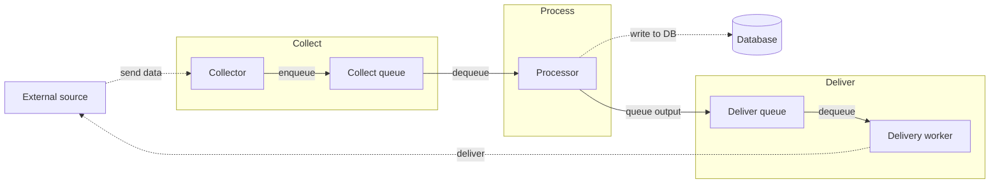
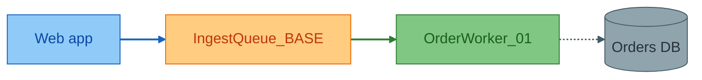
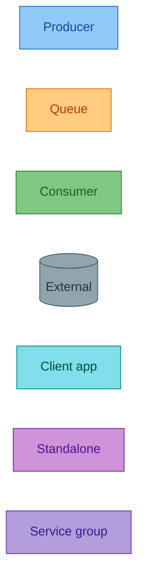

# Mermaid diagram style standard

Generic conventions for drawing Mermaid diagrams in technical documentation.
Palette, edge syntax, diagram-type selection, and detail-level guidance.
Validated against a weaker model to confirm it can follow this standard unsupervised and produce diagrams that render correctly.

**How to read this doc:** every pattern has **Source** (raw Mermaid to copy) then **Rendered** (live diagram). Tables and prose have no rendered block.

**Renderer assumption:** examples target Mermaid 11.x (edge IDs, `@{ curve: ... }`). For an older renderer, see [linkStyle fallback](#linkstyle-fallback-only).

For full per-type syntax, see the sibling reference files in this folder (`flowchart.md`, `sequence-diagram.md`, etc.) and the top-level `SKILL.md` selection table.

---

## Two audiences, two defaults

| Audience | Goal | Default diagram | Detail level | Node labels |
|----------|------|-----------------|--------------|-------------|
| **Birds-eye** (operator, PM, new team member) | Where does data go? Who talks to whom? | `flowchart LR` with **subgraphs**, or `C4Context` | 6-10 nodes target, 12 max; group by *phase*, not by *class/module* | Plain language: "Collect", "Process queue", "Customer API" |
| **Technical** (implementer, debugger) | Exact services, queues, code paths | `flowchart` with full palette + edge IDs, or `sequenceDiagram` | Named services, queue/table names, function/API calls | Exact identifiers: `OrderWorker_01`, `IngestQueue_BASE` |

**Rule:** one doc may contain **both**, birds-eye first (§ Overview), technical second (§ Detail). Don't merge into one overcrowded chart.

**Before drawing:** state the audience in `accDescr` or a one-line caption. If the goal is onboarding or discovery, default to birds-eye unless the task is debugging a specific path.

---

## Pick a diagram type

| You need to show... | Use | Avoid when... |
|-------------------|-----|-------------|
| Data or job flow across components | `flowchart` | More than ~20 nodes, split or use subgraphs |
| Who/what exists at a system boundary | `C4Context` | Internal queue/mechanics detail, too coarse |
| Request/order over time (client to service to DB) | `sequenceDiagram` | Many parallel branches, use flowchart |
| Class/module responsibilities | `classDiagram` | Non-developer audience, use birds-eye flowchart |
| Record lifecycle (Queued to Running to Done) | `stateDiagram-v2` | Continuous polling, use sequence or flow |
| Tables and FK relationships | `erDiagram` | Non-DB flows |
| Release/migration schedule | `gantt` | Runtime behaviour |
| Operator steps and pain points | `journey` | Developer debugging |
| Share of volume, error types | `pie` / `xychart-beta` | Exact routing logic |
| Root cause of failures | `ishikawa-beta` | Happy-path architecture |
| Overlap of two approaches | `venn-beta` | Single clear answer |
| Folder/map of docs or components | `mindmap` | Runtime data flow |
| Git/branch strategy | `gitGraph` | Deployment topology |

**Beta types** (`block-beta`, `packet-beta`, `sankey-beta`, `architecture-beta`, and others): confirm render support on the target platform before using in canonical docs. Prefer stable types otherwise.

---

## Flowcharts, the workhorse

### Birds-eye flowchart

**When:** onboarding docs, component overview, executive summary, "how does data move through this system."

**How:**

- `flowchart LR` or `TB`, left-to-right reads as a pipeline.
- **Subgraphs = phases** (Collect, Process, Store, Deliver), not project folders or class names.
- **6-10 nodes** across all subgraphs combined. Collapse duplicate *instances* of the same thing ("Workers" not `Worker01`, `Worker02`) unless the doc is specifically about scaling. Don't collapse genuinely distinct types into one node just to save a slot; if the diagram's point is a relationship *between* two kinds of client app, each kind needs its own node, or that relationship disappears.
- **Edges:** solid for the main path; dotted only to external systems. Skip edge colors, or use one accent, readability beats full convention compliance on overview charts.
- **Edge labels:** verb phrases (`enqueue`, `write to DB`, `send to partner`).
- Add `accTitle` + `accDescr` for accessibility.
- **Don't invent relationships.** Only draw edges the source material actually states. If the trigger between two phases isn't documented, name the edge for what the phase *does* (`queue next stage`), not for a guessed mechanism.

#### Worked example

##### Source

```
flowchart LR
  accTitle: Data ingest-process-deliver overview
  accDescr: External source sends data; we collect and process it into storage; we deliver processed output downstream.

  Source[External source]

  subgraph Collect
    Collector[Collector]
    CQueue[Collect queue]
  end

  subgraph Process
    Processor[Processor]
  end

  DB[(Database)]

  subgraph Deliver
    DQueue[Deliver queue]
    Deliverer[Delivery worker]
  end

  Source -.->|send data| Collector
  Collector -->|enqueue| CQueue
  CQueue -->|dequeue| Processor
  Processor -.->|write to DB| DB
  Processor -->|queue output| DQueue
  DQueue -->|dequeue| Deliverer
  Deliverer -.->|deliver| Source
```

##### Rendered

<!-- mermaid-render: id="style-standard--block1" -->



No node palette applied here, birds-eye diagrams may skip it entirely.

### Technical flowchart

**When:** debugging a queue, documenting a new service hook, a change that alters enqueue/consume paths.

**How:**

- Apply the [full palette](#node-color-palette): `producer`, `queue`, `consumer`, `external`, `client`, `standalone`.
- **One link per line.** Never `A & B & C ==> D` when each arrow needs its own color, see [split compound edges](#split-compound-edges).
- **Arrow syntax:** `==>` enqueue, `-->` consume/trigger, `-.->` external dependency.
- **Edge colors:** edge IDs by default, `Source id@==> Target` then `class id edgeEnqueue`.
- **Every edge styled**, no default black on critical paths.
- **Legend** as an in-diagram `%% Legend: ...` comment when more than one edge color is used.
- Name queues/tables by their real config or DB name when the reader will grep or query for them.
- **Declare all `classDef`s first**, before any node or edge line.

#### Worked example

##### Source

```
flowchart LR
  classDef producer fill:#90caf9,stroke:#1565c0,color:#0d47a1
  classDef queue fill:#ffcc80,stroke:#ef6c00,color:#bf360c
  classDef consumer fill:#81c784,stroke:#2e7d32,color:#1b5e20
  classDef external fill:#90a4ae,stroke:#455a64,color:#263238
  classDef edgeEnqueue stroke:#1565c0,stroke-width:2px
  classDef edgeConsume stroke:#2e7d32,stroke-width:2px
  classDef edgeExternal stroke:#455a64,stroke-width:1.5px

  App[Web app]:::producer
  Q[IngestQueue_BASE]:::queue
  Worker[OrderWorker_01]:::consumer
  DB[(Orders DB)]:::external

  App enq@==> Q
  Q con@--> Worker
  Worker dep@-.-> DB

  class enq edgeEnqueue
  class con edgeConsume
  class dep edgeExternal

  %% Legend: Blue thick = enqueue; green solid = consume; gray dotted = external dependency.
```

##### Rendered

<!-- mermaid-render: id="style-standard--block2" -->



### When not to use a flowchart

- **Single call chain, fewer than 5 steps, one thread** → `sequenceDiagram` is clearer.
- **Only schema** → `erDiagram`.
- **Only "what exists"** → `C4Context` or a bullet list plus one small flowchart.

---

## Node color palette

Medium-lightness fills, darker strokes, explicit text `color` on every `classDef`.
Mermaid does not adapt to viewer theme, so labels must contrast with the fill in both light and dark mode.

| Role | classDef name | Fill | Stroke | Color (text) | Use for |
|------|----------------|------|--------|--------------|---------|
| **Producer / source** | `producer` | `#90caf9` | `#1565c0` | `#0d47a1` | Enqueues jobs, triggers work, or is a data source (scheduler, upstream service). |
| **Queue** | `queue` | `#ffcc80` | `#ef6c00` | `#bf360c` | DB-backed or in-memory queues and buffers. |
| **Consumer / worker** | `consumer` | `#81c784` | `#2e7d32` | `#1b5e20` | Dequeues and processes. |
| **External system** | `external` | `#90a4ae` | `#455a64` | `#263238` | Databases, file shares, FTP/SFTP, third-party systems and APIs we don't own. |
| **Client / first-party app** | `client` | `#80deea` | `#00838f` | `#004d40` | Our own web, mobile, or desktop application, a UI or first-party endpoint, not a third-party dependency. |
| **Standalone / special** | `standalone` | `#ce93d8` | `#7b1fa2` | `#4a148c` | Notification/communication services, job drivers, anything distinct from a producer. |
| **Service group** | `service` | `#b39ddb` | `#5e35b1` | `#311b92` | Group box for "our" services in dependency-boundary views. |

`client` vs. `external`: if the node is a first-party application built and shipped in-house, even if, from one diagram's narrow scope, it sits outside the pipeline being documented, use `client`, not `external`. Reserve `external` for systems outside the organization's ownership (third-party APIs, a partner's infrastructure, a database or file share treated as a boundary). This distinction matters most on diagrams that need to show *which* of several first-party apps talks to what, collapsing them into `external` erases that.

Omit unused roles. Always include `color`.

### Source

```
classDef producer fill:#90caf9,stroke:#1565c0,color:#0d47a1
classDef queue fill:#ffcc80,stroke:#ef6c00,color:#bf360c
classDef consumer fill:#81c784,stroke:#2e7d32,color:#1b5e20
classDef external fill:#90a4ae,stroke:#455a64,color:#263238
classDef client fill:#80deea,stroke:#00838f,color:#004d40
classDef standalone fill:#ce93d8,stroke:#7b1fa2,color:#4a148c
classDef service fill:#b39ddb,stroke:#5e35b1,color:#311b92
```

### Rendered

All seven node roles on one row for palette comparison:

<!-- mermaid-render: id="style-standard--block3" -->



### Assigning node classes

Two equivalent forms: inline `:::className`, or a trailing `class` statement.

```
App[Web app]:::producer
Q[IngestQueue_BASE]:::queue

class Worker1,Worker2 consumer
class DB external
```

Trailing `class` statements are preferred when grouping several nodes under one role at once, see [split compound edges](#split-compound-edges) for the same pattern applied to edges.

---

## Edge styling, edge IDs (default)

Prefer edge IDs for per-edge colors. Color binds to the edge by identity, not definition order.

### Syntax reference

| Part | Rule | Example |
|------|------|---------|
| Placement | **Source**, then ID, then `@`, then arrow | `App enq@==> Q` |
| Invalid | ID before source | `enq@App ==> Q` → **parse error** |
| Thick enqueue | `@==>` | `App e1@==> Q` |
| Solid consume/trigger | `@-->` | `Q e2@--> Worker` |
| Dotted external | `@-.->` | `Worker e3@-.-> DB` |
| Apply class | After all link lines | `class e1 edgeEnqueue` |

### Edge classDef names

| classDef name | Stroke | Width | Use for |
|---------------|--------|-------|---------|
| `edgeEnqueue` | `#1565c0` | 2px | Producer → queue |
| `edgeConsume` | `#2e7d32` | 2px | Queue → consumer, dequeue/process |
| `edgeComm` | `#7b1fa2` | 2px | Standalone/communication-service edges |
| `edgeSend` | `#bf360c` | 2px | Active outbound delivery to a recipient, sending an email, message, or notification, as distinct from a passive dependency |
| `edgeExternal` | `#455a64` | 1.5px | Database, file share, FTP, API, or client app treated as a passive dependency/boundary |
| `edgeData` | `#b0b0b0` | 1.5px | Internal data handoff (dark-theme variant) |
| `edgeExtLight` | `#64b5f6` | 1.5px | External boundary (dark-theme variant) |

`edgeSend` vs. `edgeExternal`: use `edgeSend` when the edge represents actively delivering something to a recipient (an invoice email, a push notification, a customer-facing message), the emphasis is "we are sending."
Use `edgeExternal` when the edge represents a dependency or lookup, the emphasis is "this exists outside our system and we rely on it."
Both are typically dotted; the color, not the arrow shape, carries the distinction.

```
classDef edgeEnqueue stroke:#1565c0,stroke-width:2px
classDef edgeConsume stroke:#2e7d32,stroke-width:2px
classDef edgeComm stroke:#7b1fa2,stroke-width:2px
classDef edgeSend stroke:#bf360c,stroke-width:2px
classDef edgeExternal stroke:#455a64,stroke-width:1.5px
classDef edgeData stroke:#b0b0b0,stroke-width:1.5px
classDef edgeExtLight stroke:#64b5f6,stroke-width:1.5px
```

## Arrow type by connection

Arrow **shape** = connection kind. Edge **color** = which flow. Use both on technical diagrams.

| Connection type | Syntax | Edge class (typical) |
|-----------------|--------|----------------------|
| Enqueue / produces | `==>` | `edgeEnqueue` |
| Consume / processes | `-->` | `edgeConsume` |
| Trigger (no queue) | `-->` | same shape as consume; use `edgeComm` if the trigger comes from a standalone/communication service |
| Depends on external | `-.->` | `edgeExternal` |
| Actively sends/delivers to a recipient | `-.->` | `edgeSend` |

---

## Split compound edges

Don't use `A & B & C ==> Q` when each arrow needs its own color, index-based styling is fragile. Split into one link per line with edge IDs, then group the `class` statement:

### Source (avoid)

```
A1 & A2 & A3 ==> Q
linkStyle 0,1,2 stroke:#1565c0,stroke-width:2px
```

### Source (preferred)

```
A1 e1@==> Q
A2 e2@==> Q
A3 e3@==> Q
Q e4@--> Worker1
class e1,e2,e3 edgeEnqueue
class e4 edgeConsume
```

This applies to any fan-in (multiple producers into one queue) or fan-out (one source triggering several nodes), group every edge sharing a color into a single `class` line, per the ID list.

---

## Accessibility, accTitle and accDescr

No visual change; screen readers and doc-platform accessibility metadata use these lines.

```
flowchart LR
  accTitle: Ingest-to-process flow
  accDescr: Collector enqueues to the ingest queue; worker consumes and writes to the database.
  ...
```

Include at the top of the diagram block, before `classDef` and nodes.

---

## Edge curve override (Mermaid 11.10+)

Optional. Place after the link line.

```
Driver[Job driver]:::standalone
Q[Queue]:::queue
Retry[Retry buffer]:::queue

Driver eSched@==> Q
Driver eRetry@==> Retry
eSched@{ curve: linear }
eRetry@{ curve: natural }
```

---

## `linkStyle` (fallback only)

Use only when edge IDs aren't supported by the renderer, or when maintaining an older diagram that hasn't been migrated. Indices **0, 1, 2, ...** differ across renderers, document index-to-color in a caption if kept.

**Don't use `linkStyle` for new diagrams** if the renderer supports edge IDs.

```
flowchart LR
  A1[Source A]:::producer
  A2[Source B]:::producer
  Q[Queue]:::queue
  Worker[Worker]:::consumer

  A1 ==> Q
  A2 ==> Q
  Q --> Worker

  linkStyle 0 stroke:#1565c0,stroke-width:2px
  linkStyle 1 stroke:#1565c0,stroke-width:2px
  linkStyle 2 stroke:#2e7d32,stroke-width:2px
```

**Legend:** Blue = indices 0-1 (sources → queue); green = index 2 (queue → worker).

---

## Detail level ladder

Use the **lowest** rung that answers the reader's question. Link down, not up.

```
L0  C4Context or 5-node birds-eye flowchart     "What is this system?"
L1  Subgraph flowchart (collect/process/deliver)  "How does data move?"
L2  Named services + queues + edge colors       "Which worker handles X?"
L3  sequenceDiagram + classDiagram + ER          "What calls what in code/DB?"
L4  Packet/format diagrams, exact call/line refs  "Byte/layout/exactness"
```

| Doc type | Typical rungs |
|----------|----------------|
| Component overview | L0-L1 |
| Component deep-dive | L1-L2 (+ L3 on request) |
| Incident write-up | L2 + ishikawa |
| Migration / DB doc | L3 ER + L4 as needed |
| Change/PR description | L2 for behaviour change; L0 if user-visible |

---

## Agent checklist, before adding a diagram

1. **Audience:** birds-eye or technical? (If unclear, add both as separate diagrams.)
2. **Question:** flow, time order, structure, state, schema, or volume? → pick a type from [Pick a diagram type](#pick-a-diagram-type).
3. **Node budget:** birds-eye 6-10 nodes (12 max); technical 20 or fewer, or split into two diagrams.
4. **Naming:** birds-eye = phase/plain language; technical = grep-friendly, exact identifiers.
5. **Styling:** technical flowchart → full palette above; birds-eye → subgraphs OK, palette optional.
6. **Ordering:** declare all `classDef`s first, before nodes and edges.
7. **Caption:** one-line legend (as an in-diagram `%%` comment) if colors/arrows encode meaning.
8. **accTitle / accDescr:** set on overview/canonical diagrams.
9. **Placement:** diagram *after* one sentence saying what it shows, not instead of prose for non-obvious behaviour.
10. **Update:** diagram changes land in the same change/PR as the behaviour change it documents.

---

## Anti-patterns

| Anti-pattern | Why | Instead |
|--------------|-----|---------|
| One mega-diagram for an entire system | Unreadable | L0 overview + per-component L1/L2 |
| Every instance of a scaled service (`Worker01`...`Worker05`) on an overview | Noise on birds-eye | Subgraph "Workers" with a detail doc linked |
| Collapsing genuinely distinct client/app types into one node when the diagram exists to show a relationship *between* them | Erases the "who talks to whom" the diagram was drawn to answer | Keep distinct types as separate nodes; only collapse repeated instances of the *same* type |
| First-party client app classified as `external` | Hides that it's our own system, not a third-party dependency | Use the `client` role instead |
| `linkStyle` on a new diagram when edge IDs are supported | Index fragility | Edge IDs + named edge classes |
| `id@Source --> Target` edge syntax | Parse error | `Source id@--> Target` |
| Compound edges (`A & B ==> C`) when colors matter | Index fragility | One link per line + edge IDs |
| `classDef` declared after nodes/edges | Inconsistent with every worked example; harder to scan | Declare all `classDef`s first |
| `classDiagram` for a non-developer audience | Wrong abstraction | flowchart + journey |
| Beta diagram type in canonical docs without a render check | May not render on the target platform | Confirm support first |
| Diagram with no surrounding sentence | Hurts search and accessibility | One intro line + `accDescr` |
| Fabricated nodes, queues, or relationships not in the source material | Misleading | Verify names *and* connections against code/config; don't invent a trigger or edge just to close a gap in the diagram |

---

## Summary

| Topic | Convention |
|-------|------------|
| Node colors | `producer`, `queue`, `consumer`, `external`, `client`, `standalone`, `service` |
| Edge colors (default) | Edge IDs + named edge classes (`edgeEnqueue`, `edgeConsume`, `edgeSend`, ...) |
| Edge colors (fallback) | `linkStyle` + index legend, only if edge IDs aren't supported |
| Edge ID syntax | `Source id@--> Target` |
| Enqueue / consume / external | `==>` / `-->` / `-.->` |
| classDef ordering | Declared first, before nodes and edges |
| Legend | In-diagram `%% Legend: ...` comment when more than one edge color |
| Doc format | **Source** then **Rendered** per pattern |
