# Swimlanes

**Use for:** a process where the reader needs both "what happens next?" and "who owns this step?", approval flows, support escalation, cross-team delivery workflows. v11.16+, `swimlane-beta`.
**Avoid for:** a process where ownership doesn't matter (use a plain `flowchart`), messages-over-time between systems (use `sequence-diagram.md`), or one thing's internal states (use `state-diagram.md`).

## Core syntax

Swimlanes reuse flowchart node/edge syntax; the only new concept is that top-level `subgraph`s become lanes.

<!-- mermaid-render: id="swimlanes--block1" -->
```mermaid
swimlane-beta LR
  subgraph Customer
    request[Request service]
    receive[Receive update]
  end

  subgraph Support
    triage[Triage request]
    answer[Send answer]
  end

  subgraph Engineering
    investigate[Investigate issue]
  end

  request --> triage
  triage -->|Known issue| answer
  triage -->|Needs code change| investigate
  investigate --> answer
  answer --> receive
```


An optional direction follows the keyword: `TB`/`TD` (default), `BT`, `LR`, `RL`.

## Lanes, nodes, edges

- `subgraph Name ... end` declares a lane; `subgraph id [Display Label]` gives it a separate id and label (needed for a label with spaces, or a stable id for styling).
- Nodes use the same shapes as flowcharts: `id[Rectangle]` (task), `id(Rounded)` (step/event), `id([Stadium])` (start/end), `id{Decision}` (branch), `id((Circle))` (connector). See `flowchart.md` for the full shape catalog.
- Edges are flowchart syntax too (`-->`, `---`, `-->|label|`, `-.->`, `==>`), and can cross lanes freely, a cross-lane edge *is* a handoff.

## Good practices

- **One kind of ownership per lane.** Don't mix teams, phases, and statuses in the same set of lanes unless that mix is the diagram's actual point.
- **Label cross-lane handoffs.** A cross-lane arrow is where responsibility changes hands; label it when the handoff depends on a document, decision, or condition.
- **Put decisions where they're made.** A decision node belongs in the lane that owns the decision; route its outcomes to whichever lanes act on the result.
- **Use stable ids.** Short meaningful ids let the label change later without breaking styles or cross-references.
- **Split long processes.** If the lanes or handoffs stop fitting one view, draw two diagrams rather than one dense one.

## Accessibility

`accTitle:`/`accDescr:` work the same as in flowcharts, set them at the top of the diagram, before any `subgraph`.
