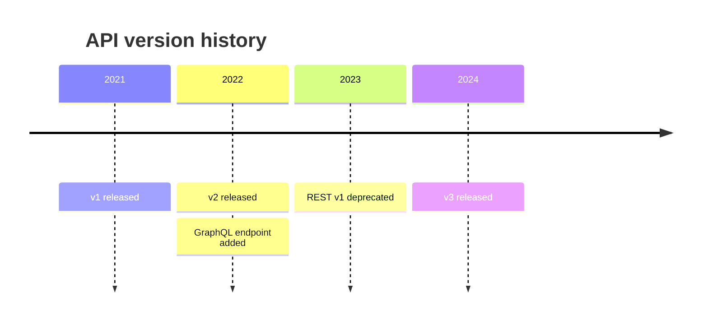
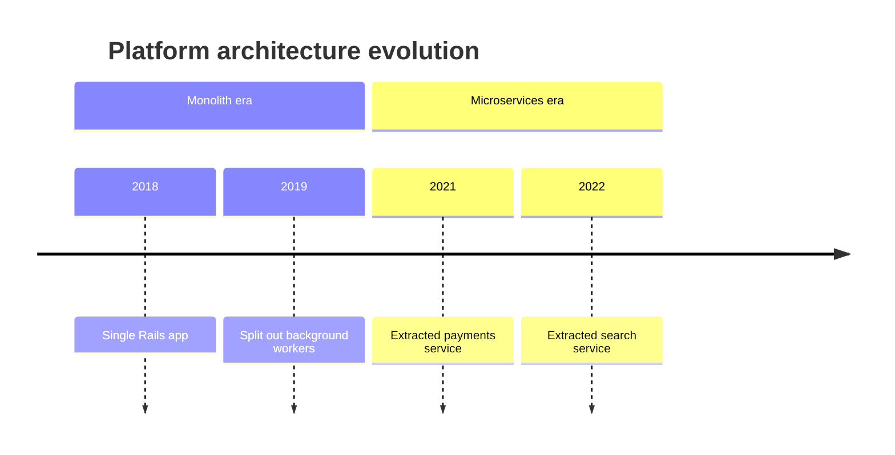

# Timeline

**Use for:** chronology of events, milestones, or periods,
read left-to-right (or top-down) in order.
**Avoid for:** runtime data flow,
or when the reader needs a Gantt chart's task-duration/dependency view instead (use `gantt.md`).

## Core syntax

<!-- mermaid-render: id="timeline--block1" -->

Each line is `{time period} : {event}`;
multiple colon-separated events stack under the same period (either on one line,
or on continuation lines with a blank period).
Both the period and event are plain text, not limited to years.

## Sections

<!-- mermaid-render: id="timeline--block2" -->

`section <name>` groups subsequent periods and gives them a shared color scheme.
Without any section,
each period gets its own color by default (`disableMulticolor: true` turns that off).

## Direction, wrapping, theming (v11.14+)

- `timeline TD` renders top-down instead of the default left-to-right (`LR`).
- Long text wraps automatically; force a break with ` `.
- Section/period colors come from `cScale0`-`cScale11` (and matching `cScaleLabel0`-`cScaleLabel11` for foreground text) theme variables,
  repeating cyclically past 12 sections.

## Common pitfalls

- **A period cannot contain a colon.**
  The parser splits each line on `period : event`, so a clock time like `14:02 : Alert fired` is a parse error.
  Write the time without the colon (`14h02 : Alert fired`), or move it into the event text.
- Long event text does not wrap by default; keep events short and put detail in the prose below the diagram.
