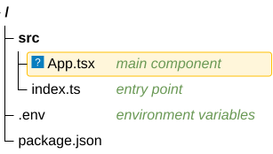
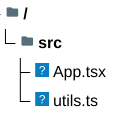

# TreeView diagram

**Use for:** a directory/file tree,
or any strict parent-child hierarchy that reads naturally as a folder listing. v11.14+,
`treeView-beta`.
**Avoid for:** anything with cross-links or multiple parents (use `mindmap.md`'s tree only if truly hierarchical,
or a `flowchart` otherwise).

## Core syntax (indentation)

<!-- mermaid-render: id="tree-view--block1" -->

- Structure comes purely from indentation depth.
- A trailing `/` on a label marks it a directory (renders bold).
- Quoted labels (`"my file"`) support spaces; bare labels cannot contain spaces.

## Core syntax (box-drawing input)

The parser also auto-detects standard tree-command output, no extra keyword needed:

<!-- mermaid-render: id="tree-view--block2" -->

Both light (`├──`, `└──`, `│`) and heavy (`┣━━`, `┗━━`, `┃`) box-drawing characters are recognized;
depth is inferred from the branch character's column position,
so this format also works for arbitrarily deep nesting pasted straight from a `tree` command.

## Annotations

Append these after a label, in any order:

| Annotation | Effect |
|---|---|
| `:::className` | Apply a CSS class (built-in `highlight` class provided) |
| `## text` | Inline italic description next to the label |
| `icon(pack:name)` | Explicit icon override, always renders even if `showIcons` is off |
| `icon()` or `icon(none)` | Hide this node's icon when `showIcons` is on |

<!-- mermaid-render: id="tree-view--block3" -->

## Icons

Built-in `file`/`folder` icons are hidden by default;
set `config.treeView.showIcons: true` to show them.
File-type icons (by filename or extension) are entirely user-configured via `filenameIcons`/`extensionIcons` maps pointing at a registered iconify pack,
Mermaid ships no built-in filename→icon mapping.

<!-- mermaid-render: id="tree-view--block4" -->

## Configuration and theming

`config.treeView`: `rowIndent`, `paddingX`/`paddingY`, `lineThickness`, `showIcons`,
`defaultIconPack`, `filenameIcons`, `extensionIcons`.
Theme variables under `themeVariables.treeView`: `labelFontSize`, `labelColor`, `lineColor`,
`iconColor`, `descriptionColor`, `highlightBg`, `highlightStroke`.

## Common pitfalls

- Tab characters in indentation are auto-expanded to spaces;
  a parse error's reported line number refers to the original input either way.
- Comments use `%%`, same as other Mermaid diagrams.
