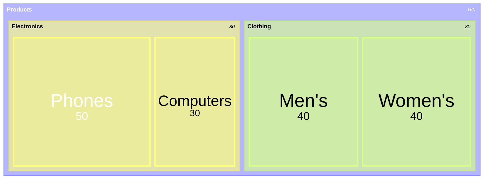
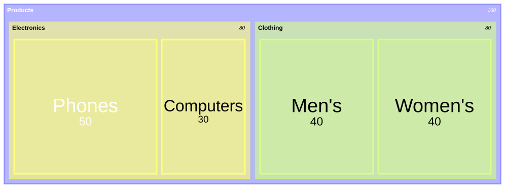
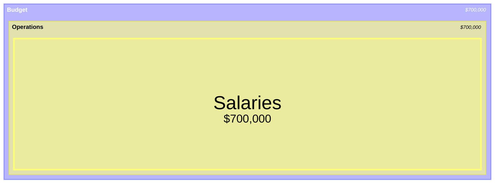
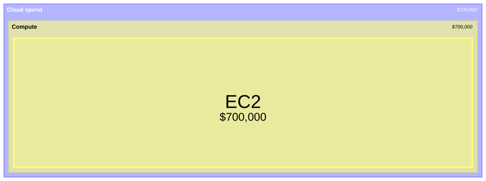

# Treemap

**Use for:** nested proportions of hierarchical data (budget allocations, disk usage,
market share by category then sub-category).
**Avoid for:** negative values (unsupported), very deep hierarchies (readability drops fast),
or when a simple flat pie/bar chart would do (use `pie-chart.md` or `xy-chart.md` when there's no real hierarchy).

## Core syntax

<!-- mermaid-render: id="treemap--block1" -->

- A quoted line with no trailing value is a section/parent node.
- A quoted line with `: value` is a leaf node; its rectangle area is proportional to the value.
- Hierarchy comes from indentation depth (spaces or tabs), same convention as `mindmap.md`.
- Style a node with `:::class` and define the class with a normal `classDef`.

## Value formatting

<!-- mermaid-render: id="treemap--block2" -->

`valueFormat` uses D3 format specifiers (`,` thousands separator, `.1f` one decimal,
`.1%` percentage, `$0,0` currency with separator, and combinations).

## Configuration

`config.treemap` also covers `padding`/`diagramPadding` (spacing), `showValues`,
`nodeWidth`/`nodeHeight`, `valueFontSize`/`labelFontSize`, and `useMaxWidth`.
