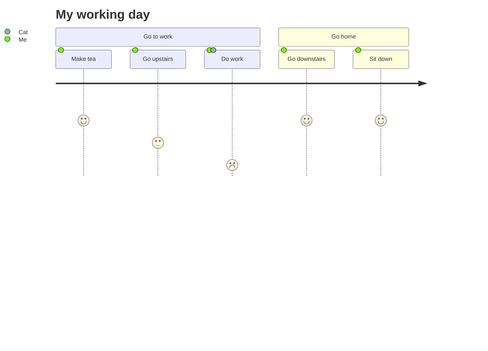
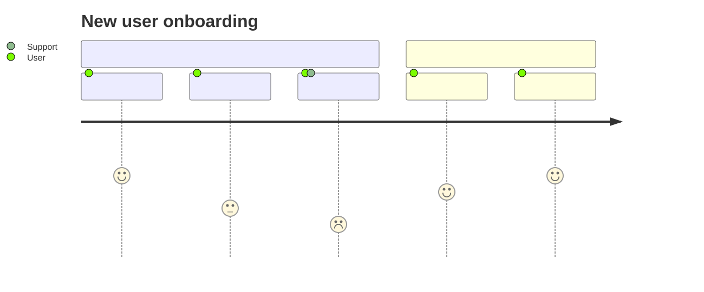

# User journey

**Use for:** an end-to-end user experience broken into sections and steps, each scored for satisfaction, and attributed to the actor(s) performing it.
**Avoid for:** developer debugging, or any flow where the point is *system* behavior rather than user experience (use a flowchart or sequence diagram instead).

## Core syntax

<!-- mermaid-render: id="user-journey--block1" -->

Each `section` groups the steps of one part of the journey. A task line is `Task name: <score>: <actor, actor, ...>`. The score is an integer from 1 (worst) to 5 (best), inclusive, and drives the rendered happiness curve. Multiple actors on one task are comma-separated.
