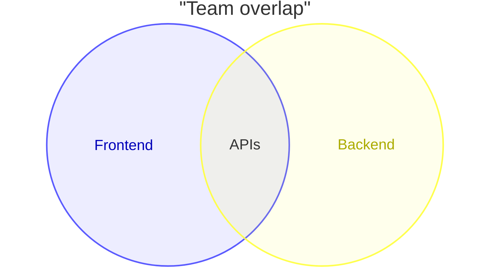
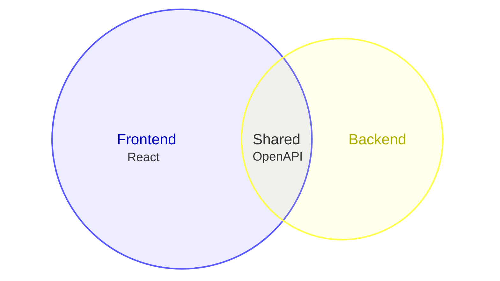

# Venn diagram

**Use for:** showing overlap between sets using circles (feature overlap between teams, a desirable/feasible/viable-style innovation diagram). v11.12+, `venn-beta`.
**Avoid for:** anything where a single clear answer, not a spread of overlapping categories, is the point.

## Core syntax

<!-- mermaid-render: id="venn--block1" -->



- `set <id>` declares one circle; identifiers can be bare words or quoted strings.
- `union <id1>,<id2>[,...]["Label"]` declares the overlap of two or more previously-declared sets. Three-or-more-way unions render the implied pairwise overlaps automatically so the higher-arity label has a visible region.
- Bracket syntax `["Display Label"]` on a `set` keeps a short identifier while showing a longer label.

## Sizes and text nodes

<!-- mermaid-render: id="venn--block2" -->



A trailing `:N` on `set`/`union` sets its relative size. Indented `text id["Label"]` lines attach labels inside the most recently declared set or union.

## Styling

```
style A fill:#ff6b6b
style A,B color:#333
```

Supported properties: `fill`, `color` (text), `stroke`, `stroke-width`, `fill-opacity`.
