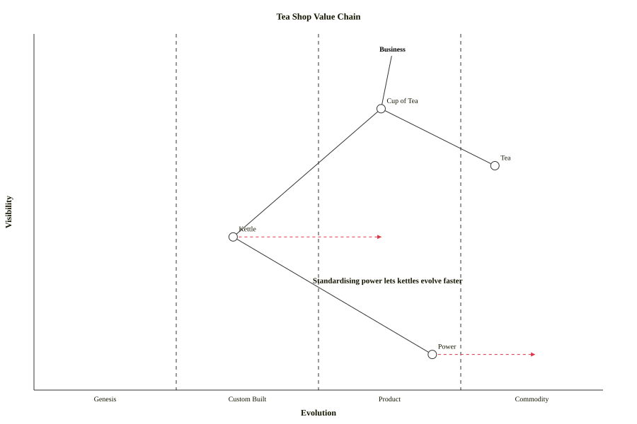
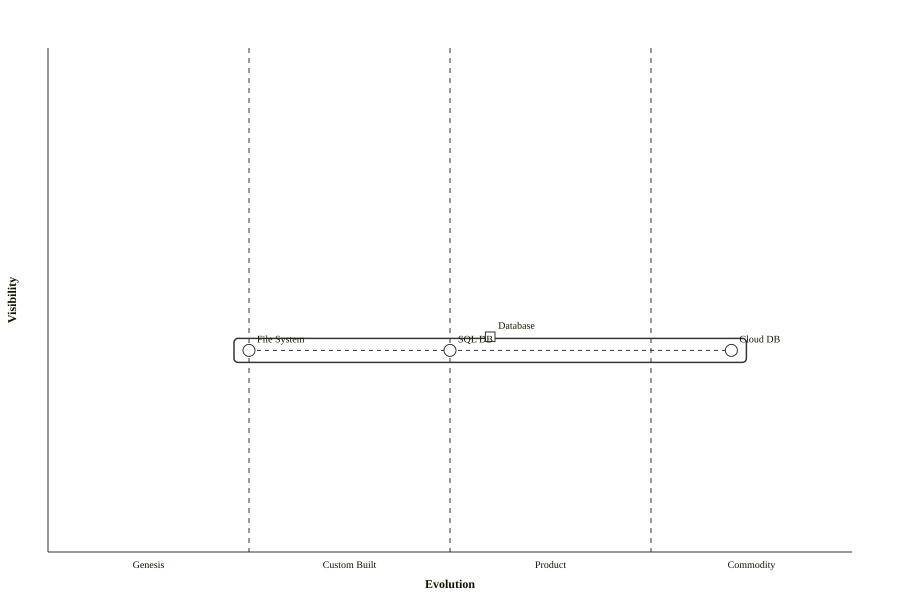

# Wardley map

**Use for:** strategic value-chain mapping,
positioning components by user-visibility and evolutionary maturity to reason about build-vs-buy,
dependencies, and where to invest. v11.14+, `wardley-beta`.
**Avoid for:** anything that isn't a strategic/business-architecture exercise;
this is a specialized diagram with its own coordinate conventions.

## Coordinate system (the one thing to get right)

**Every position is `[visibility, evolution]`, not `[x, y]`.**

- **Visibility** (first value, Y-axis): 0.0 = pure infrastructure, 1.0 = fully user-facing.
- **Evolution** (second value, X-axis): 0.0 = genesis/novel, 1.0 = commodity/utility.

**Note:** this is the opposite of typical `(x, y)` notation,
double-check it when writing or reviewing a Wardley map.

## Core syntax

<!-- mermaid-render: id="wardley--block1" -->
```mermaid
wardley-beta
title Checkout Value Chain

anchor Customer [0.95, 0.63]
component Checkout [0.79, 0.61]
component Payment-Processing [0.63, 0.81]
component Fraud-Check [0.43, 0.35]
component Compute [0.10, 0.70]

Customer -> Checkout
Checkout -> Payment-Processing
Checkout -> Fraud-Check
Fraud-Check -> Compute

evolve Fraud-Check 0.62
evolve Compute 0.89

note "Standardising compute lets fraud checks evolve faster" [0.30, 0.49]
```


- `anchor Name [vis, evo]`: a user or customer, rendered with a bold label.
- `component Name [vis, evo]`: any value-chain element.
  Optional trailers: `label [offsetX, offsetY]` to nudge the text label,
  and a decorator in parentheses.
- `A -> B` (or `-->`): a dependency link.
  Names with hyphens (`real-time processing`) don't need quoting;
  quote a name only if it starts with a non-letter or has characters the grammar can't otherwise parse,
  or contains spaces and you want it usable as a bare reference elsewhere (`component "Custom Service" [0.55, 0.35]`).

## Decorators

| Decorator | Meaning |
|---|---|
| `(inertia)` | Marks resistance to change |
| `(build)` | Triangle, in-house build |
| `(buy)` | Diamond, purchased/licensed |
| `(outsource)` | Square, outsourced |
| `(market)` | Circle, bought on the open market |

## Links and flow

```
A -> B              basic dependency
A -.-> B            dashed flow
A +> B              flow (with arrow marker)
A +< B              reverse flow
A +<> B             bi-directional flow
A +'label'> B       labeled flow
```

## Evolution and pipelines

`evolve ComponentName targetEvolution` draws a red dashed arrow showing where a component is heading.
A `pipeline` groups variants of one component that share visibility but differ in evolution stage:

<!-- mermaid-render: id="wardley--block2" -->
```mermaid
wardley-beta
component Database [0.40, 0.60]
pipeline Database {
  component "File System" [0.25]
  component "SQL DB" [0.50]
  component "Cloud DB" [0.85]
}
```


## Custom evolution stages

```
evolution Genesis -> Custom -> Product -> Commodity
evolution Genesis / Concept -> Custom / Emerging -> Product / Converging -> Commodity / Accepted
evolution Genesis@0.2 -> Custom@0.4 -> Product@0.75 -> Commodity@1.0
```

Relabels the default four evolution-stage names;
supports dual labels (`Label1 / Label2`) and custom stage boundary widths (`@width`).

## Notes and numbered annotations

```
note "text" [vis, evo]
annotations [x, y]
annotation 1,[vis, evo] "text"
```

`annotations` sets where the annotation-index legend box is drawn;
each `annotation N,[...]` places a numbered marker plus its text in that legend.

## Accelerators/deaccelerators and size

`accelerator "label" [vis, evo]` / `deaccelerator "label" [vis, evo]` mark forces speeding up or resisting evolution.
`size [width, height]` sets canvas dimensions (default `[1100, 600]`).

## Common pitfalls

- Axis order: see the Note at the top of this file.
- Trend indicators (`Component -.- (x, y)`) are the one exception,
  see the Note at the top of this file.
- Hand-drawn look is not supported; Wardley maps use a custom D3 renderer.
