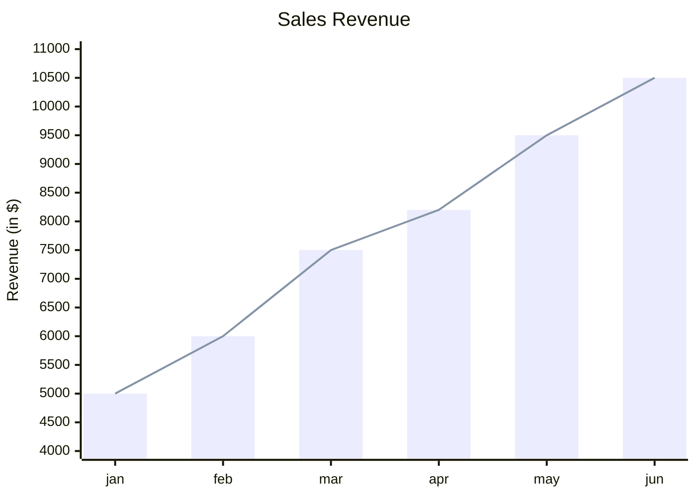
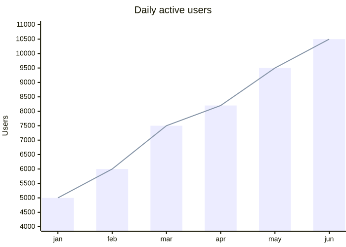
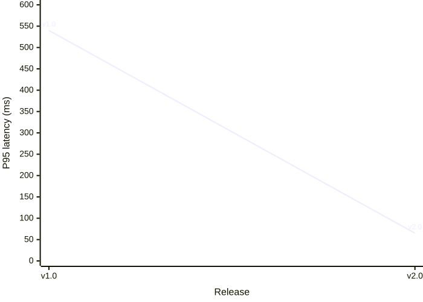

# XY chart

**Use for:** bar and line charts plotting two numeric axes (revenue over time, comparative metrics).
**Avoid for:** simple proportions with no axis structure (use `pie-chart.md`) or hierarchical data (use `treemap.md`).

## Core syntax

<!-- mermaid-render: id="xy-chart--block1" -->



- `xychart` (or `xychart-beta`) starts the diagram;
  add `horizontal` for a horizontal orientation (`xychart horizontal`).
- Multi-word text values need double quotes; single words don't.
- `x-axis` is categorical by default: `x-axis "title" [cat1, "cat2 with space", cat3]`.
  It can instead be numeric: `x-axis title min --> max`.
- `y-axis title min --> max` sets a numeric range; omit the range to auto-scale from the data,
  or omit the whole line to auto-generate both title and range.
- `bar [...]` and `line [...]` each take a list of numeric values;
  prefix with a quoted name (`line "p95" [...]`) to add it to the legend.
  Unnamed series are omitted from the legend.

## Per-point line labels (v11.16+)

<!-- mermaid-render: id="xy-chart--block2" -->
```mermaid
xychart
    x-axis "Date" ["Apr 2022", "Feb 2023"]
    y-axis "Parameters (B)" 0 --> 600
    line [540 "PaLM", 65 "LLaMA-65B"]
```


Each value in a `line` series can optionally carry a quoted text label.
Labels are optional per point, mixing labeled and unlabeled values in the same series is fine.
Line-only feature; accepted but ignored on `bar`.

## Data labels

`showDataLabel: true` (under `config.xyChart`) prints each bar's value inside the bar;
add `showDataLabelOutsideBar: true` to move labels outside instead.

## Configuration and theming

`config.xyChart` covers `width`, `height`, `showLegend`, `chartOrientation`,
and nested `xAxis`/`yAxis` objects (`showLabel`, `labelRotation`, `showTick`, `showAxisLine`,
and similar).
Theme variables live under `themeVariables.xyChart` (`backgroundColor`, `titleColor`,
`plotColorPalette` as a comma-separated color list applied in series order,
and per-axis label/tick/line colors).

## Common pitfalls

- **The first series renders in a near-invisible pale lavender** against a white background (verified on mermaid-cli 11.16).
  Set the palette explicitly when a chart has more than one series:
  ```
  ---
  config:
    themeVariables:
      xyChart:
        plotColorPalette: "#1565c0, #c62828, #2e7d32"
  ---
  ```
- **`showLegend: true` renders no legend at all** in 11.16.
  Label each series with a per-point line label instead (see above), and keep the label away from the plot edge, where it gets clipped.
