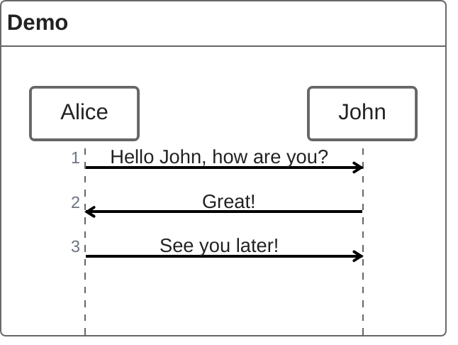
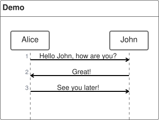

# ZenUML

**Use for:** a sequence diagram written in a code-like syntax (nested method calls instead of arrow-per-line), when the reader is more comfortable reading code structure than arrow sequences.
**Avoid for:** anything needing the richer control-flow blocks (`critical`, `par` with true concurrency semantics) of a standard `sequenceDiagram`, use `sequence-diagram.md` for those.

## Core syntax

<!-- mermaid-render: id="zenuml--block1" -->



Participants can be declared implicitly (first appearance sets order) or explicitly up front, same as standard sequence diagrams. Use `@Actor`/`@Database`/similar annotators to pick a symbol for a participant, and `A as Alice` for an alias.

## Message types

- **Sync:** `A.SyncMessage(params) { B.nestedSyncMessage() }`, think of this as a blocking method call; the `{ }` body nests further calls.
- **Async:** `Alice->Bob: How are you?`, fire-and-forget, no return expected.
- **Creation:** `new A1` or `new A2(params)` to construct an object.
- **Reply:** three forms, assign a variable (`a = A.SyncMessage()`), use `return result` inside a sync message body, or use `@return` before an async message to return control up a level.

## Control flow

Nesting uses `{}` braces instead of `end` keywords:

```
if(condition) { ... } else if(condition2) { ... } else { ... }
while(condition) { ... }     // also: for, forEach/foreach, loop
par { statement1  statement2 }
opt { ... }
try { ... } catch { ... } finally { ... }
```

## Comments

`// comment` renders above the message or fragment it precedes; markdown is supported inside. Comments on a bare participant declaration are not rendered.

## Common pitfalls

- ZenUML is a different grammar from standard Mermaid sequence diagrams, don't mix the two syntaxes in one diagram.
- Integration requires the separate `mermaid-zenuml` plugin registered alongside core mermaid on older Mermaid versions; recent Mermaid bundles it via lazy-loading.
